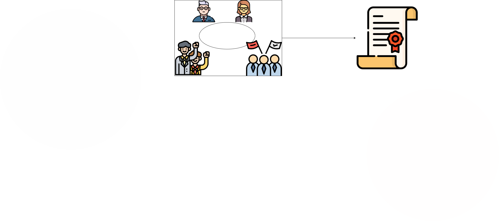
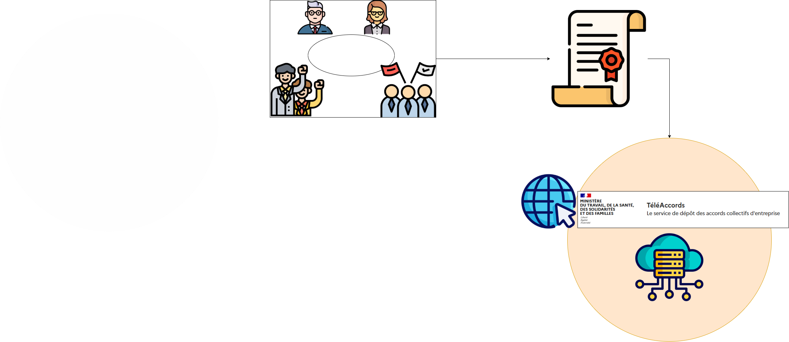
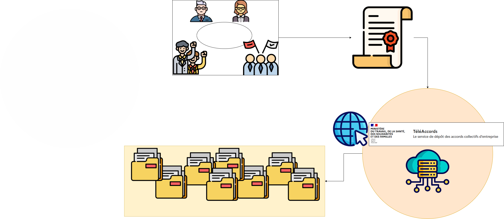
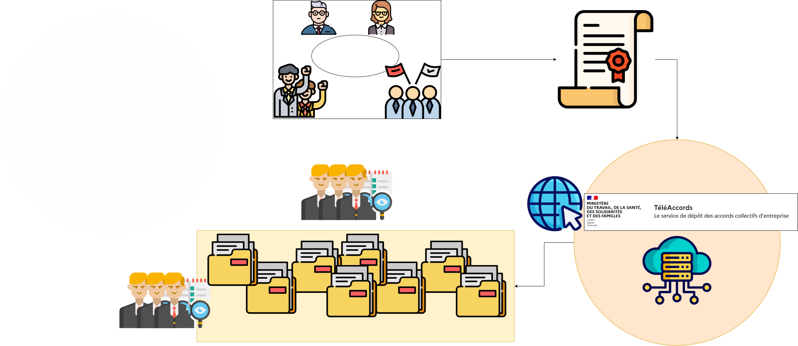
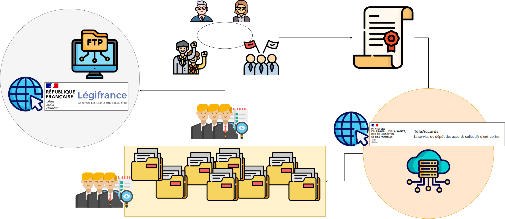
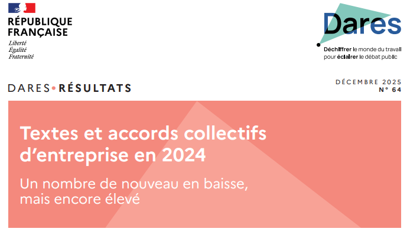
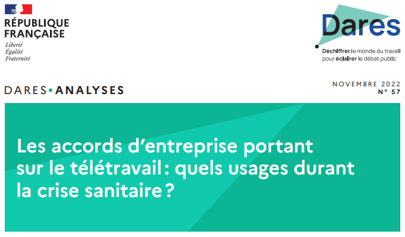
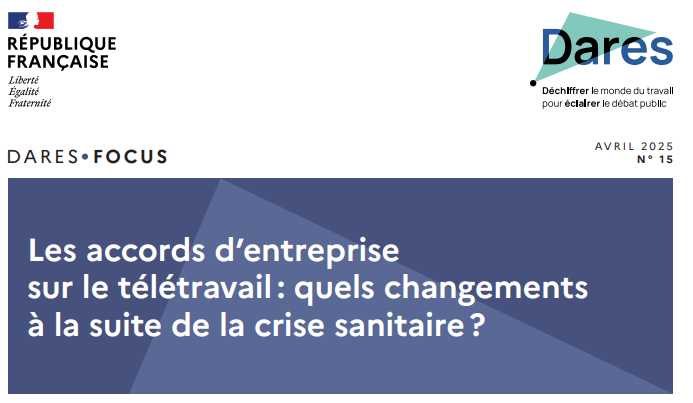
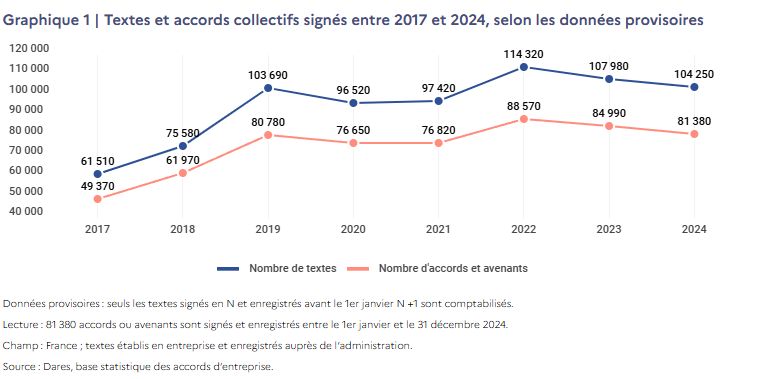
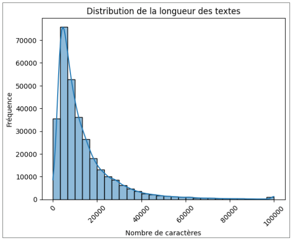

# Introduction au monde du Travail

## Juridiction du code du Travail

:::{.columns}

::: {.column width="30%"}
<div class="fragment" data-fragment-index="1" >
[**Code du travail**](https://www.legifrance.gouv.fr/codes/texte_lc/LEGITEXT000006072050/2026-02-20)

</div>
:::

::: {.column width="70%"}
<div class="fragment" data-fragment-index="1">
{width=400px}
</div>
:::

:::

:::{.columns}

::: {.column width="30%"}
<div class="fragment" data-fragment-index="2">
[**Vers. numérique**](https://code.travail.gouv.fr/)
</div>
:::

::: {.column width="70%"}
<div class="fragment" data-fragment-index="2">

{width=400px}
</div>
:::

:::

## Contenu du code du Travail


<div class="column" style="width:70%;">
<div class="fragment visible" data-fragment-index="1">
<ul>
<li class="fragment visible" data-fragment-index="2">Ensemble des règles juridiques s’appliquant principalement aux salariés</li>
<li class="fragment visible" data-fragment-index="3">Tout aspect, du début du contrat à la fin</li>
<li class="fragment visible" data-fragment-index="4">Exemples :
<ul style="list-style: none;">
<li class="fragment visible" data-fragment-index="5">📝 Embauche</li>
<li class="fragment visible" data-fragment-index="6">💰 Salaires</li>
<li class="fragment visible" data-fragment-index="7">🏢 Conditions de travail</li>
<li class="fragment visible" data-fragment-index="8">⏳ Retraite</li>
<li class="fragment visible current-fragment" data-fragment-index="9">✂️ Fin et rupture de contrat</li>
</ul></li>
</ul>
</div>
</div>

<div class="column" style="width:30%;">
<div class="fragment visible" data-fragment-index="10">
<br />
<br />
<br />
<br />
<p><a href="https://code.travail.gouv.fr/themes"><img role="img" src="data:image/png;base64,iVBORw0KGgoAAAANSUhEUgAAASMAAAGCCAYAAACrYKVmAAAAAXNSR0IArs4c6QAAAARnQU1BAACxjwv8YQUAAAAJcEhZcwAADsMAAA7DAcdvqGQAADChSURBVHhe7d0PeBXVnTfwbwQFKaUBxCW8uIagYBDo8se+BmIhcYEWDLsQUANqQf4VQXYF1Ipg4/8VQV8RRCEIViGtmNAGEhcp/2ok3UXCikAEJUlXHpKKQMSIQKF5z2/mTDJ3cm9ykxA49/L9PM99MjN37syZO5nvPefM3DsRFQqIiC6xK/RfIqJLqlrNqLCwUA8RETWOmJgYPVTFbxj5m5GI6EIIlDFsphGRERhGRGQEhhERGYFhRERGYBgRkREYRkRkBIYRERmBYURERmAYEZERGEZEZASGEREZgWFEREZgGBGRERhGRGQEhhERGYFhRERGYBgRkREYRkRkBIYRERmBYURERmAYEZERGEZEZASGEREZgWFEREZgGBGRERhGRGQEhhERGYFhRERGYBgRkREYRkRkBIYRERmBYURERoioUPSwpbCwEDExMXqMyFfJ0XIcOfqd9bfk6+8qp/WO/QdrOKpdS3Ro9wPrL5E/gTKGYUS1krDZ8KdC5O8vxa79f9VTayZhdMeAzlZI9elmBxWRYBhRnUkIPfX6jqADKBAJpid+2Y+hRBaGURiT0HACQw78hh70wYaQ0xSTZpnTdKuJ1JQmJfdsUBNO1iHryi/4K6KusZuDDLnQwjAKQ8sz9mD5e5/osSpygEpALJ03WE8JngTQA09/AJ9/CsU56OWvBEogTjBKWGzYfkhPrdKkyRW4c0hXPHRvXz0lOLJc2V5/y5QyOUFH5mMYhZG61FyWzh2EDtcGVxPxF24NOdClnNLX5C8wJ436cdDLlO2cqgKyNnXdXro0AmUMT+2HoKf9BJEciN7mioTB1Gc2WX9rM+GJ96uFhgTGHxaNqHeNQ8okr+1x4zV6ShVZlwRqMB54xjeI/G2rcLaXQhPDKMRI7eVjVxDJgSmdwxIa0iz77/R7rRBxyAEqr6mJPP/p51/rMZss60I0eyQ0vct2SJOrtrJJjchdd3cC0tlWGXYHUzDbS2ZiGIUYd+1FDkI5GKUZ5SYh4g4kOeg/3ue/SSdhkeanGZWWUX1aXVk1FVfzSoLz96+MsP46ZHsChYeUzV0D9Ne0k2VZwenZXgo9DKMQ4j3IXpsbuIP6jp/6tslzPqx+gMqBbtU89Lib81wwTTx/5PX/OmOdHrNJDU76c16fNwgREXqiYoWlK3Qc2X/yLfPEkYFrarK9TshJmd0hRqGBYRRC5AyVQ2pD7gPaSw5Md23B38Hprf08/eBtPrUWec0vn95U52aPzO8NOSmL05ySdbiDVMJD+sG83GEUzPbKGUSH+72i0MAwCiHeoPA9D1qd1BacA1gOeHfNSobdASVhMaRftFVr6eBaj7xOmlL/omo5EjL+Qk3mseZTz/8k5e1qHeH++p8kmNxh6a98Pn1FQfRfyfVHFLoYRiHE+f5XsCS8+rheIzUN5/h213ZkPudgl+GlKpDcQSGcUJIajwSOhJN72AorP31PEkT+znwJCUv3c+4yuYelVuQO4kCkjA65IJJCC8MohLibIVZNwtOn4s/Qn1Z1bkutZtc++2JE94E7b0o/PWRzwskbSG7yen+1JIe8Vs52BQoiIesZ5iqfs0x5uMvXK4gQdteqRE3rJTMxjEKIHLzugywniDDyHpTSke3uT5Hn+9zs/8CVQJKzdcF+r8wKMR1CwTSrhNR63MuWfixvx/UdrsAKxP1eyPKCqUmRWXgFdoiRGoD7YsGamkEOmd+pOchB6q51SHgEGxzyOvd30JyfEGnoN/OlSeY08bzlk7CSMKyJ1KTcX2GR+eV1ZCZegR0m5KB3n1Xy1iL8kaaQ8xL3gS68lwDUxKmZyYEuD6sppx4NCSLh7Wh3CyYo3X1hgkEUmhhGIUYCwd3PIrWC2s6qSVgECgwTmjNSBn/lkDIHUz533xWDKHQxjEKQv07f2rg7sh0NrdFcSB38nP3yV2Yvb2f80NsYRqGKYRSCvDWdFZm1f3XDX/AEU+s4Nv4B/G9EJL688hpruNZqmFb2q1Tf19VDXTuuZXtMCliqG4ZRiPI21WqrHdX3QP1u1Rrrb8W5c/j+99nWcDBOvvD/rL/yOmcZNenVrb0esklzq6Yrrh27XGcGpX8pmNeQmRhGIUqCxX3gBfP1h4nJP67syLbVfOSe3parh2x/L/sG54r/V48F5m+e2l73+V9O6CFbMB3XchbOXVFjrSi0MYxClFXTcV0MKH0ntbWg5KLJZlc10WOqCVZ2Sg/513xgPK68qYseszWN/kc9FJjMU9fXfXPytB4C2kZeHVQT0n2ho9SkgnkNmYthFMImqJqOI5iObDlY43t11GPA2b+d10OBtV6+CC0n3IcW/zoM/1hRpipTwbWDnNc1U4Fmva4WEkCOf+p6rR4KjB3X4YdhFMKkpuOuDQTTkd3pukg9FNwXS5vH34o2aYtwzbrVekpwnNf9w9YNekrN9hcd00NAjKuMgXibpWyihT6GUQiTIKrrdTWmfoHUXctpH0QZ3fMH29lNZmMYhTi5etnpL3E32wJx1yCCadpdDN7+LndfWCC99dk32e7avi5CoYHfTbsMyU9/OCEk4fTavMG1nFdrXO7vzplQHmpc/G4aVXJqFcL64utXvt8H80euFfoq4Q588+R/6CmByWl8udAxmHmlduY+KyY1HQbR5YlhdBlyfzlWwiAts/aflf3mqRes646+Sf0PHOnUE+eK/qKf8SUBJM9LeMm83muVvNw/oibcF3PS5YVhdBnydnwHcwW3+zohqfl8lZhk1ZScGpAMy9c/JIDcarq+SNaZ7blWiGfFLl8Mo8uU+wpnqR1Jv01NF022eXNJtUCSWk+gGpDMe+2W9TWGkfyQmnuVwVx1TeGLYXSZktqR+2dlJZCefiPwHV6tcNm6AT9K/ZWeEphcud2haA+aJ9ymp1QnP4bmro1JWaRMdPni2bTLmFMj8oZCbTUUqRWdUTWh09tzcV4Ny7hcaS2B1WxAvBVGNXGfPRM8g3Z5CZQxDKPLnATS1Kc34Yj665C+m8a6dkdqRN7bc8vvbNPlg6f2w5TUaqSWIX8lWOpKwkBuTeQmy5NbD9VneYHYoecbRMJ7Z5K6cG/3hSwrXRqsGYUoOQjdP0LvkCaP1Grq2v9ih4VvDUmWIbWkhnQsy3I3/Kmw2j3VZNlSzrqePZPtlo5v+evFH+IPDWymhRFvU8efeerATKrjgSnBIbez9tYynFCqy11AAoWQqG8fkdSEpL+pJnW52wldGgyjMBHogJTA8IaI9MXUp4YUKESELE/CRP66v3Tr3LZIBHqtqG9YSLn+9d/WVbv8wN92M5DMxjAKA3LQSV+Ow9skk6aLBJVzcNa3BiJkGd4zbQ3hLWtduc/AyTLcTTwpq1zJ7Twv6hPEdHEEyhh2YIcQ9+8PyYH22tzBPgecHJzuGoEESTDfO/NHlis3iJSDur79MLIMKZMsRx71DQcJG3fQyDY6QSRkuTLNvfxgfquJzMIwCiHB/M61NzgaelDKAS61EAklCRRZvgSBOwyEzCcPKxBVM8kJMvnrnbeh/IWjO4iEUzuk0MEwCiHuA0x+5TGY9lfJ1xfmoHSCRoLJqenIPfWdhwSPEz7emktDBdtUtN4TLZjgJrMwjIjICAwjIjICw4iIjMAwIiIjMIzC3DffnrauwZHvhTkP768rmiSUykoXFsMozC1anW9dES1npJyHjMvFk8GepboYpCw/SXnbb1llGyj8MYwuU84V1iZcjyNleOCZD/RYdWWqdkfhj2F0mbC+r6Ue7osDJQTki7He73tdbBKK7jJIGaWs9b3ym0ITw+gy4FyIKI/X5w2yDnSHBFIwdwdpLNIn5G4uSgDJxZNSVucCS/4C5OWBYRTmBtzyjz5XQ0utQ25V5J4m3/tyB8LFYgVhRtU3/J0rvN1k2j91vVaPUThjGIWhJk2qdqv7KxIOCST3Qe+EwsVurXmbZxMD3J67hyuM3NtG4YV7Ngx1vu5Hegg4WHxcD/ly+mUcUjNKu4in0b21MSlLoO+zHf/mez0EnD//dz1E4YZhFIYG9K26V5l8az9QE0yaa+4ObQkIqSVdDO7bIkkZJo70/2NoUnbvjR4pPDGMwpCETITu9ZVw8TaHHE5zzekglnkvxkWG3vJYZQjQS+1tPvL21+GLYRSGrJqGq//F6hMKcMZMmkbDXLUNqYkcqecPsgXL/UNpzu8j+eM901ZTU87LXeOj0MAwCiHyg/gO6yCtocfZ3xmzQE0wOY3uqCm4LgSpFbkFap5Z5XCdaaupKecI1Byl0MAwCiHeT/tA4SKc2pG7CWY1j/S4m8zr7otpzIM6+0++taIO1/qvwdSlKSe874U7uCk0MIxCiLeJsquWXzP01wRzN5HcpHbk7mdqjECSdbsDxl0jc5P53OuvqSnn8P68brDNOTIHwyjEuGtHpa7bAwUiB7z7NYFO38s87vkuxs+2utfn5j3TFsxdZ93lDbRcMhvDKMS4P/HlG+01NdWEHJjePqFAtZ4OrvugNQZ3YASquVhlq0PzTMg2ea/kptDDMAoxEiwdXJ/8csPF2kgzx7nAUQ7UQAdre9dy8/eX6qHGEaj2ImVzmpbBnj2T9yCY5h+ZjWEUYuQgdvcDSe0omFPxcoDKXTzki6eBuAOiMe475q6R1dSUktqQlDWYUJFakbwHDgmwmpZN5mIYhSDvldNTn6l+f/zLxdOuSwXkPant9D+Zi2EUguSgc5+KlyAKprkWbuRnaT/2nHWrrX+JzMUwClFW35HrGh1pqlxOvxftvTpbApp9RaGNYRTCls4d5NNck0AKdB1ROJEQcvcTyXvw+1dG6DEKVQyjECYHofxyo/vsmly5HM79R7Jt0jxzC+b0P5mPYRTiJJDcZ9eE/K51Y3/Z9VKQIJK7mri9NncwrysKEwyjMCB9Jc51RMKqPYThGTb3mTMh29z3ZgZRuGAYhQkJpHA+w+Y9cya1IXZYhxeGURiRvhNvh3Y4NNckWL1nzmq6eJNCE8MozEiHtjuQ6sL9sxuN0Q/jXmavm+q2fGeb5K/cyojCT0SFoocthYWFiImJ0WMUipwmmoRLXUPF+hG2r79rlCaQU66oa37g06QMhtSM5Iu23qvPKfQEyhiGERFdVIEyhs00IjICw4iIjMAwIiIjMIyIyAgMIyIyAsOIiIzAMCIiIzCMiMgIDCMiMgLDiIiMwDAiIiMwjIjICAwjIjICw4iIjMAwIiIjMIyIyAgMIyIyAsOIiIzAMCIiIzCMiMgIDCMiMgLDiIiMwDAiIiMwjIjICAwjIjICw4iIjMAwIiIjMIyIyAgMIyIyAsOIiIzAMApDZVuzcfNVixARm43NJ/TE+vp4I2Ii1LLUo/eLJajQk6luZJ90u/LC7JOy9HRrf0RELMHY9afCZp+EfBgVvbhK7xhn55zxu3NOr8/E1ZXzLUK3+SX6mXBzFCseOYT9f1ODnx3CwyuP2pPr41wJnh1/AEUynBSHLQ9HIcJ6gupG7ZNHD6HgnBps6D4p24Np99uv7/TYMKxOahE2+yTMakbnsWbGNuyWA9HtXDGemXEYp/Vowx3H7rX5yFSPLZ+d0dNM0Q5DRzr/oC0wclA7a8hWt3IXvboRc/eqgciO2PDWLYi0J5vpcLG1XZlr96GgXE8zhtonI1roYc8+qVO5zyBn1odYI//IfXsi+6loe3KYCL9mWvEB9clzXI/YSlfm4tliPXJBHMaCO3ORrB7T1/uuywSxj43HkZ1DkF8yHnN76ImWw1h4V7DlPomyG3oi4914ZH/4MwxrrSebane+tV3Jd+5ETqmeZhDZJyX+9okq9yhrn+xEdm2V9dMn0fxncdY+2bFuIGKb6ulhIiz7jLZM2Yg1ZXqkbCcmTjEvMBpXE7Tv2xW92jfR4/XRCr2SemPk6N4Y2t35VKf6uwD7pHk7JKr9IfskrqOeFkbCKoyGJjnV36OY9sQBVFQAeU/8N3J0J1LV8/6cR9HabPxz7JLKfqXWsWsxd9NxVx9UCRb2kOe2YY2eUvDI2qp+KE8Hb1luLiYmpiHqavX8lUsQdUsmluSe1M9WybnPfn1Ej83YkbMRt19nj49dD2t57ufz1DLH/sQp4xLEjNyGHZ4uCOlHu8J6PhPZVoFUuXvK+Das1gX0Kben/8xfuRd/WL3cQftiG7rpdY199ygyZ76DGFm2TGudhtsn51bbBsu5k8h7NRN9oqq2N+qWLKzYe0rPoDjLHn5YTziJ2TfqZUeswsIv9GRNtm1SrftkD+65wl5Gt+cPIeeJdxAlnc/q/czRz4+1lm8/v0OVsXdrezzi6jQkv3gIJ6R/yKWqb1PvE1Xum2UdqtzyfyrlfriLXka1csv/5kYMu+UNtJZyXP0GuiVmI/OL8/r58BBWYRQ5aSAWdLeHy17Nw8L12zDh1fN2QHTvicWTmlnPVXOuBCuGvI6YOw9h82dVO7jssxI8O/gd9KlHZ3eB+udrfVs+Vmw9hVJp4587j9KPD2P6bavQb1GA5e3dh/7DDmCLc1x5qef7qWWu2emUUf2TrtuD/l2ykHOB+kmk3G38lPvBn6pyv9rws2lr7kpH8svHUeR04JWdwpbl+ejfQR2An+lpouwAHuym1jnjMPJLq7a39ONiTOyx0jqLVFfOPkmrwz4pmJONYU8fR6knXBzyfH9Vxt1OTfz0KWQ+ko2YyfsuUB/lKfVh9Do633kAOR+fQZmU4/QZFGw9hOQb0zDxff8nbEJRmDXTojBraWe0tnpv1SfNv+xBgTW9CaYtHYhO1rAfTX+Ebrf+wBrsND4O+UXjULgzDhNusCZh96O5WGMd7FGYtnUcSkriMNJ6RvoChqlxmTYOO6bqs0256h/0UfvTNnJEHPZ/OwMV3w7HM7dYk5D3b87y/ItNisaESdHo1+589TMlTZth5DzpN+iNCTfpaWXFeGaluwbnpcq9xS53sl6gT7kfiLInqnL3e+SktRyfcve1n86bocr9rT3cIDd1xItvxVvbMCtef0CoWtDsn2/Ebuegb9kOcb3kuSZInHc79qty7s+5GYlWL7qcqMiz9210HHbIdvxGbwNa4PE8e7tKSkZimtPHG2ifONtW0z5p2gJD1f6YMOlatPaXMB2j8Phv1Pa8Fo3YK+1JZSt3Y0WgDxWhyv3REbvcEdY+UeXeUb3cpcszMext+wO112NDcOTUDHxfEo8x1vtwBiseyEVBmKRR+PUZxSdgcZIediT9BM/E62G/WiDuyXE4UZCC/DdvQa/oVujU9xakpXdFe+v5Emz50G4yNb+mFdq3b4bm1nSldQs1LtNaIbKlTDiDNS8dQpk1c7Q64G5BrExvGY3HM1VbX2ZRy1uRbh/0vlrh6T3TsD9rONKWDce0W739C62w4NMpyHjqFowcHY+0T4dhll1A5G06hNM1/FMGVe6XVbll0Fvudb3RzzpgSvCmKndDRN47UL3PIzH7Pun7iMeCDydi89QmdugWH8CC9+33GU3bYMzvJqJQ7ZPNT92MWFXO2J/fjuzXdFO7+EvkyEkJFc6Rsh2RznvVFK2tbbUfza1OXt998t7vfLetxn3S92YVXBORrfZH2rJ4xFW+gVrfnthXOBrP3Ku2Z+pw7P9TZ/0/cxw5H9ZQa/FT7shq5f4SS57X/Z239kbOc11V81JtQvveWJ0Zbe/L4s/wWq41R8gLww7sFhizsCdi9ZgcwC8uDO60dORN7RCpqtmlxcXIeXsbZqvmmVP7/j5ANb26YuxwDqiUzkh0n/Ho2BnDdG1mx6eqWeD9T+0ejTHda+jgVM+PdGpDoqla/iDYB3LRd+pwaohi5KlyW/yUe6hT7r0NW8vQUT09+0LVfOb8GHG6xrYlTyVM5fvSBJ1uagOUn0Tp3gPIXLoR01e6wvAi7JPYO7sh1htALrF3dq2sDVluvQ6JerDocANPnJQehrwdotdo54NRu039L1gD51FQ0LAPCFOEYRgpNwzEiodbIKpjM8Q+HIdZurlVo8N7MDvxDasDMqpTFobdtwcL156se7u/9DgKnBet3Kw7JJ3HWszV/SKnywy7Pqm2ctvt3cYpd0dVE9WDpYerDqyyP+dibK8liPjhKkT12IjkBw5gxaZ6rN+zbVfozmnj98kXx7FDD+6e5Vx1rR9XVp1EKSn7Tg+FtvAMIyVu/kQc+XIK9s/vqnaenhhI+T5M6rkNC7eqf8b2qnkwrzcycoajME996ulZgnb6DCqv9m/eDO1VIPp7xMW21lUaQ9Sl3BeaCiDrKm+lvQomyxfbcHu/fKz5n/OAqrHOmh+HjC0jXH1DdRCq++Tb81UfhpH+yyyPfjeo2mMYCNswqovS9N1YYbXH2mH5/nuw+ql4jPx5NDpFuuvz/p044fk0jY5CP6daP6g3ClQglngfRVOw47HrLun/fUPK3RA57+2pbPrazmPLc58gTzePEuOirUDIW7QPu2Va+874aE8KFjx8C0YmXIf2Vv9WTVTw+K6g2rbt/9/A23bp9skZlHnL3atdZZOv09Qhfsssf9NGBjhLHGIYRsr35ed0X8EZlBbbB+npz/IxMWmfPhvnFYXe+ixM6fN/xMSl9lcslqz/Uk3pilnPtbL/qdfnIXboZqzZ+iVKS0+iYGsuZsepZkePrEt0jUgUetVQ7pnP6lpJDeXO+Lyq3FXXzizB9K3Vu8D8KXt7G1rHpmOutW613NvScPtSfflFdFfM/rldOTlRrtdTdgpFX8vweZRuVbWl+wP0WfVog17WwBk8m5KFJdZXLHKR8z8yzXefdBtm0D5xl3uMp9zte2PmeLsPsej5LHSbnIvsj4+qch/F7rXbkBy7CFFDq19nFqoYRkqn0V2RaP2nnsS83m9YB9jVsblY4blgrko7TJjpXEB5yjq9an3FYu0J6wK2Tg/diT/OsK9aLn1/H8YmrkNU1Cp0S8zHwj+rf/jPSpDz6XdBHbwXlir3Q/7LLaTcmx+0v9cWqNzvq3LbjiMnU/fvtL8BExLq0ML57Cietdatlpura2hNW2HB+0PQS1dGh97fGZGywNMluKeDXPS4BFGJe7DFW3twRP8Es5N0Gb4oxnTrqyH5WK1yVt5nY/eJKvcs5+yvp9xAMwx9YyTSBtlnGwuW5+OOW9JVudPR+849KjzVtmwqxo7K67BCG8NIdIzDhj1xGNNXn8lq2gS97u2NHR/eHLDPKDLlTux/syN6VZ4aaoJO0fa1SnJGL/GViTixOw6PJ8mpWnu5zdur6ZN6Y/ORiUgboT+pL7Jay71oIo4HKneJKvdIXXsqPYDMP9uDnSZ105/utRvzuxRkPNQGnZxmU6S9bLnmZpb7TGH8MBRmqw+JG/Q+aa7meygehe8G+h5EC4x5dwSW39cKla1r9ZpOlRfdq9c7+2S4SftElft3I5B2b4ByN43ChA9+iUM5PVXgt0B7vd8iO7bC0Hnx2H9iHGb30O9RiIuoUPSwpbCwEDExMXqMyL/T6em4eoy0D9pg8Zf3YFpN35WSr2zcaF+AOuYPM7B6uD2ZLk+BMoY1I6qHM8j8re6oSOiM5DD80iZdfAwjqrtzB5Cz3h4cqZo4PhfjEdUTw4jqrmlPvPP3GaiomIGMlPA4rUyXHsOIiIzADmwiuqjYgU1ERmMYEZERGEZEZASGEREZgWFEREZgGBGRERhG5OG6Tc+LDfuJ2UZRdgCzY+WXDtMwe2v43GeeGEYUYopW5tm3NDp3Cgsf+W8UMY3CBsPIOCbfx/9iqHn7Ow26rvJnXWJHdkanS/E7LNQoGEbG8b2P/+X3wX8YC617z6vtz/Jzd43utyO/ZDg277wH+Zf4p3vpwmIYUchp3j4aiX3bVN0DjsICw+hi+foQlkx+B930feNbX7cKYxcdsm9XbPF/H3/7nvnBdSaf/iIfsxPT7Puxy+tapyH5iX0Bbs3s3L/dLo9zH/vML87VWBuT3wb3ruP2mfko8HM31pxf6Hl6bEZebi7G+qwrHXPXHsX3el739q/WBSh4dK2e395+a7L7vv3rq//udvDlq+V++fPd+4YuBobRxfDZNvRul43py4+jQP9ecdnhk1jzb9lofVtu5W16GqJgeTo6dMnFwq2nqg6islPIfHozouK2Yf/f9DTLKeTcn4YY6/7tzu8n2/exT74xF2sCpFHBy6vQIrb6Ora8nIturVdhgf+7FwB796HfbflY47Ouo3j2znTE3O+9W0j91bd8fu+X/2g2Ol2w++VTMBhGje3cAUyP24PdMhwZhbSCKaj42xTkO3er+LP6JE+Xjlr/9/E/Yt173b6Pf02ielyLWPkN5RuikbYzBSVFw5E23v5xfXy8B/PWVnUGl6X/AcNWOj+E3wJjXpB798dhwb32D9b7c/r9LPSbqW//LPeel3vLuV9z7iQe7peFnED3q0czxD0kr4nH6vkd7bIqpSu3YWy6nKKv2v5k3REk22/fe97e/pr6hxpcPvf98nXZar1fPl1Y8hMibocOHdJDdCF8v+ZddXy8oh6LK6Zt1hMtxyoWx8l09UjYUVGip1ZUfFIxxpr/lYrY+Ucq/q6nBuXokYrCE3rYUlQxN0qvY/xePe1IxYLuepqqA6Ud1ZO1E1kZFa0jqtZv+6YiLdF5zcqKBQV6srZ//kr93CsVicu+qSxz9n2BX1NR9GFFon4Num+tOFS5oZ9UjHXW/4KzfpfPt1bE6teNyarQ66pP+areZ/TdWrHvrDXRlrehIkqXYeia03oiXSiBMoY1o0a2O+8rPXQdfp6gBy1tkJikP7Xzjl+QphquiUKnyPMok/tqvb8TC2fuRLZzK9VzuolUfhhb9tqDzaf2xoRr7GFHZNINGKqHK5UfwLqt9mDzqXG+d/FQYh+KwzTdm7xl/QGcVoexj+7RGOl5DaLj8fhU+xY82FuCvIA1qiA0sHyNer98ChrDqFGdxP69Tj9JMe7wucf7InSbc8p+yn375fo6dxyZM99B1JVL0FruqzU0D7NfLsFub6dH6XeVwdepk77tUG3cr4n285qmrdDpBj1c9B2CvW67UyfnFklnUFKqB+ujkcpHFxfDqFGdQdm3ehBN/N4n3Xrc2gad9Fz1cwY5k9Mx6uXjKD3XDHEpXbH43duRXzQMj3tv/Nb+B5XrKirSN2Gsjfs1xX5ec+4kipwbXqqACfZu+EUqGGzNENWQX/VvpPLRxcUwalTt0C/OucFeGyzY47lXunO/9LyBfm8Wad0P39vk8ac0HwtX2reIHvrmvdixZgimjb4ZvaJb4Gp7jiotOyKxuz14emk+VnxtDzvK1n+BHD1cqWVXjNBNzNNL9dcxXApezsMSXQNLTOqK5t6e5r3FyPS8BsW5eNa5rXX3KMT5uYf+ibLqV2D71dDykREYRo0sboYKBWvoKO7plo65bx9AQelJlO49gCUzV6H11WmYuPao6xSy7338J/ncDz8AVzOv6PBXOC2ntctLkHl/NuZVO50dhQlznNuVHsXEqDSMnb9TrWMnFt6XhtbDD+NEtQBshbGzo2HfzPQkZvdIw7Ancitf0+0RXRuJjMasFH93ZVWviX0D/SZvwxq1LWtezES3G/OxRT87dM5PXF/riEIv1/ZPDGb7G1w+MkGE9GLrYQt/kP/CK9uajd6JhwJ2UrcfPxAFy3pW3t64LD0dbcYete7bX+negaj4TU894nUcKxLfwaStNVSkfF4v1xm9XXV6P4DY+aOx/+GqRo1cx3Ozc/rcq2krvLhnnAodPa7IRY/DfqNHArC2/U217XpcyPa3tu5W66LK//e3eiLikOvutFkz8I5zf32lbuWTix7tC0xlO/ep7awKKfnlAvviS+97QA3HH+S/hCIThqHw6AikzWuHXh2b2V9jaN4MsQnRWLzlHhTJwejcZ12R++HvWxHofvj+tMGEHN/7zEf27YjFHw7DMz3scV8tVHNuIgrf7YqhfZ1mZBO07xuNjM/jMSZA1SH2oXE4VRCPWQktqsor98p/SN/z3V9bU3S/GTs+7I0xPutqh8ffTUGhJ4iEbP/+Nzuid9Dbb6t3+cgIrBlRo6msGXXvicJPBzawk57CBWtGRGQ0hhERGYFhRERGYBgRkRHYgU1EFxU7sInIaAwjIjICw4iIjMAwIiIjMIyIyAgMIyIyAsOIiIzAMCIiIzCMiMgIDCMiMgLDiIiMwDAiIiMwjIjICAwjIjICw4iIjMAwIiIjMIyIyAgMIyIyAsOIiIzAMCIiIzCMiMgIDCMiMgLDiIiMwDAiIiMwjIjICAwjIjICw+iCOYL0cf3R/+kderxxnd2eisT4BKRuPwuf+5NT3Xy/HakJ/ZGQug1n9aRanS/GW7KvH8zAkfN6GjUYw8if87vw0hD1z9a/P6asO3aJD/YjyJg1CqMW7dLjtqtiE3B3UgoSYq9ChJ52SRxOx3j1PvX/6Xikf+l9p1RAT7Dfx/FrjuhptVHbO3u0tb0X5X2/qjsSxt6BlIQeuMqa4P/9djvy3lNYVjgATzw3Eh2a6InUYAwjP85uz0BGeUu0bAns/W0GDl7iqsfZYyUo+cbzuX3tAEx+dDIGXKvHL7XzB7F46Qco16OifNMSLP5Mj9SB3+1tLE3aYsDExzB5QFs9wVn/GT3mVY7y//MLLFg1B0N+eEk/BsIOw6iaY9i4bjvQcghmTeujPvkzkL2nehqV70vHnDFDrE/9/j8dgvELNqHYW2X/ajsW//soJMg86jFkzByk73MdrrpWMXuJWtZdCfayEkZhzpq9+FaWpZ6/P340Fn+uhv9ztv18f10DsZ7rj9RcVNYgyvdlIHWCLlP/BAyZ/BK2/VU/KXJTER+vlv/CHIxSTROrTBM889RTVMcoYPtLWJCrm43f52HBQvU+qunqGR9WOScnYchPZXuHYMrTH9jvnfV+qO2V9FfbG+/eXuVsYUbVez5krP0+Wc8o+r0cP8vZtlTkqcl5T/dH/Kg5eH6O3g/WvtqGY5X7ytW89nm/H7bXI+s/bM9prz8Z4x+dg9lTp6j1f+oTvtQwDCOvr7ZhQ746uEbfgcGDkjGgSTk2bvJU2f+SjgenLsZ2DMRzb2cha1Uq+hxahQ2F+nlRnqeCQYXPV30wc8VaZL29AMlRn2Lx5BSkflh5CFnyfrcGV939BtZmrcWiSdH4dMkUjFn0qTqQU/Bm7lpMv1HN9LMF+Oijj9RjJVKu8/OJrMo044GXsCsyGQtUmdaumImB5Rl4fLQ6mP6i57GUYLsKjOSFUqZfoc9Xap7UDBXBDfPDf5mF6Td9h00vLMbec6pG+fpz+OOpGzH9wWT8UM9jObsLy+Yuxuexj2HNHz/C1mVjcHbTk3hwib29Kz9S29tFbZ/a3lz39n61Hg+Pfwmfxs5B1tatWDvjeut9en6zbw3m4M4SDHx+NbKyZkN9lNhKtmPHmWS8+F4WVj/aB8fWPY45WX622Of9frHq/e6oxl3r/4Ne/94lv8RzW9hnd6EwjDwOZv0We9Vn+eABXYCr4zBkAPBdVia2f69nwFlsX7EEBzEAv172GAbEtEXbmDhMX/wqUlxVgIO/fQmbvrHnSbqpgzXP5PkL8YuOx7Fpcbp6fZW4R9OROqILOrTtgD5jFmDhvVE48d5yrA86IVSZ0hbjYPtfYOH8yYhTZepwUxIeW/ZrDIxQzae07ThTecREIeU/FiClt5QpCbMm9UHEHnWwBlhX+Z4MLFYBk76ztsJcj7sfvg9RxzPw0vOpWPjecbQf8yukROunHVepcP7dRqyc0Q9tr1KjN/4C4xKBE/l7VR0lsL2rF2NX82SkzhmgXncVOgybhXE9VWXs9xt9gjTukUWYfms02rZtqfuAlKgUPD8/BX2j2iJavW5Snwjs3bKjTgHsXv81ev2/+HEEtq9T62caXRAMIx97seG9EqBnCpLl01H9Ow8YkYyWf9+OjU7zA7uwQ7U+kDgEg1taE2xN2kD9/2tHsOvPajnV5umCwXdEI+JwHnappx0tf+SeCejy8yRER+zCXmkuBMUu0/V3DEIXd4dqy8EYnKBqFdt3qDkcP0TbH+lBpW2bNkDEtyivDFuX/JeQPPUlpGelq+bmGLykaow1umkyUke1wef/uQkH2yTj1xO76ic81MGM74uxa8sHSF+UijWqcDUfz2re/HJUxPVGn8rta4s+/dR7+ck+n2D3vpeWlm3RxvW6a9qpP9+WI1CvUHUB1h+nkvaTvT7rp/pjGLnlf4APytVhseclDLf6C9TjwQx8qyZtz1x/2X0CHjtc7OoTKUfx4drPLHaflIppw+/A9Ccno0dTPdFHOfJeSEJi0my89adiXNU9CQP/ST8VUAmKpAm86XHdj2M/xr5ejIrzwUdK/QVafxFgrf8y+8doJAyjSqqpsy4D5VcMwK/ey0JWVtVj0ZgOKqDSkfm5/NP1QT/VdMOWjSq4rBfazh/Hscpx1dy6VbXZqs1zEB9sUAdQxzj0cTXpyr/x7QY9+P56FFf0QXerdhYMu0x/2aBqJO5O9HIVrltVmQf0q+o/qYO2w2biV/1VzUlp0/9RzBzWtvbLCFr2Qcqjj6lmoJ8aitizDKlZzXD3q2uxKHUykhP7WKfHa17uD9FKLa7liFd0P477kYo4PVfjqXn9/SJqfVcoCAwjx/fbsHEL8IPhI5EU1RZt21Y9+oy+G93Vp+MHW6RCrppuE6ahC7bjycnPY3vhMRwrzMPi6Q8i3dX06nL3TAz6kT3P+s+OWPMse2QW3jrcBoOmp6jXV8l7IQWp6w7iyDHVvFszG7PeLkHrUZOQZJ1t7oDozupP7kZs/0ZFZnk5znrP2kmZJk5Hl9K3MOuRZchTZTry2Xo8P/lJbKvogukTB6BZfY6XJtFImr/eOujWzx+OaHcTsEG+xdd/VQF8/iyKs+dgwSZ33UJtb4z6I9tbVqG3tzvuvr8Lvst6EqnZqrYmZ/2/P6beqzmYMicDBy/oVQD2+x2R+4Hr/fZd/7fe9VernKna34J7MOrf01F0TobHWsPF593DelaqxDDSjv1npoqXlhiS4KcOce1ADO6pKuvrsrFL/omuT8GrS6djALZhzr3DMXxcKnZ1Hoc75CBytIxD6ornkHLtLrw0YTSG3zsbGSU9MH1ZOlJv8zm/hLi7knB8+RSMHj4aM5YXo8e0N7BmRg/9rHr+oUVIuT4PqUP7IyF5Dtb/1U+zQJVp0Wsz0acsA7NVmUbLKfuWyXh27Ur1Wj2PCXpOxnN3dUDekz+zTrNP+cM16KPeW7e4h16xtvfJYfGV29vhrpX4w8IknP3tg0j+Z9VMGjoGz2+7CoPHDkaXyp7qC0Pe77ujXe/3VyqiXOsf5bP+IejSTL+w0hEc3FOMkk8O4C9n1fAnaviQejjD1nQ9K1WKqFD0sKWwsBAxMe6jihqNXBtz12Jc/8JHSI3X04jCXKCMYc2IiIzAMCIiI7CZRkQXFZtpRGQ0hhERGYFhRERGYBgRkREYRkRkBIYRERmBYURERmAYEZERGEZEZASGEREZgWFEREZgGBGRERhGRGQEhhERGYFhRERGYBgRkREYRkRkBIYRERmBYURERmAYEZERGEZEZASGEREZgWFEREZgGBGRERhGRGQEhhERGYFhRERGYBgRkREYRkRkBIYRERmBYURERmAYEZERGEZEZASGEREZgWFEREZgGBGRERhGRGQEhhERGYFhRERGYBgRkREYRkRkBIYRERmBYURERmAYEZERGEZEZASGEREZgWFEREZgGBGRERhGRGQEhhERGYFhRERGYBgRkREYRkRkBIYRERmBYURERmAYEZERGEZEZASGEREZgWFEREZgGBGRERhGRGQEhhERGYFhRERGYBgRkREYRkRkBIYRERmBYURERmAYEZERGEZEZASGEREZgWFEREZgGBGRERhGRGQEhhERGYFhRERGYBgRkREYRkRkBIYRERmBYURERmAYEZERGEZEZASGEREZgWFEREZgGBGRERhGRGQEhhERGYFhRERGYBgRkREYRkRkBIYRERmBYURERmAYEZERGEZEIa64+CSefPK/9FjoYhgRhbiYmFVITf0v6xHKGEZEIe7NNwdZf6V2FMo1JIYRUYgbNy4WK1cOQkQEQrqGxDAiCgMSSKFeQ2IYEYUJbw0p1AKJYUQURtw1pFALpIgKRQ9bCgsLERMTo8eIyARXXLEIvkdq8FJT/y9+/ev/q8cuvUAZw5oRUZi7/vpWeshsrBkRhZlt2w4jISHTGpY+JGm6mYQ1I6LLgARRYqK5QVQThhFRmHBqRNLWCbUgEgwjojDgrhHJ2bRQCyLBMCIKcd4a0fjxoRdEgmFEFOLuv/+P1t9QrRE5GEZEIW7LlpEhXSNyMIyIQlx0dKuQrhE5GEZEZASGEREZgWFEREZgGBGRERhGRGQEhhERGYFhRERGYBgRkREYRkRkBIYRERmBYURERmAYEZERGEZEZASGEREZgWFEREZgGBGRERhGRGQEhhERGYFhRERGYBgRkREYRkRkBIYRERmBYURERmAYEZERGEZEZASGEREZgWFEREZgGBGRERhGRGQEhhERGYFhRERGYBgRkREYRkRkBIYRERmBYURERoioUPSwJSJikR4iImocFRUz9FCVWmpGPjmlcNwXx31x3BfHfXnHfdUSRhH6r4Pjvjjui+O+OO7LO+6LfUZEZIRqfUZERJcCa0ZEZASGEREZgWFERAYA/j+msaRWy/VBEAAAAABJRU5ErkJggnhJTVzClml7sMV4MRHVJY2sR9pVJM3aiX3/1E8tV/LwwqwTKNZPq+4s9m3IRqp6ZHwhQbAu6YBho1vp6VYYPaSDnhb+lTv39a145qCaCOyMze/0R6A5u246kWdsV+qGQ8gp0vPqDPWZjCr7TGLsn4lf5VY/tnM+QZJ8kfv1Rvpvgs3ZRI1OXY7BvgkZchNCdRY8dHRXhJiTVE+UlLBfYLUpvIR967IxIGgtFktCpi4rOoT4h/ON+mSfl6PxQj/UwZNZ1R0fva/PJZaNYiwj8skdwRjdVE+PDUaUnrxm6nQ7qiL1v05IdVPju7Qz7wieWHNWPzEVrMnEi3n6SbU4gcX3ZSJGPWZscn2vuiD06YnI3zMU2fkT8UwvPdNwAkvu97Xc51F4c2+kvBeB9E/uQXRdP+O6L9vYrpj79mBLgZ5Xh9g/k7k99Uyhyj3G+Ez2IL2iTpLF59HinnDjM9m9cTBCrR9gokbHFsvS6l4M9knPu7D35Ehs3/MAsp++Sc+k+iIggH2BqySiu/FblvJeOOYOaWLOu3IeT8zNrsaTntWvuKAphq2Uckdjy+wgPbeuca2jVj3lW0Gd1x7LEhjLiEqpOPe+EefsjzD0lZ+P1r3x/tmx2J4xFheTeqOF+Yprx5/2SJ3TAOqEVCc1yjHSMqZtRZI1DlXhHkye1tgOqibo2K87+nTUldNKaYM+I8IwemwYhvW0elNR5VXDZ9KiA6LU5yGfSXhnPY+I6q0WHYMR1a/dta9AE9W2kCDjt2z02P54Ycs9iLdyUhuPYYsMg1BHtbi5uy53V3TkyaxSjGVEbkicG2PW28seweio/4zWQYiKDEILxhKiOqlRJdKGjbAumTuF6c8egVx5kfXsX7BFn44r+7s7V5G7IR0/D11Reh1729ANeGab/WxePpb0kr/tRJKek/PkhtLlezgG4y/MzMTkqEQEtVR///EKBPVPxYrM8/qvZbY8aL4+oNd27N6yFXfdZD63BpW2/z1LrXPcf1plXIEuo3dit2PIrbJx4/R1+FLu3vJ8J9brArqU2zFenLtyL/+kfLl9Zh8o+71TSJ39LrrIumVe20TcNTWz3DYYrpxH1uup6BtUtr1B/dOw+qBtMFtr3SNP6BnnEX+LXreb8aRk26ZU+JnsxwM/MtfR4yVVqX/2XQTJjQLU/jTHMLANAqn+vluVMayt+TygZSJiFh3DOUdDwP6ZGOtQ5b5N3kOV27xC6Dye6KbXUa7c8t3ciuj+b6GtlKPlW+gRlY7Ur67qv1Nj59Mxaz8O0/Q8y6ZUN989/7/nJvff15Qvy39fi7/KRrwqtzF+pSq3LLf6f73FGjex7CnXGGxyLXt6uWNYOX0MKx5ca+4zWVaVM2zqHhy2Dxxeul+WISbZOf7mJWPAcfPvKtZaQwp4WG+O8yYjVgxQy0isrwq/P3/n+/nw+Xvbh8bnbMTnVCz58FSd7lFEdVDTrogcoqfxA3LdXEHg92/3wmNm/aE0ZqnjcORWt7+bZYPPu6+DGYpV3eXZZITdZNZHWgapusvsbOQ6v+y63mLFypZBazFu0SEcd3NQuDtu3W2T1zj8yjEUlsZh93VU46YI8nqXOmo11nntscz526Lep2CHqreq3wNrnGJjn7x+BPnl9om3z8+5rRWT35dnfmHFJ/N9J29Q8ck1kJtUDPyR8d5rsfhLPU+T+pu5D606NVF1sH3f7e0w+2+1+r66tpnUd1i1o/z5ja0wzljHr0/tESfXY7Z8e8mKIerx4H69fostttlik0s8/kRih70NmIxn1D65qJf1pU5ozHbUf1yKYTv27fUf53Z1ctZ/hNSBpr6LHrqd2vYmiW3+xCmzvjzcZRvTVH3ZwwoYp2pdo0qkBU4ZjMX6srnC17OwZNNOTHr9qnnA9OyN5VOaG38rR+6cMvR36HLfMWz/oqySVfhFPl68+130rcSNCXLUF7rtHdlYveMCCiTiXVGVic9PYMYdazFgmYf1HTyEgdFHkGHlhJzU3weodSbtscqoDsCN+zGwWxq2VNP17FLudm7KPfNOVe7XXROFlZF0fzJiXj1bVvksvICMVdkY2EkFsC/0PFF4BDN7qPecdQLZBWXbW/B5Hib3WqMCof93hrI+k0Q/PpOchHRELziLAg8xTf4+UJVxn9VILr6A1CfT0WXqoWpqTF7Algd/h673HcGWzy+Zwbn4EnJ2HEPMLYmY/KH7m2tQ4+Ep1lTXMSt8/557/r6O6eb4vqqKzYBbMrFEldtYhyq3LDe5z1rctbL6ehFL2Yc7jmG5i27XG9MxY915c58JVc59q7JwWxdVUbK2896bEacnZdwQlwZY0X6stxJS42/GsKbe19sjRFVuauDufjUds4W7fShjRU2+xdxWs9Jovm/8sGSEzD7CZBr54Tzy7fUeR+8Mr7/d6jvuTs7cdLP+UBqz1HG46Yj5u5nmof7gqQ5WqBpVnVTdZcEp7Dth1keKC1Td5dVMdAlJQ/r3xizlErZMXWe8rxUriwvOI+nJ7eiqjpUM20HhKW5XVB8pF4efSkeIv/WNGqjzuqd+Dx5ORKcoVW9VvwdWGY19MmsrOql9VxprHcp/fmXbetGHoFa4KQ0h6vflxTQrPpnvu/o+9TmuM58T1XVJ8n11aTOp77BqRw141bdj1FP9wFucqSw5Zr21l/wm8fhOiR32NuApvKj2SZeH98ND6Kh21nblO7fri53oK/W9VWeRo9uphScktqWr2J6J4xXGKRUfJyWqOHwE6S7bmKfqy5mlJy/o2mpkl3YGYc6bXdHWGLrkPJ74xX6Y49Y2wfQ3B3seALXpT9Dj9uuMyZCJ4cjOnYDje8Ix6WZjFvY9pb7QRqIqCNN3TEB+fjhGG3+Rsa+i1XOZNwG7H9V3tcxUlZ2nzGx/4KhwHP5+Fkq+H4kX+huzkPUra33uhY4IxqQpwRjQ4Wr5QWybNsfoeTJOVhgm3arnFebhhTXexsFQ5c4wyx2jV+hS7sf0NRWq3AOePG+sx6Xc/cw/Z81S5S6tMFbBrZ2x6B1znIA5ETq5eeU84u/din1WoGrdAeF95G9NEDXvLhxW5Ty85TZEGXc8uKoCVZb52QaHY7dsx++t60JaYW6WuV35+aMx3RqP39NnYm2bt8+kaSsMU5/HpCk3oq272mrnIMz9vdqeN4IR+mNzVuGafVjtKSEqVLk/PWmW2xxqR5V7d/lyF6xKRfQ6Mxnc5+mhOHlhFi7mRyDO2A+XsPqxTOT4UKmkBkofs6JGj1lh/57rhq7ze+78vuZf9Px93bfmCPbJRIsgpJwyy7387ibGdrw7sZ2xTHkVxDIVg91yHMOBt9yIPnJtRWAHzE0fpV47CunzOpg3VClUlcyl38iUel1vjBuvBxPfmIcMW0WqeFNe6ZnJuLG9jYUqWu/MV/V6q4sjZh86X4Ofv2MfFm/aj9VGTbYNXjgwHSUXH0D6rFZAv+5Imdedl3iRj1TDYcOf8MQO/bRFBwyw30enot9u+Y57+u3u2A5zVkhdIxyLx1tDVKg49IsPyob/cMO1DnYWq0fvRJKRBG+DuRkP4GLJdOS/19msaxbkYeYifVwX7ceKNWaDKPQ3o8zl0roipKl63XuRiLIOCkfcLj1ufakjeo3D7uuoJ23x0Yhl1V3n9SD31fcQvUafPFGfxaRXzLprab1P7bvoITs93+VTtlXqil5+c9wq3IMHfpEHa7jc0PG98e57EVj/SmeOLUu1Kzcfqe+bg+BXdiD/Fv8RjOXy/VV1CeuS0H0Je1zqI255qh8444yP7RGfVNRe8ltzhD8epuKG6/FbsGYnxiXLCZGK64TeYpTPnNt15QhmhO9HtrFzg7Dq8DSU/HMashe2MRbHZ9l4Itn7TQ8Kkz/AcBUfDWr9cUZ8tP9WUV3Q+MZIi4jE8hF62jLiP/FChJ52qxXCn5+AczmxyH67P/oEt0FIv/5ITO6ug1Y+Mj4xu4K2uKENOnZsXtZIaNtKPZd5bRDYWmZcQtLSYyg0Fg5WB0V/hMr81sGYmxqGcFlErW91shncXLXBgv3TcThtJBJXjsT0253jabXB4gPTkPKb/hg9NgKJB6IxR0fVrG3H3HdX13wq96uq3DLpLPfGMAwwIlE+3lblrorA8YPVfh6N+AdlnIAILP5kMrY/2sQMdHlHsPhD3eW2aTvE/XEyjqvPZPtvbkOoKmfovXch/Q19eW7eN9gil380bY5A2Y5Aa181RVtjW82HOe6A62fy/h9dt83rZ9LvNlVxn4x09XkkroxAuLN12K83Dh0fixfGq+15dCQO/7mr/s6cxZZPvPQWc1PuwHLl/gYrXtI9c24Pw5aF3RHUUm1CxzCsTw02P8u8L/BGprEENTq1c8wanN/zT9x9z8t/XzuqL6n1fW0p5bF9X/MLHJUMVe7p6dNxLrU/gnRC2p1ysSzQGcsc1DF86LzjGO7cH+8fj8XhA7F4YdhN6rU3YdhvRmOF+u2QYuZ+eKy0cTdsbGedSTuBJBWfLBkfWmdzO2PcvXoRL+sV9vVWXfnPv8f1arpGPv/y+7Dc59eiHYa9NhklWUMxoK7fnIauvXU7VaNNX8py3wmc0z+WfV60fpNFVX67e+PwNw9g8WNS1+iPOb9X9YllVoL+FF5Y5a63pps62MF9eHGHWS8JX6YaoZEyDlgTdBw7Gu+ruovIXbQfWTJx+gdVGju13IhoHL84AS+ElyXyjG2SSedxW1Ed0U0cDjKO87I4XHFdT1RnndeTI1iSoGNPYGek5zyAxCfMuuviT8Yjfbyu931+CEvUb4K7bT2cq7ZV6oqObf1Qbas3uasOlQ3psnoCDv9+MMaNDUPcE6Nx+JSaZnyi2pJ5BGP0jTrMh383RJM208lsFYvk+/ubWOS83cFMdhWrY/R/3Rw3pXyPM761R3xQUXvJb22w6PA07F4aoeKGPn6/DCu9u+mWhX8x6lN+1wn95Wa7ijfsxwpj5zbB9NSxmBTa3NiPfZ4eieW3G69CamJ2aTK/PLXvF57Sl7p2wKqTk7HeiI/mb9W5tM7mCVi65hrhzQZaIW5Jb4TqZ8aBuKS/T1/IwFs7ILD4Agry8rBFVfLiX8k3g5By0eeuqnnYbSWDYrsiyh6AOndFtO5FtvuAqm45I2DPYMT1tAKZG+rvo61eaKKpWv8Q3YDLdVbg/JWHLKuR6Kbcw6xyH6zauwwb09vxWTRBVMLPEG5shGqcZuXZ9ksThNyqKr5F51Fw8AhS39yKGWtsjcJa+ExC7+uBUC8/BqH3dS/thWa4/abSIJ97ooqXpxWcgOwO0WesVcHV5LbZxsRV5ORUQ0OZ6qHaOWaFT99zP7+vUWOCzVigKoQxHVYg7MGdSM8tu8youhjHcEv9xK5FB4R2Vm9/+jxydmRjxbNbsfqADgH2M6m2yzuT3t9vTlzZj/XW5UH6ss5SHtZrqJYztJba/PzL78OQEcHoY0ydxzO9ViAoKh2J+6RSbswk8pOqC7wSje0ud8Kswm+3ikHO3kchj/bHdP17nvPJifInH93UwQqy8nXyuw1iRrj2lI36+Y3mRPE5HJYWU3B3jNM95XKe3YiWN72L+Le/Ka1HmsxtMvhdH6ne+kb11Hk9+DwPKTrehT8/GMNcKn6tMGyhVe+7ihQ5K1rR5+fztl5CljU+ZItgzB6ve4hYAnsjznmynaiOGjZWtZl0+0gE3hGk27eXpLObF37EmWoSOtZ7e8lvzjavCI7AXKvzharbZPnZu68y3G3Xvs++1VM3YVikbocb2iFqpD5pknXW84nTohPIOGhOtng0DJNuMKctgSNUvVJP07XVCBNpys2DsfqJVgjq3ByhT4Rjju6u7tWJ/YiPessY0DQoJA3RD+7Hkg3n/W/3FJxFjvWiNdv1GVfrsQHP6HHAigu9n1GrdRWV27xGtmbK3blN6WW3BSfKkkKFn2ViXJ8VCLh+LYJ6bUXMY0ewelsl3t+xbeZAjbZtq6ufyVdnsVtP7puTbCuzevy4bPDf/MIf9BQ1KtfymHWngu+rNRCs9X1tcW80di+zLlW4in3r9mN4txXoMftIae+UmnPBHBC85TK07LAWPaIyMWNBHjJ0ItBFU9XwGq+nN+jLOz/8qvT4My7rLOXHeqvqWn/+6nc2Y0vXskstdhzDlDAVq4dl4bB144UGrMR11GTyV0R3yOU6c1UjxHRVtR7aup5oq+7f7qaqrmHVB308+Zh78Ds9dR7xIfb3V4/R1hquoFBfCjnnw7swx2r8nTiLJZM2ou1NyUjUx2OFx21t1Ueqq87rSf4Ppb0xQoLdXKrvod5XdWeRr1qvxtF5s3oPRzKVqFaNH4x//WuW+r2wHhN8a5NWVV2JMzUgJMS8LF2Sifl+9O6rPudx+KB10jcP0S77dhl6JOgxOIsvweOwuAU/lCbZQkLa2DNxVMc0zkSaEv7KZJz8ZhoOv9JdfbH1TE+KDmFK751YskMFlI7tEDcvDClbRuJ4VndbzzYf2Q+cFs3RsbP7R3ho27p14PhT7uqmKlFWQOmoKleGr3birgHZSPpfFaxu7YA5cu14xijbWGh+qK+fyfdXyyq1ge7LLI8BN3saT4oatGt5zLrj9/e1CUJnxiL/YizSX+mMPlZPkVe3YnIFY0tUlYzdYwzarQocOqIrFv8+AtsPTMD6se5DwLAxnc2J4m+Q+snVcpd1Wrytt9rVgc8/8N5oHL44Adlvd0WU3kUFH+7B8AXVPBZcHRRQYcWCvAoJMi7XeSF1MOL0sZ8xNQ1LrISTqO7f7iuqrmHdlU01xnypTZwrKuslG+jmvc1HG4RYXXBvuA2Lc2bh3L5wzIm0xgI7hSnDtpvjutaF+kh11nk9CbqutFdybp6bHmTu6n3Voh2CQvSu+0q9R1V71hHVR3WtfliNcnOtzgPNEeRy6UNtuYTC0rFnm7jdr8bj9naex2bveF3p33Jzz5frkUt1R6NNpPmjIHmfHjS5A1YdfgDrfxOB0fcGIySw4lNZ5845GnzBQRhgdQEdEoacb6Yh3/nInYbdT990TXM2VSl3VWx533mnFdUoXfhXZOkgEhUebNSAspYdwj6Z17ErPt0fi8Vy7XjkTehY4fXu6sfD9Q3Kbdvhv3netmv3majA7Cx3nw6llzKEPDrUbZnl/8TRurJOjYu/x+zNHTDAnELqR0f0lCnjIysx1A6hlT1bWonva+FpVYFo0QHDnhiN7O+jEa9bts7yeXPO7zOq5tg9Rnh5IhqHPojGnPFhiOrpZSyQ0ss7r2L1xj8hVQ8o7npZZyXWWxVV+fw/rKbPX31+hU3boM/EaGz/ZjIS9bUIuRurcyw4atACe2NFUpA5hqLcJOrBncixkh9V+O3O2XCkbD1a7pt7sEJn+0Pv6IwWPvzgh6nGkKkVpm90//7534zGaKtuckUdE+q3PPA/+mNxxjSce9s2rqsk8fw4bqujPmLU9RyNtGqt83rSLxgxejuzntvpuDvnBWxJsOp9TRAzzKz3VY/mCL9DJ+aK87B0naO3W+F+JFl3W7br1a70UvXUD+037zqLLal6Hf1UfDSniOo2f+sHLty0RyotCKH99eFt9ei37MhDqp4c0NPNaY2D6u+651ypvEy8+KZ5Qyuo14S7aRO6rRM66z+2mGicGDWe+1r/UesKt4YAaIclB9zv2/yswZ7jRevOqm5oTha/mY3Vp81pS+Gmr0pvZuXCEafKME7VFCbSfHCxSB3ZxkF0CQV55gFY/EU2Jo84pO/66RSEMD0ORsFLf8JkdRDI3VhWbJKz8N0xZ2EbM2hsykLosO1I2vENCgpkvJxMxIevQECvNKR+VXaWs/YEoY+Xcs9+UVc+vJQ75cuycucuWmt0Y5XBgmfowXgrUrhuJ9qGJuMZ473Veu9IxF1WUAzujng9aHfpWeDCC8g9LdNXUbBjJ+562GrwOZQGl0t4MTYNK4y742Riy//KPNfPpEd0HfpM7OWOc5S7YxhmT9SDGb+Uhh5TM5H++SlV7lPYt2EnYkKXIWjYTuw+ZSxCjY6/x+zNGD3e/D4Vv7kVPVSDdf2GPVjyoDoG3zCXaTE+uDQZ5jc339ctXr6vhRvTENphLQY8e8S8LXvhd8jXlbfQnrrx6ZG3WFaRKyjWjenCE2fN9y4+i4xFyZiU7CGO2e7eWfz6kdLGuOtlnd7XW/3Kf/7rffj8jW2ohs+/+OBODAhai9D79ph3ISs+gwJr9/cpOxNbmd8JalwCR0Xj3VjdMPl8P2IWWb/zVfjtVuvpcdO7mLxoj4oN5ve8yyyr4dEBz0zx7W5uHWP7YJJxvekFvBieqGLNIezLO2+MK5a6aAO6tHwL0a8cQ6E0EIu/wZI71qo6zgYk5khd8iryT1iNujYINe5+Z26TwctxW7X6iGsddYojPlZvndcT23YWnkB0qPVZqG28Y13p3Z1lIO85EdWYR1NCptyGYXqFWyat1bEuG0mLUtGjg5ou7apjo+qfcbphm/WrDRg4O1OXdQNmfGbuLhmjLqQ6C0pUYyoRZ7y1R6ogapQ+aVGch5/3TsWSdfpYvDvPvIqhRWeMvsNdDDiPJ3q8hQFTdyLJOn5vyUaG/uuwhP+09fiqqE7oWv+57SFZp67/6DaoP/Wf8Jm36X11CuOkTfv7I8hR+1bG814xW/0GtFS/Fe+d8nKpfBAmJegbR6h1TOmUiHG236q2I084Op1ojjg1gHGqxjGR5oOQsd0RZXzpzmNe2FtGpb9laCZWW5cAlNMBk2ZbDb0LWP2YeTeWGRvOGXfgCHn8PvxpljnYYMGHhzAuaiOCVIOjR1Q2lnymgtYX+dhy4AezElGrVLkfd19uIeXePrOVEWg8lftDVW6TLfvd8WZMchlssQJfnMKLxnur9WbqSmbTNlj84VD00SdEhz3c1RxgszgfD3RSAV/u7BW1HxmezpIE/yfi9R338FUeZhh3x8nGehVDZT/X2c9ElXuONfCto9xyZnXYW6OROMQM/jmrsjG8f7IqdzLC7tuvfgDVtmzLw+6CqlS4qT6zjllR8TGrvk/L7kCcHoQoZ91+PHBfFuLX6fEcAjsjZVnvsjsf+a389zXa4/dVxY93VaVOTWUt2IqglssQ0CET6y/KetphdmxFF115j2Xe3YZJM3WFKjkLnVqp9275Lu568pT7iotWdvdOi+tlnZVdb1U4Y/YDvnz++koOd5//+6/5+vlfQs6GPGSp9njBhiz0uF62dSOeMW6q0ATTp1gJxir8TlAj0gqjV6jvpv7y5SSk45nPzekq/XYXnMXqJ7NUbLB9z9VxMOmDX5TGwQq1vg2JWf1xlxw3VyTWbEdYyFpjXLGYJ/ORe+UStmz8BvnqWCg+eBTrVWMGBfmYohqAUm/p8az5/Q9UDS+r96ovx23V6iNmHdVspKkyTy+Lj0YdtZJ13tL1Oeq8nsh2pk9sbh7zpZ+F2kar3tcxGOnbBnu+/KmyAvvj3Q+CSy8tNWNdJsY9eaJcL8UyQZjzXu/SRELWq9muZe3XGymP+5Z8JaoLfI0zpby0R6rSNmox4h68r0/i4osTiH/Qfiw2Qdwf78Ewj1cbqWNx1X6Mcxy/HScOxvpYPai/wXOd0IxR5es/46pS/5UxYjO6oouxc1Wb9qGt6KH2rYznPePV8yhUvxXpH+Wj2GO8UW8Z+wtsVvHRoJZPKvdb5Q7jVG1jIs0XncOxeX844vrpA71pE/QZH4bdn9zmsXtkYOx9OPx2Z/QprYw1QUiwNQBiK0S9NtkYI2PuCLkFr7neFh3V/Clh2H5yMhJH6bOstazCci+bjLOeyp2vyj1an+EoOIJUqTAqIVN66IO6YnF/jFUHeTuEWNEq0Fz3pycnlA3QKyKicTxdVfZu1p9JC7Xc4xE4/p4eiKecVoh7bxRWPdgGpVcnqNeElHZsUa+3PpORdekzUeX+4ygkjvdQ7qZBmPTxIzi2pbdqhLZCR/25BXZug2HzInD43ATE99L7iBoszz/G6vurjlmPscZ+zIrA3lj/ZTSWq+Oko3UMtmhuxrsvRzvurFYJPn9f2yEu5RF1PHfHsH7WbctVLIrsipRvHsBkH64gt2JZmNtY5l340vHYPK8sDrW4uR3mSGzSvc7cst290+C8W6fidr3vmeutGebn71PMFurzf/eo+vxVvHH3+Uf7PFyKes3zE3DukzDjc7ZiV2C/zlieNRHL7zCfV/Z3ghohucRT/b63NQ7AC3hxSBoyjNP56rvs7bdbvuNufrtDX5Sbmdjig3zPR3RHypdqeeuuar66NRx/OiljOQYj6tbm5vdd1RM79uuAue+NxYVPBht3dWvR7y5kn1LH15R2CLXeN7AN4pap+syy7nqGqOC4rYb6iMTHQ6s91PUqWef1uD6PWmHY25NxMiNMvZcV52U7ZZ8MxcnckVX/zfEgcMRI5H4ZYXxnrPgk7zvJWzy+dbCKgxGYE1UW04w6qqp7Hvuz+owd8Z6obvMtzpSpoD1SaSoOrB5vxmNdBokfHaW+8Ml4rPcUj3vehk//LLHD/hqJubE4/nZv1xvTKBXWCb3Ufz496n/9NzAyGse+VftrXgf06azjm1pfaGQwlmc8gFwpo9eYIftlslEPjnbZxmC8fzTCtb5pxzhVqwJK/Ly11PHjx9GlSxf9jMi94uRktIyTa7TaYblq+E73lN8SX+1Ej1v2G5cMxH0wSwVNczY1TrURYxpSHCs+uB0Dex9CthHJg5Feohofxl+I6ja/fifqGcaxumg/HviReYfg0JfH4vCTlbg5EVEjwjhGdc2Wh5Yh+vdqomdvHNs/2Oz1ReRFTcYY9kijGnAJqX/QAx1FdkVMA2ocEdUZm1LNS256WUk0oMWj3ZlEo3qCvxNEREREVD8xkUbV78oRbNF3PRo9Jax0HAoiqkE3d8XmF+2XBxHVYQ38d8LPzv5EREREVI8wkUbVr2lvvPuvWaohMQspsXqgRCKqXjcFYdKUYEx6vDfWZ4zFxZxoc8Brovqggf9OBJgjrxMRERFRA8REGhFRffQf4UhcORKJSwcjLjIILTiAKBERERERUY1jIo2uvZsH43CJ2TOBNxogIiKi6lfWC5I3GiAiqn+GvWPG8JIDvNEAXXtMpBEREREREREREfmAiTQiIiIiIiIiIiIfMJFGRERERERERETkAybSiIiIiIiIiIiIfMBEGhEREVE1Kikp0VNERERE1NAwkUZERERUjQICeDsxIiIiooaKiTTy03488KNlqpGwDD0W5et5dUjhEcSHqvL9OBHxOy6AfQKo8bEdo6/UwWOUiIgamf0Yp36TrLoj62ZERFTfMZFGDUrumiws+UJNXLmAJU/+BbmsrRERERERERFRNWEird45i30bspGqHhlfXNLzGhPv2x8y5CaE6unQ0V0RwqtriEoVf3HIOHZSN+ShQM+juqFGP5sTeXrdh5BTpOcRETUIl5CzzawXpn5+Vs8jooasduuzjb3tTZ4wkVbvnMDi+zIRox4zNp1thN3jT2DJ/Xr709xUmHrehez8kdi+5wFkP30TmEcjKpO/aQ/GGPEjG3vZW7NOqdHPZl+2ETNj7tuDLcygElGDchZbZpv1wphlJ8D7fBA1fLVbn7W1vd21PanRYiKNGpwWHYMR1a8dWujnRERERERERETVgYm0uuL0MayY+i56BK0wBmNte9NajFt2DIVX9N+RjyW9ZKDWnUjSc3Ke3IAf2QZvrUjxV9mIj0pE2x+brwlom4iYZw+hoPQ97K4id8NWRPc3yxMQsAJB/dOQ+tUVr73gir8o/x53zc52eznRlof0Mr22IyszE+Nc3isZz2w4hYt6Wfv2r9cFyHlqg17eNnjtVzvRQ88btwnlyup7+WwD4750DLtfT0VYW/2almq/vWL/bIhqwZXzyFLfw746RljH5OqDF/QCXmxKNV7T5cnz+pg4geH6hgQBAanYYszTik8h9dlkhN1kvk/LIPMYyS3Wf9dyF60tfX3qwT0YF2YuXxqL1LF4m36Pce+pdc5+F11a6vdsuxaT1fHtWKUicScdd4Va26hiYegGPLOt/BnALQ8uM+Ofm/jRZfRO7D6lF3QqyjfKYsXagB+vQI+odDf70YyBw/u/ZcaLlm8Zy6V8eVX/3RdWHHVdR+pXtnX489m4YcX1lvZt2Xfe/KMVD0eeMJ/jPOJvsda9Fku+0rOFP9+vK2ddP083j3FpelmlUH0+k1UZg2R5Vcag/qlYkanLaCe/gw+t1fHZXG7JFnffE6LqYLsxS7nf+bcQNnKr67Hqwn18KLe8Sxz8BqsfXGseq712Ilcv4vZ7/6Gb733xWWRIGV2OUXUs7Thbfll7XUjFWnfxt6x+JSpb53Ef4/yLkx5UWC+26pEbEH9Qz1i3Ez+y4ueD+/VMIqoeV1GwIxMPWMe7Os5aBqnjctEh5Dvjg1XXsuKIrp+kurk00qU+aa/TqEdbo+3pf51J6ojGPKkjfrgVd/27+bysbmLWN3/upr5Z1nZ00/Z21/akRouJtLrgi50I65COGavOIqfADBaFJ84j6VfpaHtHZlllqwpyViWjU7dMLNlxoawSUngBqQu2Iyh8Jw7/U88zXMCWhxPR5b4j2PK5FbxU8Pw8DzG3ZCLJQ9TIeXUtWoWWf4+MVzNVIF2LxTl6ntPBQxhwRzaSXN7rFF68LxldHt6PQj23qipbvpyEdAycdQL7rIIUq/32VDpCph5iA49qR+ERzOyxFgPU9zBbxwjrmJzca42qGPiQTPNFoWpMBSUjZsEp7Dthvk9xgXmMdAlJwxa342udQEyvLCTts8pVXtL9ap2vni1LxhWex2p1fA941VYJuZKP1Xf/Dl3vO4aML8rWVfhFPl68+12EeaqwuIkfuRv3Y2A3N+VVsXZA2w1GWaxYiytXkbPjmNqPiUZ5TCoGPvQ7Iwamf37JjBfFl4zlxnRLxOQPfRkjQ63jQXMdWxzriLlFrWNLNYyzoRrLA3VcN3attS1ha3GX+j3xuYLn1/frApJi3nX9PL3IURXkturzWa3KWCDLqzIWfH4CM+5Q77fMdgKo6BAm36J+B39/Xsdnc7n46GSEzD6Ci/WstlrC68vqlfK/85ewb9MR81gtF189xwdvx3bS/Rsxed1513qDp+/9MPN7X7qsis1TuryLu6SMLseoOpai3kWIl7pSkoq17uLvwKXuT8D6XucxY1xXNzHOipOVPgpUrO57o+d68XEeXkS1TB3vkxIRFJWN9dbxrhQXqOPyye3odJOqc1kxQx2/A9vpupY1T9dPYkLfwgAPsceoT6p2ZmmdRik02p7rsPhLPcNfUkccdgQZ3+jnQuqbQyWGH8N2N/XNvrzjPfmIibRr7coRzAjfj30yHRiExJxpKPnnNGQvbGOO7/VZNuKTpVIWhOk7JiA/PxyjZb4S+nQ0TubLvAnY/WiQnuteUK8bEdpUTdwcjMQ9scjPHYnEia3M9/h8P+ZtKKv4FSZ/gOg1+nnTVoh7ORwp74Vj8fhW5jw3ij9Mw4DZ+uyAes2weWGur7lyHk8M8NQQF80R/ri8JgLrX+lsllUpWLMT45IvqPWWbX+MHvhMtl+23dp+b+OhVbl8nYMw9/cRSHkjuLRshWv2YbXV0YOoJrXugPA+zdVEE0TNuwuH1Xf+8JbbEBUof7yqGhdZ8JSnNgy5xzxOntbHvDqe3j1pHjv5+fcgyph3FqtH70SSUelpg7kZD+BCyXTkv9cZbeVFBXmY8Yq9JuKqY0RnTJoSjGHB+gBxaPEfwXhdju95HdS7m/Yl7EGGlcRv+hP0uP06YzJkYjj25k7A8T3hmHSzMQv7nsxE0vfmdDlNm2P0PIlTYZh0q55XmIcX1tiSSdJgVbE2S1f+Qkd0x3KXeNMcQYFNjcpbwapUDF9nVq76PD0U+Rdn4WJ+BOKM/X0Jqx/L9L6/FVlHtG0dJy+Y6xjXVuaodUzX6/Dps3Fv39tHsE82sEUQUk7NQsn3I7F8SBMEjgrH+ontEBAcjt2ynt9be7wV5mZZ6x6N6cF6tofv111GWR3fr8wdmLxJJpogLnUCSkrUdh24DWE6AAc+epex/hV3qyeZ6RjwpNnzTMp06LxZxhf6G7OQ9Sv1meqYW7xpP1br794LB6aj5OIDSJ+p9km/7kh9tjtaegvwdVBAQD0rMKkg1g5z3lC/8y71HXWs/uIDHRdNFcYH69h2R71HnIqTk+5tYzz19L2H+t6nzOuuh6jIx5IhO5Go23YdI4Kx2KiPdEV4R3Oe1JWi7CcmHNzG37kq/up4WI4PdR4rxsl72mOcS5z0VCBvdL04W17roV78hFEvBqJek1gWjblW3B8bjpNW/Fx2m55JRFWV++p7GP62bhuqODbpFbPONSdC6g5K8HVoK/FE17V267pd+bqW+u2fk+ol0d4EfaaYbbS59+p14zzmvXrEnKxknSl0hIq7KvYOuFHFbk/1zVuMWdj3lFU3cd/2Nt+r4rYnNQIlfjp27JieoupwMek9FUdeU4/lJdO365mGMyXLw2W+ekTuLsnXc0tK/loSZyz/WknoKydL/qXn+uTUyZLj5/S0IbfkmSD9HhMP6nknSxb31POQVJJ4Ss/WzqWllLQNKHt/03cliVHWa9aULM7Rs7XDr6zRf3utJGrld6VlTn/Q82tKcj8pidKvQc8dJcdKN/SvJeOs93/Zen+bL3eUhOrXxaWV6PeqTPnK9jP67Sg5dNmYacraXBKkyzAsqVjPpOpSGzGmfsaxKyXHc87oadPFJOkfqr/XuXqml2PkuPquBxjLp5RsdgaPA38qCTH+9lpJ+Guu77P9seXm+7TYXLJbz5N1me+9vCQutey4LqWOxR66HIHj/1piDz3n3rbK/buSuX/RM7VzOd+6LFuy56OSjsayr5VMStfzlPTxr+ltcRzT//yqZE5Hc3mM+EvJBV2w/GXr9Hu+VtLHGTvOfVWy/cAV/eRvJXOD9etv/6TkpH3DMj4oaWlsk4rXn1jxxR3XdZTFb0Wto4VRDnMdFq+fjQfpE/U+aPFeSYoVq/+p/7dTcdvcdrWvvtTzyvHt+3V8qS7nrX8qOWzOMqTEyXLqoT5rU3HJ+lF6XosPSrbby/XNJyXhxnrNmCtkvdZ7vVD6WSjutqceYByrD8piZbnfeeW4LWaU1Xe8xwf7sW38yRkHHd9nn773n2zW6zXXcdb+nudUXSXQ/JvE50+tv9nqQl7j7x4rjvle5zGX/1vJMyF6eTcxrjRO/lnPs62/orqrS704Q880eKoX2+qtalv/5W3l5BfGMTL884uS6S30MRao6ihn9Xzt8Cdflca2/JW2upbzWM/ZUdJH/02OYSt+utQn034wZxp+KEkcppfv+FFJtp4rKqozSR3RXKcjttp4rW9usdfxbPHLXduT6rSajDHskXaN7cv6Vk/dhHsj9aShHaJG6DOiWWer5fJO3BCEkMCrKCw4hX0f7sGS2XuQfk7/7Yru2lp0Ahl6rIkWj4Zh0g3mtCVwxM0YpqdLFR3Bxh3mZItHwzHHOjOohT4ejul65P+MTUdQrEKRi57BGO14DYIjMPfRJmam/2A+sjz2ZPNBFcsXel93hP5YPxG331R6xiP3BO/eQrWlCUJubae+z+dRcPAIUt/cihlrbONMeepZ4KOCrHwdZ9pg9Aj1PjZRP7/RnCg+h8Pl7voYhHGjdE8BD4aN6Q2jk4IWeEcQQo2pS8h19KAPvLUDAosvoCAvD1vW7UT8K/mllyxddLeNzvjRtCuihsAsT+4PMFd/CRnWOGstgrHocUcP3kD1mp5NzOmCE8jKMyf7qGO/o33D7lDvZUxcRU6OmzG+LM51mJMmX9fhg6ixwQiU8hXnI6bDCoQ9uBNb8nQs95uf36/CK47LvEwtAq0zyHnY/aGejFX7195RsXNXROvPbPcB8xMKGRGMPsbUeTzTawWCotKx+n/V+7vv4EhUrcr9zishj/YvrRvkfHLC/L5XIT4YcdDxffble7/vQ/3eql74wsLeZg9hS2BvLPlNOxgdIItPYMvn5my7YWN9j7/CpzqPfT+Mrd4Yt++zsnrxsJquFxNRxf43Dyn6Bz/8N4MxzOitXiY0oquObaqutbmsrrVY1bXs4Qq3DsZiq223Iw8Z5dp2qj5pHeOGVogabPbeRYFVn/OTqiPGWfU7B7/rm0QOTKRdU+dx+KDV6MmzDZaoBzFM0ONyFF+Cle+qND04dNCPV6BtUDLChmUh/tV87HO2hFSgsionISE6eFXE/ppgN69p2gYh+vKssoZtxUJCzG63EpjzyzXe/VBD5SOqTYWfZWJcnxUIuH4tgnptRcxjR7B6W9kl2VWVe+A7PXUeT3RxjUUBo62j4goKq5LUrsiJ/XjirreMwa2DQtIQ/eB+LNngGFOoUs4i3woCN6vj3Vty5quz2K0n981OLr2hi/H4cdnNTvILfzAn3HGsw2VfqnVYg9Z6XYcPWtwbjU9f66AbsVexb91+RN+yAj1mH/F7bElfv18hqhFuJA8KvsLijWYjufjgdryYbExi9M+7mxMFZ5FjfXBrtrvug4ANeOYL80/Fhfo9bh6MjC1d0UM34AtkrLc+qizqtyqHFVq6FtzVDSqID34f216+99bYtfknrOOwFUI660mbjsFll6G6S4zVCPt+mFM+xvkUJ91yrRdH29erHtVaLyYi3+T/AKsZFhLseqLVVcV1rWpr21WVqm/GR9VEfZMaEybSrqlLKCwd86cJOnZu7v5xezuE6KUq5xK2TE3GmFfPouBKc4THyvXqdyE7NxpzzdOSZTpeV/peubk+nkm0vybPzWuunEeudXc4FUC9j+ZWJldVXE3NEeRyutNPNVQ+olrz1U7cNSAbSf+rGhi3dsAcGZsiY5Rt7KuqO1dU1pMp0F0cMh6qYlSVY9EbGVej104szlCNRhlHSMYx3DISx7O6694TVdFOVZT05FfqePeWmPn+allFKtDdPjAfA272UpmsjnX4pAlCZ8Yi/2Is0l/pjD5W75lXt2JSsh8Dffvz/erXHwuGyMRVJI0277TVstchczyjfr0x9175m2Jv6LZwv/3yCA8tO7UdeG80Dl2YgOy3uyJKJwwKPtyD6N98A47dT7XOXd2gBo5tT9/74QvMMSmD1PpMF5DrZlzWgjzrZgjNEVJbFZgai3G1VS8mIp8FXVfa6zQ3z9uVOBXXtaqtbVcVqr45pfdOLNlRE/VNakyYSLumOmBAuNXdtB0W75+G/G8cj1z1yBrs9sA+d04FAF8aFwXZWLLGHBB22NvjsTtpKKaPvQ19gluhpblEmdadEdXTnCx+MxurT5vTlsJNX5XeWrhU6+4YpbvfF7+ZhSW6p4El59UsrNA1rqgR3dHCpZ+vcjAPqY7XIC8TL75plhk9gxDe2pjr4pzVk6EiVS0f0TWWteyQOah8x674dH8sFj/RH6Mjb0JHN8eFb1RjxdGzLCzcavC0wvRURxyyYtE3ozG60u/pXUHyPj3odgck5jyA9b+JwOh7gxHivBaqUpojaojevuI8PFF6d06t8BgyrF4QfTqUXsYU8uhQnPybu/0wDYmjmnu+nNWxDpfXO9ZRXvnPxpvC0+eBFh0w7InRyP4+GnN0xTT1wyNufh8uqbipJ238+361w4CfO3r2tmiFqMcjcPyTwaU9axAchAE6sYchYchx7gN5qP2w++mb9EKK2pbCpm3QZ2I0tn8zGYn3mpfo5m48xsu4qEblvHcEOS53L1ffuzf3lNYNQu/obA78Xx3xwcnN915Y3/s+9+r3xlk8k7Af5+zHdeF+zHn2rJlobtEZw/qZs2ucrzFutLsY541rvXjJAcd6rXV7qBdD1QtLE3xEVD3+Ixgx+vc869md2OLoDpqTeUzfxVPVtYaX1bXkyieXasgXOxFvte0igxFVLfVJ/+pMwl7fXHXYv/qmz21PahSYSLvGwmfdpsfHOIUHeiTjmXWqMldgjlGzYvZatG2ZiMkbTtkqBkEI0xWlgpf+hClvZiN1QzZWbPJ8Nz17z4DcE9+iWIJdUT5SH07HvHK3lgrCpIQOevoUJgclYtwre9R77MGSBxPRduQJ10qcoQ3GxQfrMTjOI75XIqKfzSx9TQ991zYEBmNOrLuxlNRr5HbIU3ciSW1L0qJU9LglGxn6r8MS/hMhpS8KQh/b9k/2ZfurXD6ia6u0t1jhBeSelumrKNixE3c97N91PCE9VQXH+IKfwoyY7cbxlrpuD7IKgI6xfTDJOEgu4MUBKu68eQj78lQsystD6qIN6NLyLUQvsipL1e9ikbXiS+o9zYpK8RfZmDziUIV3yPRFx4nW9gH7ntqAHiO3YoUVbzqk4y4VF2LWqFjbMQxzJppjeOS+lIbbpmViy+enUCBjS27YiZjQZQgathNZjpMMLvQ6hKyjx9RMpFewDm+fjSeFG9W6b1yLAc8eQYH8SBR+h3ydKAvtpeK4Fcx6tdO/M5fwYmyasd2pG9R2/a8x0+P36+eT3Hy/CrIw8ykzZkYtG2vevSr3Pqx/8mbzjl2lumPOQp1w25SF0GHbsX7HN2ofnEfOjkzEh69AQK80pH5lvnfxwZ0YELQWofftQY5UiovPoECFdePnpg97n1AN+3w/bvv3dzF5UVl9p8ssq+dFBzwzRXf1qo74YOPpe2+wvvcRYXhB13sK1+1EjzvTsGSdOobfTMeAUOtOy2rxhWEIt475mqb2w2wfYtzuU8YifgmfWVYvHhfqoV78nmu9OLS/Dneb/oLhz8lnqGJ7soqLxt+JqEqamr/nxjFWeALDe1ixUv2W3/EWetyRjrZ3bDfiXlldUtW1ntyA2+x1rV77sc/4SxNMeiLMdYxJP1WmzmQx6ptG5cK1vjllpKf6pmvb27e2JzUGTKRdazI+RkZXs7KkKiAvPrgVPVSlSsaomfHqedVovYD0D/PN5JehAybN7gDzzvoXjNusx9yXiRkbvIwWEdwb0yPNeJPzbBpa/ngZAq7foBqNF8p3WFACY3+B9In6LKJ6/6SnstR7ZCF+nXX5QHkt7h2J3Ut1kFWv2bIg2/U1Tdtg0e6RGObx7MMlZK3aj3FqW8Y9eaJ0TJyOEwdjfax1i2Ohtv9xK9Gntv+xsu33dulP1ctHdO0Me7hr6aDyD3RaoY7/FQiK2o8MN72LvBrSG3ODzcnCbYeM4y3mwUPYLQ241rchMas/oqQCpI6R1Y9tR1iIikUhaYh5Mh+5Vy5hS+o3yHdJllSfkLHddQ+H83imz1vmJYOhmVhtXVpVVcb29Ua4PuGYs+kIZrjEm0vIL7yCFmiOYStHY9XdZiMxZ1U2ovsnI0jGlrxvP1JVeQq25WF3gU4+uWWuI3FI2TqGV7QOb5+NW2exZd03KFBxL2vBVgS1VHG9QyaSjNZlO8yJtQ3yG/yfiB+h65xf5RnbHXNfNtbrRJWn79d2dz8rrZuXDlyeMWuD2ib1HdGPtterz6xPGlL15Wchj9+H7TPN8ZsKPjyEB6I2Gsv1iMrGks/Utn+Rjy0H5DKPS8h5Lw9Z6nMo2JCFHmo9AS034hnjxjdNMH1q77KkYD1RwmtR65+Cs1j9pLO+0xyTPvgF4qwvfbXEB4v63m/w8r2for73hiDM2TYYk3UuryAzD/EPqmP4sWOljUapK2U4B/auUWo/vGXGOHlPn2Kcr3S9uIus2FO9+CN7vVjFsMe66xOuV5GxQD5DFdsX5uOi8Vciqir5Pd/8sG4blsZK9VueqXto5f2Ac1K/0nWtAbp3evm6FhC+RMWOe/3oteuO33WmMkZ903jz85gXVlbfTPzS+LMbZtvb5Hvbkxo+JtLqgMDIaBw/NQqJ8zqgT+fmZhf+Fs0RGhmM5RkPIPdt1zs9Bcbeh0OrO6NPacWuCUKCrcEb3WmHSVtGYdWDbUrXE9ivM5Z/Eo0XepnPXbXCsLcn4/h73TGsn1lZNMaq6BeMlC8jEOch8oU+PgEXciIwJ7JVWXkDzUt+Dp+bgHhPF573vA27PwlDnMt7dcDc92JxXLZdz7XI9h9+uzPCfN5+U6XLR3StRagYka5++G/Wx4h1Kd17bkae9qZpMBb85S7MVceAddUdAq9DkJVAvjUc2/NlvK1gRN3a3DxOmlrH41hc/GQwQktfWM06hyP9QDjG9dfbqN63z/gwFRtuq74xK24djN3nxiLl8XYI7Vj2PqGRXZF4YDJ2W3fzbBqESVsfwfEtvTFJ7auOOtYEdm6DYfPMeDHHw12gSsk6Pva8jkNnHeuo6LMppx3iUh/BMSNO698NiYVqW97/2wOY5PLVaIW491x/A+Q7FGLVCz18v465+361CEL47Z63vfh/8xDTKx27jcvk1HqWTca5feGYO6INOup93qKjmj8lDNtPTkbiKOm11hx9fjMB59TvwGRbfJbfqdd3T8TyiHqXR1MV8/pW4sYtdGE0Pl1mq1epOlifEd1VnUd9R0fa7yKnVBAfyh3bHqn3eN799355lvre32E+NwT2xqrjD2C7lNGKXUZdSS1r1RP13FqjY9wxL3Eyvpcv+6E8qRcf+9b3ejH6DcVeewxTAkOvKz98CRFVkmobrp6M/IwwjFN1Duv4a9GxDeJeuQsnvxmJYVYQUnWtT8/qupY1T9e1UnKmYffsahjM0e86k42qb27eH17W7tT1zU+91Dcr2/akhi2gxM/TpsePH0eXLl30M6LK2/LQMkT/Xk307I3jBwbz0h0y1EaMYRwjqpysWSsw8PWr+MnMoTi3TN+h03AVua8no+uvZLymJpj+5+muiYBGhnGsPtiPB35k3mEy9JWxOPREbfboIqr7GMeIqL6ryRjDHmlERETkg0NY/bq+cU2kPYkmmiBkSBDveEVEREREDR4TaUREROSD69BR3xU06ck0pB68oAf8vorCvCN48bEvcFiybIHBiLvd+AMRERERUYPDRBoRERH5IBjxS4NgDP/1lYyFloiWAcuMmxO0DdmKZ3bIwOKtMD01EuF6oGEiIiIiooaGiTQiIiLySWDsWFw4HOFy8wAR2FluUBCOvacmY3mk/U7LREREREQNC282QER1Cge3JaL6jnGMiOo7xjEiqu9qMsawRxoRERFRNfLzHCURERER1SNMpBERERFVowBjIDkiIiIiaoiYSCMiIiIiIiIiIvIBE2lEREREREREREQ+YCKNiIiIiIiIiIjIB0ykERERERERERER+YCJNCIiIiK6tq7k4ZmQZQgIUI/+O5FzRc+vSwqPID5Ule/HiYjfcQE1dW/WnFXJ6PSjZQgaloXD/9QzG6gtD+nPvNdO5Op5wH48oLZf5vdYlF9j+9kv9s8+44KeSUREjRUTaURERER0TeUs2okX82SqA979eDBCmxqz65TcNVlY8oWauHIBS578C3JrJMNzCEumnkK+WnfBh3uwdJueTdeUy2f/lPrszdlERNRIMZFGRERERNfOVzvxwNzzaqIJ4tJ+gbi25uy6JmTITQjV06GjuyIkQD/xyyXkbMtG6gb1+Pysnmd3M4aNBYxVNw3CvXcYM6mmncgzP5MNh5BTpOfZuHz2o9Rnr6eJiKhxYiKNiIiIiK6ZwqJ2mPvHCKRsGYkVI1qZSaS6qOddyM4fie17HkD20zdVspxnsWVOJmLuU49lJ/Q8u+YYnTQNhzKG4vC5sYi5Xs+mmrUv2/xM7tuDLQV6np39s0+4Sc8kIqLGiok0IiIiIrpmAv+jN0aPDcPoe29CoJ5XV7XoGIyofu3QQj+vEU2bIzSyO0Jb6+dUJ9TKZ09ERPUCE2lEREREVGm5i9aaA8YHpCL1q2zE35WIlsbzZWjbPw0pX17VSzqcPoYVU99Fj6AV5rI3rcW414/hnJsbDRRsTMfPbzGXc/t4cL9eUik+i4zXUxGm1xsQsAJB/VOxPOMsivUi5RTlI3V2WVkCfrwCPaLSsfqAbWD5r3aih36/cZvgMgh+sWx3VCLa/tj8e0DbRMQ8ewj5tpsFbHlQ/rYB8Qf0jHU7zWXlocpfolcoy/1I5vXaiePOcdiscrbVr9PlTP3ikl6gTNlA/tux+5NMjOtftj+6jN6JrNN6QV9Y+/Qm13265GM3l6d6KGNKTvkyVkZhZiYmq30d1NJct/HZfiKXBrvhqdzbdLnVZ3qb3NhgpNU78Dzib5Hl5LEWi7/Us+2ffZrMyMeS3nq5kO3IMRay+XwrgvTyLjdMKD6F1GeTS8vTMigRd83ORq7HLyYREdVFTKQRERERUTU4gZhbMrEk40Jpwqrw8zyM6bYOS77SMyxf7ERYh3TMWHUWOQVmoq3wxHkkzUpHuzsyXQZzL0xORtDoY9j+lYeEnF3hfkwOeRd3zTqBfXq9wFUUfH4CM+96FyEP78c5Z3JKlWVguw2IebWsLLhyFTk7jmFy70QMeDXfnOeB3GUzSLZ7xwUUWknAwgtIXbAdnQZU4x1I7eUs1PN0OWNC38KApR7KefAQBt6ZjaTPy/ZH7sb9GHBLGtK/17O8se/TE677NH7ouwiy71MvZRzTQ5VR7Uvn7vdHzqK16vuRjdVqXxfIl0yt2/hs71yLAa871q3KPaWLh3LfbZbbKqL/gjB6fBtzMi8X6w+6Jlb3pebBvEK0DSaNCjIvA1bleaBTMmIWnCotT3HBBWS8mokuIT5+FkREVCcwkUZERERE1aQJ+kwJQ8p74Zh7b3M97zyeWXpETytXjmDmgP3YJ9OBQUjMmYaSf05D9kKdmPgsG/HJl3Ri4gjmTTplTAWOH4xz/5yFkouj8EJ/YxZwQzDS8ycgf9lt6kk+lty9E6v1GFcdI4Kx+PcRSHmjK8I7mvMK1uzEXfbEWNEhTA7fj92651joiO5Y/l4E1r/SWd85tDmCApt67smmBPW60Vz25mCs+kss8nNHInFiK/OPn+/HMxvMbYlapsqZH4251qj1Y8PVc5lnlj/A26BrFZYTyJqTiskfWvvNoWlzjJ4Xrj6XMEy6Vc8rzMOLa9zd8MCu4n0a0vk69ZmqCV/KODsVU7ZUsmdaZjoGPHne2L7AUeE4dF59F74fiRf6mX/OmpWJpNJklCr3kJ1I1B+1x3J3DsenJ9X+/32QOROtMDdLfyb5ozHDy10FQkYF6xsQXEDqh/Yk5jdIUd9fQ89gjL5ZJs5i9eidSDon020wd/sDuFgyHfnvdUZb+dwL8jBz0TfyRyIiqgeYSCMiIiKqRiXWNXqNjtx1cyL2rozA6LH98cKW8Ui817wDZfHGPDNxJtMb9mOF0RWoCaanjMWkW5sbiZ4+T4/E8tvN5VNXZaNAdmNePnYbWaxWmPN0bwRKQqbFTZj7tE58nL4CdGyDjoFNgMxszPvcnC1Jt8N/Hok548Mw+tFo7M4ZjHH6bqD75mYjy5xEwZp9WK27JfV5ZSwOpQ3F9LFhiHtiNA6fisb2A5ORMrGD13GxAm+/C7vzx+L4npGY3L8DOgYHY9LbP8dcnbBJ3faV0V2pRaAqZ8dWaKuTSmjRXD2Xebr8XhQkeynngd7oY/zlKlYv0vvNRRss2j8NKb/prz6XCCQeiEa83n1ZfzrmNUmIHXs879NvxmL3JxOw+zdd0fbHFZcxzEgUqjIuVmU0lvLHJSS9eszsQdYiGCnv9UcPuRFD62DM3RiGAca68/F2sr7EU5X7GVu5cz5xX+5A9RkEuuz/pmh7g/5M1KOF9Vm5c3N3TOppTub8/ghyrf3+1TGk5pmToeO7m3f4PLgPL+4we62FLxuJBVEy1loTdBw7Gu8/ar537qL9pd9LIiKq25hIIyIiIqpGAV67FjVkQRjnctfNVoiK1L3MCn6A1WdnX9a3+jq4m3BvpDFLa4eokbonV9ZZl8s7JQFTXKQn7Vo0h86PYd+WEyg21tsOLyzsbfb0sQT2xuLn25nTxSeQ/rkU4RIyrLGyWgRj8eP6EjxLYFdE9fSe4Cp1QxBCAq+isOAU9n24B0tm78EWnVSSyw+rRpVzs5dy3joYix9tYs7bkYcM536SXlFWLzTRtCsih+jp3LLPxZ192/I979OmQQiP0J+vlHGT9zIu0gkjt2WsUB6yPtSTsepzsSe4OnfFML19uw+aW7PvT6rcxpRZbpebWLiUuyqCMPrBNuZ2HsxDqr58OXdjnh4zrQ0eHmVmLAuy8vX3uQ1iRrRz2TdRP7/RnCg+h8P+ZxiJiOgaYCKNiIiIiGrJeRw+aCWW8jBcBnrXg7IbA7MnXDBzbMWXYFwFFxyMYUbPrktY8fp+cwyy4m/w4ks6/TP2JoSbU8g/YV0y2AohnfWkTcdgnaRT68o1Xn4W+Va27uY2CPHW+8ibK2eNwfWDfrwCbYOSETYsC/Gv5mOf165e/qi4nCEh1+mpS8ivxmRMRfu0jA9lDK5CGQvOIsfan2u2u3xn5AYOz+jR/osLzfL6Xu6qMS7vNLJi55H6oSQS85G6TveKK72sE8g9+J05ITczCLGXXT1GW6nMKyj0O8FIRETXAhNpRERERFRLLqHwe90hTS5t69zc/eP2duYlcQjG9Bc7GFOF63aad8VsuRHP7JE5bbDo6d7G30SQep3pAnKtmzDaFORZd+BsjhCjo1A7BFljYH11HrmVuinAJWyZlmwMrl9wpTnCY2VcsLuQnRuNufZeYFVScTlzc3/QU80RpC8prQ4V7dMyPpQxrwpltBKrQi6JtX9XbI/wULN/ou/lrqKbu+NhfXlnVvJhFJw4htSD5vPQB7sjRHc9O1dU1isx0FHmskcbhFTjZ0dERDWHiTQiIiIiqiUdMCBcX4aIdli8fxryv3E8ctUjazB66CREx/AgPQaYpQlCIrsi5cvxiLcG7lf6DOuMFsZrzuKZBMfdOQv3I/4569LDzojuJ2OxNUfUEOtyzzyjF5n9JSg8hozS3nMeFGRj6RpzmWFvj8enSTIu2G3oE9wKLY25XhRe8j4+WSlVzuFeyvnFTsS/edWcFxmMqNbG3GrRZ0iQ5316JR9Zmbr3lZRxhPcyPqHKaKhMGYODMMAaqG5IGHKc3xn9vdn99E3GIn1+rsptTJnltq6yNbiU2+kSzqmFXcrule3unZ/lYfnKPOw2Xmy7W6cSdrveN2iF6Run4aSbsud/Mxqjq/GzIyKimsNEGhERERHVmvBZt6GPkWE4hQd6JOOZdUeQU3AeBQePYMXstWjbMhGTN5zCRWPp81g9Xd/hMzIMx427KY7H7qQ7MCDQ0e0pIgwL9B0cpfdajzvTsGRdNlLfTMeA0J1Yr7s09XkxrPRy0I4T+2CSHkBr35MbcNvIrVixIRtJi1LRo0M67uqViJg1pzwnvGw9pXJPfItiKVJRPlInpeOZL8z5roIQat1xdNNfEP3sHqTK+yUf8ToAf8dYL+XspfcPmmDSE2HoaGVvqkNkf8/79KYNGHDHWgx49hjO/bPiMmYbCSZVxnhVRmMpf3TH7Bd1wmpTFkKHbcf6Hd+gQH1vcnZkIj58BQJ6pSHlSytZ17/0bp5S7tA73JfbuFRY9Gqnk7WX8GJsGla8p5bdkIkt/2vM9Krs7p1n8eICnay1XdYpyvbNBbwYnogpbxzCvjz1nc/LQ+qiDejS8i1Ev2IrDxER1WlMpBERERFR7bl5MLZv72peullwCi8+uBU9gtYiqNdWzHj1PAqvXED6h/ko/qcs0BwtrZHid2SjiyxnPTq8hYCWazF541ndgygIcz4ejEk6S1OQmYf4BzMR89gxZOksVceJ6r0f17esFK1vQ2JWbwz4sfk0Z9MRzLgvE+OePIEcI6lxCfmFVzzftTO4Nx7TN0zIeTYNreTS0+s3IOZt6zLS8oY9qu/kiKvIWJCFGHm/hfm44K0bVIXlBMKXjEbivc1dBrKvuor3ae6JH+Rml76VcelorBpmXXbpn5DH78P2mebNLAo+PIQHojYa34MeUdlY8tlV4It8fHjAunxUlXvbYEzWH7XXcovg/0T8CPOOsfgqDzPvV8vel431fzP+6p3t7p0W47JOPW0w9k1/3CVXnqrv9+rp2xEWor7DIWmIeTIfuVcuYcvGb5DPRBoRUb3ARBoRERER1arAyGgcPzUKifM6oE/n5maiqkVzhEYGY3nGA8h9uzfaGgmZ5ugTYV0W50bxeawenYyZn+jngb2RmPsAti/rjD4drTtuNkHHfp3x+na9Xmem6dbB+PTsWKQ83g6h1muaNlFl6YrE/ZOx2554K6cdJqWr7RjfBoE6KRMo7/XnaLzgSK6U6jcU2Vu6465byu4IGhh6XcWXgtrLaSUXdTlTcqZh92xv5awC+z7t7LpPF299APn2feqljO8fVmV03s3TL60QtWwyzu4Lx9wRbdBRf1YtOqr5U8KwPX8yEkfb7sapyr3quIdyf2yW2yqirDvuvVFY9WDZ54gWrRBiDs9XAdvdOw3mZZ3l3BqOP52MRforwYi6tbn5PmrfdOzXAXPfG4sLnwxGqMeMLRER1SUBJYqe9snx48fRpUsX/YyIqHrVRoxhHCOimnTs2DF07dpVP6sZjSaOZaaj3Z3HcO4nXfHpt9GlvZ1E8VeZGN4tG9tVTbbFzKG4uKy7/gsRVRXrY0RU39VkjGGPNCIiIqJqFBBQ+T435GrL28dQKKd8770J4VZPIa3FzV0RWW13xiQiIiLyDRNpRERERFQnBXXU42kl/wVTNnyDQj3qf3HhKWS8tB0v5sizJpg0lr3RiIiIqHYwkUZEREREdVKfJ/tjtHE55wWsvn8j2rZchoCAZWjZNhl3JZw17uwZMvPnWBAhyxARERHVPCbSas1JJE8YiIELduvnNevyrvmIiojE/F2X9Z2sqFIu7sL8yIGInL8Tl/WsCl3NwzvyWc9MwUl9F3YiqouO4p3x6lgd/46aElaczjLj5olkPBwxEPMzwThKdK0EhuF9GbzeflMCESg3JuiKxOwJOL6se/kbCBAR1XtF2DX/HgwcsRSfX9KzKkPaM1ERqj2zC5cqU6Gp6uuvgawFAxExIVnV7K6BzPmIiJiI5BP6eS26ptvdyDCRVhlX92LpUNXYGjgQ0zaeucYNrJNImTMGY5bt1c9NzUIj8csRsYgMbVbNt0H3k2qITlT7aeCdKph849xTqtE6ydyPE5N8PdzV9saPNba3VvZ7s56IHDccsZG90MyY4X5/2518/zdYeXwQnl04Gp3KbshFVL3Uj7QcO/U1yXNyYzzGjFmOvde08J3Qd3QsYkf3VVMNRNFBJCeMw9A7JbZGYujU+Ug59L3+Y13Z70R+ah2E0b+JRfY303CxZBZK5HFuGg5nRGNSH9tdGomI6iKrPeTykN/oBKzMOOnxZP3lz17Hkj+1xkOLZqOfvsq9UqQ9Exet2jM90bwyDcOqvr4mfJuCacZ+HIql2XoeUS1iIq0SLu9KQUpRa7RuDRz8QwqOXuMGyeUz+cj/zhGCbxyEqU9NxaAb9fNr7epRLH/zYxTpp6Jo2wos/0I/8YPb7a0pTdpj0OSnMXVQez3Den9Pp4WKUPR/HsLitQkYej1PjxN5dPEM8vNP49I1TQO2Rs9RMzBjVE811RBcxq6Xp2FFZjPE/L8NSFu3ECOa7MLSqY/gna/1InVivxMRETU+weN/h7S0NPOhfqMn3PQ1kueNRcycNDc9iC7jdLMBmPPGW5ha1ZuquGnP+KWqr68BR9P+gIOq9ta6dRFSNtafnnLUcDCR5rcz2KoOVrQeijnT+wInUpC+v/yRW3QoGQlxQ80zDncOxcTF25DnvMzv211Y/t9jEKnPTAyNS0DyIVuqSZ+9iF+h1nV/pLmuyDFISDqI72VdxmVHY7H8SzX9Ubz594G655ebS5KKDqVg/iRdJuMsyFLs/If+ozC6oar1v5yAMZG6TJMcy1RSUOcgYNdSLM7Ul5pezMLiJWo/qvnqLy6Mck4dYfaoiByKaQs+NvedsT/U9krmUm1vhH17lcvHU8r2+dBx5n4y/qLofTlxjrVt85GlZhvdX8ck4KUE/TkYn9VOnCn9rGyX5Lrs7yfM95H31912zfePwcSnEhD/6DT1/gdcEodENe5qEbKWTcNQ4ztuHuO7vtV/U9/4+XIMJP1dPxdqXkREaY9QOR4GljseduG0PXZ5fQ8VIdVxPlH32JX4Yf+bSR1TEyMwdoVcTLkNT6j3l2XNcpl/GzghvjTmSQwzY+U48z1Vmcb990rsNQ6uM0h5VM17NEVN2WQvxT0R+gzl1TPYtWwWxg0z1zc0bhZWZpf10PKvC/xl5G1MwDhr+xwx+2TSw2r+fOwusaKuzJtYNk/HZWccku1basXmoROxdOdp47X+24sdGSrmD5mCqWGd0L5LOGYsfx9r1r6Fh37qbb97ibs2l7/ei12fZeGdR83XymP+J7KtbvbLwbJ9TERERECzNu3Qvn1786F+o2PnrcemBUPwz89extw/2moi32Vh+bQRGDczAQm/isM0e11M1yWmLSirb0Xen4BNXxdhb+KvbG245bquJHT9yhq6wui9rut6RttSt1nKzbfaUo7XC3ftWPtvv4dyVk/94CA2v58PhM3A7HtaAxkp2HqmrO5V6moeti2eqHvpyz5R9dITts4YvtQRK6wXq3UsturFehv/WgRbVVApwsGN80v3g1HPcqzHp/dykvrj1KH6M4jEmIRk7C10XKlSQb2dKo+JNH99uxObVeMsaOxw3D0kBoOaFGHrNsdlfl8nY+ajy7ELg7FwXRrS1s5H32Nrsfm4/rsoUg3YSepA+7YvZq+WngOLERN0AMunxqqGiWuAyfpjEpr98i1sSNuAZVOCcWDFNMQtOwB0jsXbmRsw4xa10D2L8emnn6rHGsTe5KYnlCrTrMeWYm9gDBarMm1YPRuDi1Iwd+xEJFs9FQz52JV5GTFLpEy/Rt9v1TLzHY3USrj+F3Mw49YfsO3l5Th4RYW/3y3Eny7cghkzY3C9XsZweS9WPrMcX4Y+jaQ/fYodK+NwedvzmLnC3N41n6rt7aa2T21vpn17v92EJyYuxYHQBKTt2IENs35q7KeXtrv2HDu6Jx+DX1qPtLR49NXzkL8Luy/FYNH7aVj/VF+c2TgXCWlutthlfy8q29+d1XPb+3+g3//gikewMINj1FHtObgsDvHvX0bcWxnYseV1xPwrFQkzV+rxv3ykj4fF+ng4vTEBc9PKEjsHl8W6fY8j8kW/uAtL5qUAv1yPHTvUsfJv2dj0WZ7jGOiE2DWZ2DC9m5oegkWZmcaxtCbu/5h/Fl9mIX/gi1iflob4/zyJlAXzsbXJaCxLVzFBleeW47/HrOc24XRJewy+uyew/2PstFUK9mZsRdF1QzHoZ6rql/YbzN/WDKNf24pPd6QhITQXv//v57GpEkHtjIobDyw+gFueSjO3r+tBLH90IXZe8O8oN+LQQisOXcau1xOQcjUO72ao2DE9CNmbssqfePFJN/Tqrf7L3IxNVkWxSXt0u0X623nZ7xJ350ncTcB6Z9w1qApg0nJsutwLg24PR8+uan1NhmOxev38OwJc9kuGsV/Ub9ljL2GXjALfSJW41qCJiIjcah01E1N+FoCjGzab9bWrB7H0gXgkX4nDW3/aga2vxeByWgIeWXPEWN5yULU/uz35rtFeC1f1r9+OH4pZH1yH2Dc3YMPrD6HTV6rt97L7nlpH/zAfy/f2xHPpGWr9g1GweRuOFMn8513m52/+GEfd5b2kHTt5rtGOfTzR1o6dFof5mUUu9b7Scr6/DLGtd2H5nFXYW6k6jk32x/i4qASDRg3F3cNjEIS9SP/ETcXu+GasPdYXz601ewAOvqjqrHHxSPuHWUKpIz5fUR3Ra724CFkLJ2DuxpPoNWWZ0VZ/65fNkPRH4zRpqbykmXhk8V60H7tY1W03YE38YBSpz/QXU5Nd63sV1MFd6M8gJb8Xpi5Tn8H7byG2WTKSP9N/17zW26lKmEjzk9mNNAh3D1KNkZbhGDoI+CEt1dZgUI2i1StUIByE51Y+jUFdzDMOM5a/jlhb16ujf1iKbd+Zy4y41ew5MPWVJXio81lsW57s0vANfyoZ80d1Q6f2ndA3bjGWjA/CufdX+dEQVGVKXI6jHR/CklemIlyVqdOtI/D0yucwOOAolifag2wQYn+7GLFGb4YRmDOlLwL2q4Paw3sV7U/B8peXI3lPRYX5KX75xIMIOpuCpS/Nx5L3z6Jj3K8RG6z/bGnWF7P/uBVrZg1A+2bq6S0PYUIUcC77oNceIwfXL8feFjGYnzBIva4ZOkXPwQTVoNz1P1tdkoDhTy7DjNuD0b59az3mmRIUi5deiUW/oPYIVq+b0jcABzN2+5U8tL//Dfr9H1I/irs2qvdnoKLacGYTVqWcQc/HF+PBbs3R7Cc9MfWx0Wh9IgWb9+tlfKGOh4Uvx6KvPh6mhqnvt3U8qPdYqY5dd+9h9My9cB5FqkLQrFUzNGvWCSMWvovFI4P9H6fx9l9j2cwBCG7fHq3VemL+31akvBSD7q3UutsPwoSxKnB8tlfFyRK0v3M4+qqo/PGn+oi9uhe7thXhunuGoG8ToNOo17D1vYWIuUUCSnsMenAMgv+Vhb05/o4tdxDvrNiL60Y9h/lR7c3tm/kQel7dhdRt/kQLiemvY3q4FYe+x/lCNbOl2mdNVOwYuRDvLhmBYHfjK14+qWL5S3gpcRPyyjrC2bRHzPPPYch1qkJ9/1CMSViJLPuZV08k7v5B4m64il/l4+6Z9Ocx7eP2uP1mM2r2vf12tZ+PIs/ojeu6X5ob+2UCev1rF1L83C8NSUAAL+0nIiJftEdfVSdAvqqb5Mtv7iqknO2J2QsfRDdVN2jdeypmjGyNgg3p6he3TPhTb+HXd4UY7bX5Mwer32XVhnvpRcSodmWnsKl4OrYT8BepK5V3+XvJjql6XMvmav0z8HbSbPRtXX7+Gpnv0uPBdPQPS/CnwjuNduzIUFs79qZz2PZ6ksuwR6XlDOqLqb+KwfU/bMWuQ/qPDpdP7MLKl1/CyvQ8L1f1qHbtxhQU/WgQhoY3Q8Atg3F3Z1Ub+UNq+W1VddrXl8/AAKM9Pki1fZ9VLfS9WJFk7kmpI35UUR1RtxPd1ou/TMKSj1SbdvxiLI7ra7TVu42aj+SnwsvqvhfVNv3uqLnM5HBVt1XLRD+Nt+YNQsAXy7HSfmNAb+/lILmEP53piIcWqXZ7X/UZBHVDzPwk/FpV0UpVVG+nKmEizS+6G2nvWHXAyfNmGDQqBq1Vg2GrdcmiOjh371L/RQ3F3fZBd5q0g2ozaSex9zO1nnLLdMPdw1Wj84QZSC2tf2JfCOh2r2pkBezFQbnE0CdmmX46fAi62Rtnre/G3ZHqMN+1Wy1huR7tf6Inlfbt2qkWwfcoctezIHspYh5diuS0ZCz/77iKB3q8dSrmj2mHLz/ahqPtYvDc5O76Dw7NVDC7mIe9GR8jedl8JKnCeT/U1bLZRSgJDzMazib1ozRA7cu/HnIJqs59aWjdHu1sr7uhg/rv+yL4fnMcD+8vP4p/Pej2B4yo2h3cq47jYAwIa1/24/2zvghXVZEDOb5duGhwHg83Sgj4wTwevL3HF+o92kcidmQ7HFw2zvckjjuBN6C1PQ/RpBmaXT2Do5/tQkriS1j+Ya7+g9J+AIZIRePjnWZF468qHhe1xtConsafhYSUM19kqYrXSry07GPkVqbu8LXadlWrC+9X2pcVuLGvqpypCPuFf0e5axxqj8j7h6PdoeV4YFwCVn7madDhM0j51VgkrNmMzWt+i3FPeOgpfOPdmL9hB9YviEGnnHcQf/9QTPujbX954iXuHs3OAorU74B+fvniP9W/QWgvQ6V42C/hXQJURZTRj4iIyB8Hs9UPcJcBCLuxrCLUt3848MMBHPDQPmzW8sfqX9c2XOs216vf7vP43k0rqufoCeh5eTOeGDkRS9OPGidBzfkPuZ3vSrVjs/JREqXakc52bLRq+6h2bHZ+2Xu61HnaBaGTqk2cP++mbfdtCmben4B30jbjnYXjMMfTDf3ObEVKBnDdyNEY1FJmdEPML3uq9vPH2Okce9ulTquotu/QKLUrD5Z10KiwjuilXnwy+zPkq3rxiHukt38ZY5utj++vu7Hrqptloobi5wEB2LXHdmWbtzq4CzOXUNJlBO52GT+vNW4ILHvrCuvtVCVMpPlDdyPF/qUYaVyLrB4zU/C9mrUrdVOj63l05oT9bEER8k5UfAfTnlPmY/rI4Zjx/FT0aqpnuihC1ssjEDUiHu/8OQ/Neo7A4P/Qf/IoH7ly2ey2ueZnoh/jfpeHkqu+p8Mqz9P7q8ar8f6N7ItB18TJv3+tvmp5WBlX9h0ceGcCtskfq9qFXjPeA97eozXCn9qErWtnY8A/UhB/f0y5Lv6VkffHaYgcGoeX0g7gcufBuPt2e1fW9hg6clDp5Z2SCCoKikF0b11l+DoZ034eibhFm3DgYjAG3xOuqhSV8E2u2nI5zMvGBxs4cBxWyrFfyXyhpXXE09i0aQ1m989HypNjEbNgty22WvLxtX14gONfqzkeNGmG4KgZWPb+Viy8pzUOLXsCK72eeJG4OxKRHuJutzBVgc/fhORd36ttzUPyH3cBal5fqcB62i/H1Kdexf1CRETU8J3B3iz1SxqkfleDTuKkVLWOr8QDEdZvqnokbDPH3Kqm+hx+Gou3tm7A4rFB2C1jiFmXGLqZn3vFfEmNK/jaqE9Y8vLc13LO/Hmz0QGkaOOvSvfPyMUHVV1T1aE27/WvzqnqiI8MqYY6Yh118u9/U//WbNugMWMizWdl3Uh//b6+24p+LIvrpBpxyUj9Ug7dvhig2nTI2IqP7S2hq2dxpvR5J/S9PcjNMkfx8eY8lHSWQKrnKUXfuTapjn64CXklfdHT6BXnC7NMX2/ehqP2g6boY3y8Q5V50ICy8cL80D56Nn49sJ0x3W7gU5gdbct2e9K6L2KfehqxYfZTGDb7V2J+WnP88vUNWDZ/KmKi+qJTE1tm3a3r0UatrvWo1/S4ZfbHfKgmYA3z/v4DeIkP1YLmraXvfU/M3uj8Dso4WCpGoT06qbhy9JhtUMQTefibqnIEdbhBz/DO+3uUjXHW+pYRmL06Bb8OP4dtazbhpF+1Goczm7B02UH0fSoFby+cgVhVyenW1vWYahYxGIPk8s4dm7Br2/cI+vlgyFCKUjndtGQFDob9GimrF2JG3N0I73Y9KnVItmkj94ZCzDJzbDGXx7wBxiI3dJDA/TW+1jcgEV8fO6oqx53U3q/gTX/SDSPi1yDlqXCc+2gVNpWrP/bE1JdiEdJMTTYLRuzCKWpOeWf2Hyy7WUqT1hh0p4ruAfk4+Q8vKX0Vd5/f1Ayxy993G3fb3zMFD/30LLY9ew8GRk5E0o9+iWUvjVDbpHjdLzUffYmIiOqzoozXseqvJeg2dji6oTmMqlbv2fgg0/Gbao3LXF2adUL45IV4f3ksOh2RYXrKzw/6Yjn+sMdZe1Dt2PAgBGRIBxM9S0g7Nj0PUO3YsKBKVLR6T8XC+4ONoXeadYnFwik93dScjiLlDweNcatf+8DeHt+AXw8KQFFaCnbZx60tOoOzjrbvVunN1rOn2gqzjnigz1OVriN2CrsdQcjDpo9ce+AbbXerGD8bgEFN3CyTsRV/KinBoP6VaYWbuYSA45vwsUsvvCKctt1swNd6O1UOE2m+urjTPPBGjsaIIH23Ff3oO/aX6iuaj48z5ABphkGTpqtAuAvPT30Ju46fwZnjWVg+YyaSbQ2jbr+cjSE/MZfZ9MVJY5mVT87BOyfaYciMWPX6Mlkvx2L+xqM4eeYk9ibFY866fLQdMwUjjFZMJwR3Vf9lbsWu74DLRUW4XC7DrMo0eQa6FbyDOU+uRJYq08kvNuGlqc9jZ0k3zJg8CM0rEe/QJBgjXtlkHIybXhnpfkyfSvkep/+hAtDVy8hLT8DibfYGoNreLuo/2d7CEr29PfHLh7vhh7TnMV+uqZdeEBfPqH2VgGkJKTharb0izP0dkPmxbX+7vv/3zvcv1ymuCFmLH8CY/5azPDI9zpjOk7uqlE7rRYl81H5ILKLbH8Ly51bi83/Il/Ayio7L3XymYelnUtPphsH3qB/dj15Cgvqensnfi5XPLccRGWMiQqotFZP3GN7uoIf3+B6Xv3wHEyMnYuV+9X6XT+OsXHvYqRPcpek6/ftP1b9ZKm7KskXuLx+3OfPtafVul3EmeyWeT3RcqthysNFV/+Dby7G1KAh339XNtfJ15ixOq+JePqO2+TcrK3dpZ+9fYsKtRUh54XlsOq6OezXr8rd7kZwwDQnvHzWeN4u4W1WWjmL5/FXYm3/GiF8LPwKC7rESe25cPop3JkVi4u/kbsyXcfpbtdOaBKFToP67TeuwGXh3h6oA7ViPGe4GLflyJaY9Og1jJizVvyu78NJb21CiPuNIyaepRTzvdzPulriJu2fSV+CdrwfhxW2SLNuBrStnGGOpGHzYL67cxz/XWKgXJSIiakAunz+LM2dU21Aequ2XvGAcRszbhh/f/hRevN886Tk0Lhrt9i/H3NWf44z8Rqvf6ryMpZg2dSmyVNuj6oqwa/4I9b6b8HfVRin6x2l8XyLDNcj8ka7zrWEcHLr9cg5+Hvhnox2blmNrx37TFkNmxnmu83jVGn1nrccO1a7csc5Wz7D7Yic+PgH0/GUs+t5gb493wogxo9H66i58nGmreeQnY+aM5dhttMdVnWjqb1QLvS+mx9lORZ45V/k64i1xmHNPOxSsi0d80l6jrX5043zEvmy7u2nLQZj6SDdzmcQs5Mky6S9h2oJdKLl1BqYOalbRqVa3JJfw8/YFeOeJeCTvVZ9B/lGkzI/Db203G2g/5Jde6+1UNUyk+ejMR6nqwGuNodIacbpxMO7urY7VjenmXUh+GovX35yBQdiJhPEjMXLCfOztOgHDJQFkaR2O+asXIvbGvVg6aSxGjo837roxY2Uy5t/h2kAKv38Ezq6ahrEjx2LWqjz0mv4Wkmb10n9Vf398GWJ/moX5wwYiMiYBm/SdSFyoMi17Yzb6FqYgXpVp7KSl2Nk6Bi9uWKNeq5epC4yzEZ2Q9fw9xm1/p31wA/rKXehswh9/zdje56MjSre30/1r8MGSEbj8h5mI+flADBwWh5d2NsPd4+5GN99yBD6T/f3LYNv+/lY1Tm3vP8bl/YeiW3P9wlIqgO7PQ/5fj+Dry2r6r2r6mHpY08Z8vSiRr1qG4+mkdzG76178duJQyC2uY+asRF7PODzU36yNdJv4Fl4c1Ql7F4/DyDGzkHJxEGaveU6PMeEDeY/k9W7f48H+16NZl+GYEN0MKb9Sf4scZ/ZcespDoj4iHsvuD0bWC+pY/3kMEj76u/6DQ/sRmK3W8f3vxyFKvV/c4jx0G2jrsmtohvDIQarWV4SizndjcGlv3fYYMecpDLq4FuMi1fEatxR53QapamFldELsyjQsi76MP8yJMW41PnTCS9jZ8m7E3dPNOIMqlaUEif0XUzBrzEiMW7xXxYbFWDvRkdiza9YNwx8cgWZpM3HPnZEY9wfgl68+7ftnYnfLVCSt+7V67Vb9u5KgyjcEv15r+4zd7XcVd1+87/8ga/5QRLiJu+1Db0Ow+gWcG2W7fHPoOH1bfB/2iwvGPyIiapzy1j2CkSNV21Ae6jd67dH2iFmwASlLRqpfU1Oz259G8rrZ6P6X3yJOtTXkt3rmGtX+G/cgwm1joFVea/QdG4dex5bjvij1m73gIMKeWoSpt8j8WJf5fZ9ajCnusmLSjk180WjHvjrZ1o59KwnzI1pXKjHki72bU5GPnrh7oJt+/j8bhKGqurtr42aUjiGr6qWxnVSbcYK5v3e2HI2FSYsx8t/k1WYdcXBxVeqIrRGesNaoWx9YNctoq0/7w2XE3e/aIz847nX8Lr4vzmyIxzi1zMTFO9F65EJ8sDK28h1R9Gcgd0tdOUt9BmOmIflyLGLtNxuooN5OVRNQ4uc92o8fP44uXewZIaoxJ5Ix8f7l+OnLn6qgpOcRNXC1EWPqfRy7WoRdC8YgYVs3/Dptme6dSlQTTiJ58n1Y2/lFvP/MIFyvx7YsypiPmHlZGPrGR5j9s5qqMtdfjGNEVN8xjhFRfVeTMYY90oiI6pGTSQ8bvTUTtl1Cz1mzmUSjGnYWZ75V/10+j9MXdVexy2dw5OjXKGrSHTd3NGeRKz/PURIRERFRPcJEGhFRPdJp1DJjYNWtO3bgrfsb0r2FqG7qiRmJL2LEhT/gkZGR5mWdP4/D0i/62i6PIKcA3mSGiIiIqMHipZ1EVKfwUgIiqu8Yx4iovmMcI6L6riZjDHukERERERERERER+YCJNCIiIiIiIiIiIh8wkUZEREREREREROQDJtKIiIiIiIiIiIh8wEQaERERERERERGRD5hIIyIiIqpGft4QnYiIiIjqESbSiIiIiKpRQECAniIiIiKihoaJNCIiIiIiIiIiIh8wkUZEREREREREROQDJtKIiIiIiIiIiIh8wEQaEREREREREdVde5ZjzJh4pOTr50TXEBNpRERERERERFR3XTqN/PwzuHxVPye6hphIIyIiIiIiIqLKOZGMhyMGIn5FMhLuj8TAgQMxMHIMEpIO4nt74uvqGexaNgtjItXfZZmh48xl9J+BIhxMStB/j8SYhGQcUH/MWjAQEU9tU38/iuX369cuyEKJvORqEbKWPYKh+jVDpy7Frm/lD0Q1h4k0IiIiompUUmJU7cmLrAURGDghGX+vwV11edd8RKpG1fydl/SchuXMrqWYOFQ1HO8cihEJm3C6mvdl3d1/J5E8QRrRu82nugE/P1Mde+acuqUoC/NHRmDEqwfrZvmIqlHWH5PQ7Je/w4a0DVg2JRgHVkxD3LID+q9FyFo4EQnvn0HfOW+rZdZj8dggcxl1PBfJIl8m4fk39qLnvK3I2PI6Bv9jM7Z9+T3C532KzJeHqAW6YcYfP8Wnn6rHvHAEqDkHl8XiifcvIW7lDuxQr4m5moKEmStxhAcc1SAm0oiIiIiqUUCAVO0bt5NJExEhPQZcHhOR/E1NtGxOIiV+LMYs2+uSqGgWGonYkbGI7NFcz2lATiQjPiEFeGA9Mv60BksmR+KGav7aNej9Vy32YvmYMYjf+Hf93IPW4Yh/8ufA+/OxKocte2rYwp9KxnOjuqNT+07oG7cYS8YH4dz7q7DpjPrjl0lYuvUMBs17C78eLssEI3yyXuajpUj6Ui1zscjonda8VTM0/0lPzFi9HrPDrpdVu3dmE1a+fxa3Pb4ID93SDM3Ua6ZOj0HrEylI38/jjWoOE2lEREREVAOC8dCbaUhLsx6vI6ZTzSQZL5/JR/53l/Uz7cZBmPrUVAy6UT9vSPKO4Ci64e7IYDRv1gndurTWf6hGDXn/VYvLOJ2fjzMX9VMvWkck4PX/NxPdL+arVxE1XK1/4hqLut07AsEBe3HwS+BkdhbyS4ZgaFRroyeZxVwmH1nZJ4HbRuOh3v/E5idHYOLiTTj6nV7Ik4N7sVf91gzo017PUH7WF+EowoEv1PqIaggTaURERERUA5rh+nbt0b699WiNZk30n5yMMW6muYxxs/Mf+m9CxtVZbP1dPYZOxPz0PFw6kYyJA8di+dES4KN43QtuIpJPqNcYfxuI+Z+U9UooOpSC+ZOG6h5ybsbSyZyv5o9BwsvWGD0DMXSSfRn34/eUpy8/nLMcyQljEKnfz1i+UC+iGOP+jJmFeF2miUlmw89bOb2NFXT5eAoS4vTr9NhDxuVS4ttdWGqtU+2/pbuki4hSdLCsjMaYRgfM11Ry/0VEeNt/+rLeMQl4yXrPO4eqBvNOnHEZR6mC70MF3O2H0o/JuR92ntZ/KK/8eg6Y6zG2Mx7Gp7DiPvPvA+cjS/7mpN5v+X9PxLQnE5Cg/p/43yux1+13hojQJBixb3yEDa/EIGjPUkwcoeJ5nueeZSf//jf1bx5WjlNxxTgO1ePOBOPYBG9KQDWIiTQiIiIiuqYOLotD/PuXXca4mTtrJY4af5VxdSZgbloRBsev0ePqtMfehdOw9JvRWPPpBszoFgDcsxiZMm7Op2sQ29l4oauvkzHz0aXYGxiDxevSsGH1bAwuSkHCGGdDLR+7Mi8jZskGpK37Nfp+q5Z5LsUcg8zD+D0efZaMpGax+N376v1en4rgA8vxyPilOGhv4OXvxZFOU/G2Wub1UZ2Mcs56zCznIjfl9DhW0LebED9hKQ6EPo20HTuwYdZPjbGHFmZcRgkuY9frCUi9Gof18rfpQdibthu5V4Cjf5iP5Xt74rn0DGx9bTAKNm/DkdLsm00F5Sqj999ivf9O2fafJX8Xdl9S61HbvP6pvjizcS4S0s6UXprr/ftQAbUfnpgo+yEBH9j2w0vbZaw3tR+Wz0WK2g/vZpj7IXtTFvLcNbjdrOfgikfM9UTMR2bmYhifwvT3zM/g0/kIN19pcxIpC+Zja5PReH3Lp9ixMQG3HHsHs+anQacxiRqUou9cg8fRDzchr6Qvet4CdAoLR1DANmzNKHK5DN9cJgjhYSr+GZqh0+1TsTDpdcTeeBTL/+g2RW1o3lou++yJ2amZ+jgse6yJ+z/mQkQ1gIk0IiIiIqoBl/H92TM4c8Z8FHm6BO7MJqxKOYOejy92GePm+r+nYPN+9fcvk7Dko7O485nf4enobqXj6qRs3YSnw30dv+sydq1egaNBD2Hxy1MR3qU9Ot06Ak+vfA6DpGfX6l22S+6CEPvSIsSqRl37LiMwZ0pfYP8u7D6jmn7+jt9z+1NInh+D7kHq/cJisXjRQ+h0LgUr08uSRgiKxUt6mdYtVTkTl+Nox4ew5JWpGOC1nK4Orl+BvS1j8NzTg9G+mWqIRs/BhN7Aro1bcabke5wvBEpaqv3bRP1t5EKsXzICIU3Vnvne2CI0a9kcrXvPwNtJs9G33JWi/pRL7b/fLkZsX73/Jvcr238W2eZXYtFPbXOwKueUvgE4mLFblVP9raLvQwUOrl+OvS1iMD9hEG6w74f/UftBfXqyH2DbD++q/RDspqeku/U89LMAvR5fdULM/9uKlJdi0K0l0Kz9IEy4LxgBn2X7lhQkqmeyXo7F8xuP4OSZk9ibFI856/LRdswUjJArL2+Jw+yh7bFrwTT8drMsk4esRL3MPbMRdwtQtGs+Ro5IwKYTKqIUncFpFZ6C2uvLNoO7o5s6cj7elodLVy+jqOgy2g/5JYa3O4jl81dh77cShdT847uwdOo0LP3MzUmOr5Pxq7HjsDSzqNz0rDEy7eXECJENE2lEREREVAPy8M6jIzFypPmYufGkSy+EUtYYN2GuY9zcjh9wIOck/i7j6mAI7o5yze40a91MT/liL3bvUu2w4XejW1M9S7S+G0OjgIBdWWoJy/Vo/xM9qbRv1079+z1+kESgv+P3BN4Al1LfejeGdwnA3hxbGqV1e7QrTeSY5fzp8CHoZk/uuC2nXR727lONwfC+6Fv6uvboOyAY+OtB1fRsj8j7h6P94eUYF5eAlZ+dLE189Rw9AT0vb8YTIydiafpRFLm9HMqfcjn3X1v1r95/Fpdtbo8bOqj/vi+CcX/QCr4Pbr9DpdR+yC5CSXhYuf0Q8NdD5n64LxrtDi3HA+Nc94MrD+sJt9bjhybN0OzqGRz9bBdSEl/C8g/zKtgGovor/P4ROLvqEYwdORazVuWh1/S3kDSrl/5ra4QnrMHCMe2xd8nDaplxiN+Qby4zb4ARK1v3HYPYXl9jeVwkBg6bj4N9f41FE7qbL+8ci+eeGoTLfxiHqDuHIubtAyhpGY6nk9djdte9eGmCXIYdiZg5K5HXMw4P9i9/kuNy3hEcyFfHd+5JXNLTB/5+vnRa5hP5gok0IiIiIqoBtksPjctsOrkMMG05+fevgZI8rIzT49tYY9yUlNS9MW78HL+n9uQj97j6b1sCIiLK9uO43+WpfSjpqRK0jngaaWlrMLt/PlKeHIuYBVnmeF8/jcVbWzdg8dgg7F48EUOnJru/1LGWVO37YO2HuWWv1fuhxNgPqqGu9sOmTfb9sLtsHLlSntaTW7oeX+X9cRqihsbhpbQDuNx5MO6+PVj/hajhaf2zqXhtyw4z7u94HwvjeuJ6e/K9SXsMmrUM7+/Qvw1b15vL6D+jdU/ELlyPrX+Wv+/A+wvNnrOWYOlNu9X829ZZfc3flNbBGBH/Ft7X77t143osmzUIN9jfV2s2aD4yMj/F+vHd0FxPr7m/kzG9Q712/XidtCOqABNpRERERNWoRBr85LPSMW426oaV7SHJt/8j4+pgGz7OcE13XC5y35fIvb4YMAjI2/wxjl7Rs0TRx9iaoT6zQeFqCV8183n8HhSedk3SfPExNh8vQd/QbnqGk1nOrzdvw1F70qjCcl6PNq1Ve3LUMj1OnP0xHwMCdArzJ91Ug3MNUp4agLMfrcTmk/q72qwTwicvxPvLY9HpyHIk7zFnl6lsufxX0ffBXTK2jLUfXiv3WpcxzEr3QzjOfbQKm/L1/FI+rqciZzZh6bKDCHvyfaxZOAOx94SjW1tUsA1ERFTXMZFGREREVI0CrKRFo+c6RtqZM0W47KZHUfshsYhufwjLn1vpZoybImNcnZlRzfDnFx7BS+lHS8fViRk6Ai9lSe+gTgjuov7L3IpdhSW4XOTufZph0KTp6Jb/DuKfWoms42dw8otNeGnq89glPecmDVJLVMzr+D3ufPYyYuen4Ei+er/sZMQ/8Q5Oto3B1Oj2HpIpqpyTZ6BbwTuY8+RK7Pa5nD3xy4ndUJQ2H89vzoWRY7x4BnuTEjAtIQVHvz+KdyZFYuLvDqDo6mWc/vYM0CQIQYFF2DV/BEbM24S/q11Z9I/T+L4kCOU3qbLl8l+F3wev1H54uBt+SHveuKvr9879UKT2w+QotR8O4nvbfugUaL66TAXrkef4KbrfAhz9+E/IU88vf6e+dzLbjTOnTqu/XcaZ7JV4fhUv7SQiqu+YSCMiIiKiGuA6RtrIkTORYvWAspMxbpLedTvGzUP9jVFzMGj++3hxZGvsXDxRj6tzBn0T3sJsfbOB8MdfQ+xPs/B8dAQiYxKw6VtjtqufxuL1N2ejb2EK4sePxNhJS7GzdQwWvr8GscG+JT+9jt/jzu2xGFG4Eo+MUe83U21Trxn43brZ6OnmkqNSqpzL3jDL+YQf5ex0/9tIWzICl/84CzE/H6jKF4eXdjbD3eOGotv13TD8wRFoljYLQ++MxLg/lCD2/yVgcKvr0XdsHHodW477ogZi6IKDCHtqEabeoldqV8ly+a3C74N3ne5fgw9kP/xhJsa47Ie70a212g/jh6v9MBP3GPsB+OWrT2NQS/1iG6/rMbKGnRD7/K8x+J9JGBep9l3sWhwwXmnTfgRmPzUIRb9/AJFqO+IW56FbRJD+I1ED0jkWb2d+ivkR7HFJjUNAiZ/XHxw/fhxdushpPyKi6lcbMYZxjIhqEuMYASeRPGEslnddhE/nDdDziOoPxjEiqu9qMsawRxoREREREREREZEPmEgjIiIiIiIiIiLyARNpRERERETVqhNi137KyzqJiIgaICbSiIiIiIiIiIiIfMBEGhEREVE18vM+TkRERERUjzCRRkRERFSNAgJ4838iIiKihoqJNCIiIiIiIiIiIh8wkUZEREREREREROQDJtKIiIiIiIiIiIh8wEQaERERERERERGRD5hIIyIiIiIiIiIi8gETaURERERERERERD5gIo2IiIioGpWUlOiphu4kkidGYOCCLP28/ijaNR/3RIzA0uzLek79cVmVPSoiEvN31d2y28vYWI4GIiJqPJhIIyIiIqpGAQEBeorqpItZeH3xNrR+YDFmhzXTM2vWyY1PYMyY5dirn/vmJFLix2LMsr0uyahmoZH45YhYRIbWTtk9OpGMhyMGYuBA18fEpL+7lJFHQ0X2YvmYMYjf+Hf9nIiI6jom0oiIiIio0bh8phkGPP4W3prSXc+pBf+/vfsBjqO+7z7+uThz1B0ZB8tNR1e3VsxjkQwCUqs0yHIsy0+NCCD3Ack1J+HHVgAJalstssDoXMbn8WBBkJUiSxMsUwSlluARwkVyiP9Qy8djWWmTowMWkyA/iPMEpAfqc6A+Hoajzj27d6s/J2RnDSeik94vZq3fb3+7e7/b/fGb3e/+du/joAYHT+tix5CFg4Ma/HDMWl/PVdnmMuV+3cr/jqWv2a0XOzrUYU27bvmjSVfHyS2s04ODCn5sZQEAkx6BNAAAACRASL37vCq/JT86MinvxnJ5DwTO/2jfMa+WLClSxf2lyl+ao5x1rRowZof72+Upjm0jJ79EnpYTxpYt77Sq1Jhf1dgqz+q82DJ5RbFlzlnLmI+crjO3VzW8jPeYFDkXUk99uQrWVMjz4EYV31Mn3/vWKmbdWzwqyjNHVeWpyNOq3uEPDSuwz6Pb882yHOUXe9T6xnCherYvUU6RRzWeIuWZ9Vmar9LaowpG6xOry6rGN430YVWZ5cZU2jIQ3S+hN9rlLSuIff+8fJVvP6SAuV70e65SQ5+x1IEqLYmuV6rWXxl5aySY+Z2GRLdzh7XPjPrnl9Xp6HtWoWH8Ovp0eniffX7OS+coNTV1eEqZacwcVcfo8beOteeRoX1s7Mc74uuo931q+NsS5ZvlRv1K/rZJ/uHdbD1GfI9XdUPfM3rce0fahsnYRl1Zfuw7Rj/Dq87+kUDkZ9tWr85aZePXsUH+DwM6tN1qo9G20Rk7RkM+7FHD0Geax3D42JustviZelttOvqZVUbLkPoa/ypWnuNV8j0sDQDTC4E0AAAAfGHhnzWpuv6krqjcq65XurTb/akOb9+oxt7zhtIMg/L/Ik1lu9vU8VihXO936r7SOp34lkcvdnWprWK+ehvv1o4j8e/a6nmuRc7bdquto031d6XrhLGMu743Pmh3skeDOTu0t6NDVX8uvVFfrKrnwyrefURdL+1S4W9ekGdjk/qiy7bI2+hX5t8diJYte3+/DvXFQjTBjiqV1J7Qf7v/RXV1tWnD5b1quGeHjv6/UZ826NPxTwr16PMd2rs5S8F9W+TpCBr1ccn9VLfa1puj31aotrtb3cbUXOySI+xX09816OS3qtXycre6mooVPrxNGxuN7zHPreZu47MyHNINtToWXa9Z7j8e50HJU63aeE+d/F8rVO0zHWr7h0otC7Vry6pStZ6yljFZday16nh6n0dbOk5bhV+GQfmOhVVYaxzrZx5Q1vtGHb3tCkbLBtS+3auDM27VrpeMfWHUbeFbT6tia6dOjz6orx+WP6PaOKbGcV89S77GTWp61SoL9ch75xa1h5bp3ifMz6hV4df8evieneoxY2lG26paZ7atanVYbetEY7lq/uWT2PpRI3Vs27VWrv/TqoqCEm0LZMn7lLHfPNkK+x5WVXNfrK2d61XdmvvUeq5Yjx/u0kGjDX/auUXlRnmcaL09+ier3q80VsXqvcSrY8dqjZYhZaz/X9G20d3tVXZ0JQDAZEUgDQAAAF+Y89pKtb/UrMrvzpVzhlMZxWu1Qmfkf90cZ3Y+aXI/vEOF33IpdbZTvXsb5P+9Qnk9uZrrdMp10yatvcYh376DCo4KqGTf3yLvLRlypbqUVVyrnWtcOvN8kzpHR12u26xdFdlKN0dJne3UnvagMu+t1f/MuETO2Zkq++tblfJOu/a/biz7cSg6MumS33dGyzY8sVeVi1KMOb16utGvlFu82vrfje/ldKlg41plnvPphcOxEFBUmls1P3Drz9JSlW7U+a4sh3qPHI+r82c4s1T53EE1VyxWqtPILlyrdculM6+e0MCF1osTlu8fGtWXtla1j5Qpe0GqXN8sUHXTVi1z9KnhCd/I46RGHXc84laWVceyRca3M+toFcc5Z44ubFBNfav8w6P2xhf+zzMKBoOxaexjqHHMY10rd5ZxrBcUaNNdWXK87tPxaAVcKvz7g2qvKVTGTGNfpOZq3V+lSz/1ywpZxVz3gB6/f5lxTI3jfvcmFaaEdNAXC6D2PbtTL3+wVFubqrXSbE8LslX2g3Yd/OdqZRv7t3dvo/wzC7W1epmxv2Nta93Vku+fjbYV27phpI6uRWWqdruMfZGtzX+/Prpv02/yasMyhwZfezN6bIM/btILwStVWbNWVxhtJ+XqMq0vmKXBtv1GyxnFaIu7N+fqG1a9b531UbTeAIDkRCANAAAACeGcKYX6/fIdaFXD9hYbL9efpdTZVlIB+V8NKZK9SFkzrFlKVVZ2uvRab2zkmCVlthnkGpHxvZuVbnzaGyetGaavzdXwUr1+ozRdixeljrz8/posZSukE78YUOTKW7Xu6rD2b16p0tpO9X1oLXPKWC8kZV+bZc0wfD1LixdI/l+OqlFKquaMqvPcPzD+nA1p9FincTmd0sfG9z5ySK31XrVc3K8RGPw67pPSb75eGV+1ZplSrtf1ecY39R0fOQZj6/h1yXH2o3Hr6P9hoe6ubdX+5xpUsaZO/gs8Ahp4plx/uXKlVprT37Tr3fMGAUcfa6MGc+aYFVBo6N1gM5xynguq76c+tT9Ro4afBKyCUcxjOnwA5ygtzWhvITMEOiB/z6Aiy43vPbppGNuMPmpqtq1/Nw9kVnzbWpwux2tvjGpb8XVMuXSW+a/mDm/TqVm/Z/yxjm3vq8beXbBYWaPeBZd17XVGpU7oxKA1wzS6LcbVGwCQjAikAQAA4IsL9ajmljwVVD+trnecumrlMl1lFdkzqLf7jT+Ht1jviopNJY+/LZ0zwxa2h2l9xsC7p4zVA2oqHtluzlJP9N1UMoNEM9Ll/tFBtf2gUGk/q1NpgfVY5K/elhnOOezJsd5TZk4lajLreaHBV7aE1PNIgZYXVOnpVwJyZhZo2betot+poAZOhUb2diiggQ+s9Dgy1rdZj54a01Nu/dE4T5/aEXiuXMvzi1XTcULhect0/XXpVkkiDLUtj5aM+qXRkscDikTb1ucxoAGjcUT6m1Qy3DaMyRNtVbF2BQCYkgikAQAAJFAk8vkDPsmsd8827Z/hVv3eennvLFTuNS45rTJ7ZunSFCnllsesd0WNnrxa7BiJ0IQ+jHvFvPp+sl8BZenKhdaMMS5JMUcWZapy39jtWu8riy7llOu6Mu1o2SX3H55Uw7M9ilx6qVKM/wp3fXa97gcXR9f63F5vkrfjEt22q0313jIVLs+Sa3i0lF1ZWpwrBfYfUt9/WbNMoUM61GW0w9zFxhIXK1UFVQ9o8R8ayRlzlH3/vSpIjZVMmGCn6up7tej+59W8Y4PcN2Qr4zKrzBaXsrLT5DhifO/RTeNc2BrxNtS26keCfsPT530n2SWKNqurK9XxmW02yz0vthQAYOohkAYAAJBAjlEBn2nn7GkFQ5Ho44qd3p2xEV+2Zeq272foo45t8v44oLPmiK+Pg/K3eFTuaVffqIFDPT8olndfnwaCA0Z5lTY9M6A5RWUqmDv+vk9d4dZNqW+oYWuTfv6eueGwQv3mLzyWq+6nIYV8XhUUeNT5K+NDQkGdPiulpaZKV9+mdd8MRV+E3/HW2eggtPD7frV6yuV5vs/2oDTXn/yJ8W+PDh4JKRI2Pm/ocUad1en3QtGAT+DHHtXG7TCX0hcYf44dlO+DiMKhkMKfGeXkVO4d65Ux+LSqNjeppz+ogV92qqZsm45GMrThztyLDGZa5hfo0Re61f1Kp2r/8hvWzIkX/I/Txj4NK/hqk7btGefRzgvIuG2jcr/6iraV1ajjFwMK9veo6f5C5f+PGvWEjbZVmqFQh1fb9r+t0Ni2ZfdAxklVfsnNSj3RIM8Tfp02j6lxbANH6lReVqeeoceDf6v5umKh1HfoZQWMeoQ/NI6zVQIAmJwIpAEAAOALy7zrIbnn9WjLTUuUc2O59s9epEyrzC7X6ma9uLNA4Wc3qugvcoztFKvmqFPXl+Qr4xJrIUP26gKd2VOuVStXqWJPQFetf1ytFZkj7z8ba2a2qlv+SZWX+/Vwab5ycvJUuKlJgcxirb02RSlZRSq+6pQaSpYbn+lV76LNqi3NMLbnkrupQ/U3hfVcVZHycnKUv65GR2der+IbMuwHqZZUqX51unq252vJXxTKc2BAkavLtGO1Sz3bblDO0nyVvzhXWVdby1uy731M7vk92mbs07xCjzrfG2e043y3dv2oUlkftKtqzUqtuqNOR1MK9VBbs7Gutcxkl1qgys25Cv3j7cY+zlNxbUAZS9KsQptScvXQsw+pMOWofnjnKq1cU6X2D7L0wI82RX9swLX6SXWYbeu5ChXGta3rlfG5oo2S87pqtfxjpa74txqV3Ghs0zi2G5uN9liyVtmj3rV2YUYb2/aAln3aopI8o325n9IJqwQAMDk5Ihf5/EF/f78WLDBvjwFA4n0ZfQz9GICJRD82gd5pVenqBs1/+Ji8353GI/+ACUY/BiDZTWQfw4g0AAAAAAAAwAYCaQAAAAAAAIANBNIAAACQHOa51dzdzWOdAADgd4ZAGgAAAAAAAGADgTQAAIAEusjfcQIAAEASIZAGAACQQA4Hjx0CAABMVQTSAAAAAAAAABsIpAEAAAAAAAA2EEgDAAAAAAAAbCCQBgAAAAAAANhAIA0AAAAAAACwgUAaAAAAAAAAYAOBNAAAgASKRCJWChgj1KtWT5HycnKUd2OpGl4NWwWTW98zJcpZWqKn+2jbAAAQSAMAAEggh8NhpTBt/KxBRUVVah+4cKCp54flajyRKe9LXep8rFrua5xWyWThV8OqIlXtG9Dob+JadKvcRbcqy0XbBgCAQBoAAADwRXxyWoODQYXPWflxDSjwlhT58+uVO9uplIUZSp1hFU0aYZ0e/L8KfmxlLSlXFmpDRaEyU6wZAABMYwTSAAAAgAs5F1JP/d3Kz8tRTk6e8svqdPS9WFHP9iXK2XzYSPWp4TYjnWMss/14rHDIO60qzVmlhpNG+sB9sWVyStX6jpE/F5SvvkJF0W0bU36JPC0nFIquaBpQa6mx3XVV8qzOiy7j/d8R6ZjXSBfJ84hneN38Oxr08w8COrS9VPlLzXl5KvJ06u3/sjZlbLV3n1flt+RHl8+7sVzeA4FYUXR7VTociaivcZWWROvo1XHzUeVomVHfXw2NU4ttpzTfqnNevsprfQoOBxKtOt/jVd0dsc/KyTPq2tKrs9YSAAAkKwJpAAAAwAX01rt13/OfqLipS10v7VLhuXZtqWhSn1GW/eAxdT+ywkhlaMOzRrq7W90PLo6uN2yeW83dbdqw0Ejf8Ghsme5mueeF1LOjVJ7ng8ra9KTaOvaqdlWaTjTeLff2nvig08keDeY8pL0dHar6ztAjloPyHQurcGeb2natletkq/5mZYm2BbK09akO7fVk6xPfw7rvqTejS4d/1qTq+pO6onKvul7p0m73pzq8faMa3jAKl3iNOtVqhcOhjPVtOhato1eLx3lUOdBSofJav1JXPWrUp03NVcsU6vBoZVnrqKCd4fXD8mdUR5epXz1LvsZN2uO/8OOvAABMdgTSAAAAgPMJdqrp+TO68t5HtXahU87ZmSpbX6hZ77Zr/+vWMp/XyRbVHQwq98HdeuDmK+RKTVf2nbXaucalMwd2qnX0y/2ve0D1GxcrPTVVKcOvVkuTu+ZRuRe55FpUpuriNDnOZeuBxzZo8YJUpd/k1cZcafC1NxU0lnZeW6n2l5pV+d25cs5wKqN4rVbojPyvxb8T7YI+9mnP7j6lrdmpR+806+NSxk3V2v2g8UG/bNAe3yfWggajzo/fvyy6TNbdm1SYEtLBV3qtQgAAkhOBNAAAAOB8ev3yK12L/zTVmmG4JkvX6SOd+MVFBKDGMfBqjwYjK5S/PEWjx31lfO9m4xMH1fPvA9Ycw9fmKuUzg8NmKXW2lTSkXDrL/Fdzh99l5tSsmZLj7EcaCm85jXyo3y/fgVY1bG8xvttFeu24fOfmq+B7GXF1TlmeL3Ncnu/no7YYV+c5SkszPjvEw50AgORGIA0AAAA4j4F3Txn/BtRUYr3/zJyWeqLvEtMFf1xgEgr1qOaWPBVUP62ud5y6auUyXWUVAQAAewikAQAAJFDEDLBgyrgkxRzllanKF6z3n42amotdcaOyLpZrUbbSHId18EgobmRb30/2K6A0Zf+py5qTGL17tmn/DLfq99bLe2ehcq9xafgpUbuuWazcGafU+ZO+uDqHjhyU+ZMLuX+WFZsBAMAURSANAAAggRzjvJwdySt1hVs3z+lVg3eP/O+HjTlhhfp9qisrV91Prd/WTL9CGerToZcDCp8zykPmcjYsLFZlfqp828v18P43NRAMqOeJKm16ZkBzbtgkd8YEtKWzpxUMRaSPA+r07owGv0bM1xULpb5DhxX4xPimH4aMbzvGzFzdVZ6hwWc26b4njisQHFDfj2tUvt0nfXOD7sq9xFrw4oSO1en2ogq1noqlS8amAwSoAQCTA4E0AAAA4HxmZqu6da8qL/erZl2+cnLyVLipSYHMYq291noZ2Ty3tm7O1afP3q68pfkqfNLurxCkKNvTrB1FqfLv/L5WrSxRVdugrlr/uFofzJY5Fi6RMu96SO55Pdpy0xLl3Fiu/bMXKdMqi3HJ7d2s3HCLbl+eo3z3U3p9nPhVenG9dldlKdh2n0pWrlJp7VGlrNyhjia3vvFVa6GLNPC2X4HBE3ozEDbSrxrpt41pKB2bDwDAZOCIXOTzB/39/VqwYIGVA4DE+jL6GPoxABOJfgxAsqMfA5DsJrKPYUQaAAAAAAAAYAOBNAAAAAAAAMAGAmkAAAAAAACADQTSAAAAAAAAABsIpAEAACTQRf6OEwAAAJIIgTQAAIAEcjgcVgoAAABTDYE0AAAAAAAAwAYCaQAAAAAAAIANBNIAAAAAAAAAGwikAQAAAAAAADYQSAMAAAAAAABsIJAGAAAAAAAA2EAgDQAAIIEikYiVAgAAwFRDIA0AACCBHA6HlQIAAMBUQyANAAAAAAAAsIFAGgAAAAAAAGADgTQAAAAAAADABgJpAAAAAAAAgA0E0gAAAAAAAAAbCKQBU1wg8J/atu1frRwAJB/6MQDJjn4MQLKjHxsxw2uw0rb8+te/1mWXXWblAEx2c+bs1tGj70bTy5bNi/6dzL6MPoZ+DEguQ/2Yw5Ec/diZM2eMOs+xchODfgxILpddllz9GOdjAMbiunIEI9KAKe7JJ1dE/5p3D7iDACAZDfVjXu+/RqfJzmFeKQPAKM3NK6JBtGTpxwBgLK4rRzAiDZjivv3tP1B6+qXq6OhPijsI3AEFMNZQP/bii/3y+Sb/iA76MQBjmf3Y/Pn0Y6PRjwHJhevKEQTSgGkgmU7eOHEDMJ5kOnmjHwMwnrH9GOdj9GNAsuG6MoZAGjBNJMvJGyduAM4nWU7e6McAnM/ofmwy3xSgHwNwPmOvK03TrR8jkAZMI2NP3ibjRSgnbgAuJBlO3ujHAFzIUD82mW8K0I8BuJDR15XTsR9zRAxW2pb+/n4tWLDAygGYDL7ylXpd3P/JI7ze72jr1u9Yud+9L6OPoR8DJh+Ho95KXTz6MQCTwRfpx8w+zOzLJgv6MWB64rrSHn61E5jmzDsJAJDM6McAJDv6MQDJbjr1Y4xIA6aZo0ffUV7eC9G0+VPs69Z9K5qeLLgDCuC3Mfux5ctfiN4xNX+KvbR0cvVjb731li6//HIrNzHox4DkxvkY/RiQ7KZzP8aINGAaGbr4NE3Gzg4AfpuhkzYziGb2Y5MtiGZymC8KAYDzGH3xad4M4HwMQLIZfV05HfsxAmnANDH24pOTNgDJZrqftAFIfqP7scl6MwAALmTsdeV07McIpAHTABefAJIdJ20Akt3YfozzMQDJhuvKGAJpwBTHxSeAZDfUj5m4GQAgGXHxCSDZcV05gkAaMMV9//svR/9y0gYgWQ31Y9wMAJCsSktf5uITQFLjunIEgTRgijty5FZO2gAktaF+jJsBAJJVVxf9GIDkxnXlCAJpwBSXnn4pJ20Akhr9GIBkRz8GINnRj40gkAYAAJBAEfP5LQAAAExJBNIAAAASyOFwWCkAAABMNQTSAAAAAAAAABsIpAEAAAAAAAA2EEgDAAAAAAAAbCCQBgAAAAAAANhAIA0AAAAAAACwgUAaAAAAAAAAYAOBNAAAgASKRCJWCgAAAFMNgTQAAIAEcjgcVgoAAABTDYE0AAAAAAAAwAYCaQAAAAAAAIANBNIAAAAAAAAAGwikAQAAAAAAADYQSAMAAAAAAABsIJAGAAAAAAAA2EAgDQAAIIEikYiVAgAAwFRDIA0AACCBHA6HlQIAAMBUQyANAAAAAAAAsIFAGgAAAAAAAGADgTQAAAAAAADABgJpAAAAAAAAgA0E0gAAAAAAAAAbCKQBAAAAAAAANhBIAwAASKBIJGKlAAAAMNUQSAMAAEggh8NhpQAAADDVEEgDAAAAAAAAbCCQBgAAAAAAANhAIA0AAAAAAACwgUAaAAAAAAAAYAOBNAAAAAAAAMAGAmkAAAAAAACADQTSAAAAEigSiVgpAAAATDUE0gAAABLI4XBYKQAAAEw1BNIAAAAAAAAAGxyRi3z+wOGot1IAMDF+85sKo6+xMhPgK1+pF09eAZhIE92PcT4GYKJFIhVWamLQjwGYaBPVj33BEWljr0TJxyMfj3w88vHG5idaoutLPh75eOTjTbf8REt0fcnHIx+PfLypnp9oia4v+Xjk45GPN93yifMFA2ljb7WSj0c+Hvl45OONzU+0RNeXfDzy8cjHm275iZbo+pKPRz4e+XhTPT/REl1f8vHIxyMfb7rlE4d3pAEAAAAAAAA2XPQ70gAAAAAAAIDpiBFpAAAAAAAAgA0E0gAAAAAAAAAbCKQBAAAAAAAANhBIAwAAAAAAAH4r6f8Dqx7suqXO+A4AAAAASUVORK5CYII=" data-lazy-loaded=""> </a></p>
</div>
</div>

  
 

## Composition du code du Travail

:::{.columns}

::: {.column width="30%"}
<div class="fragment" data-fragment-index="1" >
**Droit législatif**  

</div>
:::

::: {.column width="70%"}
<div class="fragment" data-fragment-index="1">
{width=1000px}
</div>
:::

:::

:::{.columns}

::: {.column width="30%"}
<div class="fragment" data-fragment-index="2">
**Droit réglementaire**
</div>
:::

::: {.column width="70%"}
<div class="fragment" data-fragment-index="2">

{width=1000px}  
{width=1000px}
</div>
:::

:::


## Droit du Travail


<div style="position: relative; width: 1200px; height: 800px;">

{style="position:absolute; width:100%;"}

{.fragment style="position:absolute; width:100%;"}

{.fragment style="position:absolute; width:100%;"}
{.fragment style="position:absolute; width:100%;"}
{.fragment style="position:absolute; width:100%;"}
{.fragment style="position:absolute; width:100%;"}
{.fragment style="position:absolute; width:100%;"}
{.fragment style="position:absolute; width:100%;"}
{.fragment style="position:absolute; width:100%;"}


</div>


## Droit conventionnel


:::{.columns}

::: {.column width="30%"}
<div class="fragment" data-fragment-index="1" >
[**Convention collective**](https://www.legifrance.gouv.fr/conv_coll/id/KALICONT000005635702?origin=list&facetteEtat=VIGUEUR&facetteEtat=VIGUEUR_ETEN&facetteEtat=VIGUEUR_NON_ETEN&facetteTexteBase=TEXTE_BASE&page=1&pageSize=50&sortValue=DATE_UPDATE&tab_selection=all)

</div>
:::

::: {.column width="70%"}
<div class="fragment" data-fragment-index="1">
{width=400px}
</div>
:::

:::

:::{.columns}

::: {.column width="30%"}
<div class="fragment" data-fragment-index="2">
[**Accord de branche**](https://www.legifrance.gouv.fr/conv_coll/id/KALITEXT000050623896/?idConteneur=KALICONT000005635702)
</div>
:::

::: {.column width="70%"}
<div class="fragment" data-fragment-index="2">

{width=400px} 
</div>
:::

:::


 
<div class="fragment" data-fragment-index="3">
[**Accords d'entreprise**](https://www.legifrance.gouv.fr/search/acco?tab_selection=acco&searchField=ALL&query=%2A&searchType=ALL&typePagination=DEFAULT&sortValue=PERTINENCE&pageSize=25&page=1#acco)
</div> 

## Les accords d'entreprise


::: {.callout-note title="Caractéristiques" .fragment}
* Niveau micro le plus fin (établissement, entreprise ou groupe)
* 1 ou * points négociés entre dirigeant et représentants du personnel
* Rédaction libre, le plus souvent structuré en article, de longueur variable
* Dépôt numérique avec métadonnées (thématiques concernées, signataires, type d'accord)
:::

::: {.callout-tip title="Opendata" .fragment}
Disponible en grande partie sur [Légifrance](https://www.legifrance.gouv.fr/liste/acco) et sur le [FTP de la DILA](https://echanges.dila.gouv.fr/OPENDATA/ACCO/)
:::


## Cycle de vie d'un accord d'entreprise


<div style="position: relative; width: 1200px; height: 800px;">

{style="position:absolute; width:100%;"}

{.fragment style="position:absolute; width:100%;"}

{.fragment style="position:absolute; width:100%;"}
{.fragment style="position:absolute; width:100%;"}
{.fragment style="position:absolute; width:100%;"}
{.fragment style="position:absolute; width:100%;"}


</div>

## Un accord d'entreprise {.scrollable}

```
ACCORD SUR LA QUALITE DE VIE AU TRAVAIL

TRANSGOURMET SERVICES

2026 – 2028

Entre les soussignées :
La Société TRANSGOURMET SERVICES, Société par action simplifiée au capital de 40 000 euros, inscrite au Registre du Commerce et des Sociétés de CRETEIL sous le numéro 421 104 449 00044, dont le siège social est situé 17 rue de la Ferme de la Tour, 94460 Valenton, représentée par _________ en sa qualité de Directrice des Ressources Humaines Groupe Transgourmet France ;
D’une part,

Et :

L’organisation syndicale CFE-CGC, représentée par _________, Délégué Syndical ;
L’organisation syndicale SUD SOLIDAIRES, représentée par _________, Déléguée Syndicale ; 
D’autre part.


PREAMBULE
Le présent accord s'inscrit dans la continuité du précédent accord du 21 mars 2023 couvrant les années 2023, 2024 et 2025 et, vient en renforcer les dispositions.
Il a fait l'objet de réunions de négociation en date du 9 décembre 2025, du 23 décembre 2025 et du 6 janvier 2026.
A cette occasion, les délégués syndicaux et leur accompagnant ont reçu le bilan de l’accord au titre des années 2023, 2024 et 2025.

Article 1 : PREVENTION DES RISQUES PSYCHOSOCIAUX, DE HARCELEMENT MORAL, D'AGISSEMENT SEXISTE ET DE HARCELEMENT SEXUEL
Article 1.1 — Définitions
Les risques psychosociaux (RPS) :
Les risques psychosociaux (RPS) correspondent à des situations de travail où sont présents, combinés ou non :
•	Du stress : déséquilibre entre la perception qu'une personne a des contraintes de son environnement de travail et la perception qu'elle a de ses propres ressources pour y faire face ;
•	Des violences internes commises au sein de l'entreprise par des salariés : harcèlement moral ou sexuel, conflits exacerbés entre des personnes ou entre des équipes ;
•	Des violences externes commises sur des salariés par des personnes externes à l'entreprise, par exemple un client ou un fournisseur (insultes, menaces, agressions...).
Ce sont des risques qui peuvent être induits par l'activité elle-même ou générés par l'organisation et les relations de travail.
Les facteurs de risques psychosociaux, tels qu'ils sont habituellement répertoriés sont les suivants :
•	Les exigences au travail,
•	Les exigences émotionnelles,
•	L’autonomie et les marges de manœuvres, 
•	Les rapports sociaux et les relations au travail,
•	Les conflits de valeur entre les valeurs du salarié et celles véhiculées par l'entreprise,
•	L'insécurité de l'emploi.
Ces situations peuvent, chez certains salariés, se traduire par du mal être au travail, de la souffrance mentale, des atteintes physiques et des tensions sociales.
Le harcèlement moral :
« Aucun salarié ne doit subir les agissements répétés de harcèlement moral qui ont pour objet ou pour effet une dégradation de ses conditions de travail susceptible de porter atteinte à ses droits et à sa dignité, d'altérer sa santé physique ou mentale ou de compromettre son avenir professionnel. » (article L-1152-1 du Code du travail).
On distingue deux types de harcèlement moral :
•	Le harcèlement individuel ou organisationnel et managérial (collectif) ;
•	Le harcèlement vertical, descendant ou ascendant, exercé soit par un subordonné ou soit par son supérieur hiérarchique ; ou le harcèlement horizontal exercé entre collègues.
Ceux-ci se traduisent soit par un isolement du salarié et/ou d'un refus de communiquer avec lui ; soit par une atteinte directe à ses conditions de travail, ou encore par des attaques personnelles ou de l'intimidation.
Le sexisme :
Le sexisme regroupe à la fois des croyances et des comportements qui tendent à stigmatiser, à délégitimer, à inférioriser les femmes ou les hommes en raison de leur sexe ou de leur orientation sexuelle.
Ses manifestations sont très diverses. Elles peuvent prendre, de façon consciente ou inconsciente, des formes d'apparence anodine (stéréotypes, « blagues », remarques) ou plus graves (discriminations, violences). Elles peuvent également se manifester à travers des stéréotypes négatifs, des marques d'irrespect, des pratiques d'exclusion.
L'agissement sexiste :
« Nul ne doit subir d’agissement sexiste, défini comme tout agissement lié au sexe d’une personne, ayant pour objet ou pour effet de porter atteinte à sa dignité ou de créer un environnement intimidant, hostile, dégradant, humiliant ou offensant » (article L-1142-2-1 du Code du travail).
Le harcèlement sexuel :
« Aucun salarié ne doit subir des faits :
1° Soit de harcèlement sexuel, constitué par des propos ou comportements à connotation sexuelle ou sexiste répétés qui soit portent atteinte à sa dignité en raison de leur caractère dégradant ou humiliant, soit créent à son encontre une situation intimidante, hostile ou offensante ;
Le harcèlement sexuel est également constitué :
a) Lorsqu'un même salarié subit de tels propos ou comportements venant de plusieurs personnes, de manière concertée ou à l'instigation de l'une d'elles, alors même que chacune de ces personnes n'a pas agi de façon répétée ;
b) Lorsqu'un même salarié subit de tels propos ou comportements, successivement, venant de plusieurs personnes qui, même en l'absence de concertation, savent que ces propos ou comportements caractérisent une répétition ;
2° Soit assimilés au harcèlement sexuel, consistant en toute forme de pression grave, même non répétée, exercée dans le but réel ou apparent d'obtenir un acte de nature sexuelle, que celui-ci soit recherché au profit de l'auteur des faits ou au profit d'un tiers. » (article L-1153-1 du Code du travail).
Article 1.2 — Les interlocuteurs de la prévention
•	Le médecin du travail
•	Le/la Responsable des Ressources Humaines
•	Les membres du Comité Social et Economique (CSE)
•	Le/la référent(e) Harcèlement du CSE
•	La filière Prévention des Risques Professionnels
•	Le service de soutien psychologique de la société STIMULUS

Article 1.3 — Les mesures préventives
Les mesures permettant de traiter ces situations de manière efficace relèvent de                       3 domaines :
•	La prévention primaire vise à prévenir en éliminant les facteurs de risques présents dans l'entreprise ;
•	La prévention secondaire vise à réduire ou « corriger » les facteurs de risques en permettant aux salariés de lutter plus efficacement contre le stress et les différents risques ;
•	La prévention tertiaire a pour objectif d'aider les salariés déjà en souffrance psychologique en menant des actions leur permettant d'améliorer leur situation et leur santé.
Mesures de prévention primaires qui agissent sur les causes du stress et du burn- out :
•	Les mesures décrites à l'article 2 du présent accord, comme l'aménagement du temps de travail, le droit à la déconnexion et le télétravail.
•	Mesures de prévention secondaires qui aident les collaborateurs à gérer plus efficacement les exigences et les contraintes du travail en améliorant leurs stratégies d'adaptation aux exigences de l'environnement :
•	Brochure « Les risques psychosociaux : Comprendre pour mieux agir » permettant d'identifier et de prévenir les facteurs de RPS (comportements susceptibles de générer des RPS).
•	Brochures « Handicap au travail » et « La Reconnaissance de la Qualité de Travailleur Handicapé (RQTH) » permettant d'informer les salariés sur le handicap ainsi que sur les démarches administratives à effectuer et les organismes à solliciter dans le cadre de l'instruction d'une demande d'une RQTH.
•	Mise en œuvre de modules de formations spécifiques pour les responsables RH et les managers portant sur le cadre réglementaire, la prévention ainsi que sur la détection des différents facteurs de risques et des salariés en difficulté. Cette formation leur sera proposée lors de leur première année d'activité, ainsi que tous les 5 ans, pour actualisation de leur compétence.
•	Action de sensibilisation sur le sujet pour l'ensemble des salariés.
Mesures de prévention tertiaires qui ont pour objectif d'aider les collaborateurs qui souffrent de problèmes de stress ou de burn-out :

•	Poursuite de notre collaboration avec le service de soutien psychologique de la société STIMULUS.
Il s'agit d'un dispositif d'écoute qui propose un accompagnement aux salariés connaissant des difficultés professionnelles, mais aussi personnelles, via un numéro vert dédié (N° tel : 0 800 20 00 32), par tchat, mail ou visio-consultation.
Il est également possible pour (es salariés d'accéder à la plateforme à distance d'accompagnement psychologique STIMULUS ( www.stimulus-care-services.com ). Cet espace comprend également une bibliothèque de fiches en ligne pour s'informer sur sa santé et sa qualité de vie, avec des nouveaux contenus et des mises à jour régulières.
•	Les mesures préventives des agissements sexistes et du harcèlement sexuel :
Compte-tenu des évolutions des dispositions légales récentes concernant la prévention des agissements sexistes et du harcèlement sexuel, Transgourmet Services a mis en place des actions spécifiques de sensibilisation/formation à destination de tous les salariés sur ce sujet et a défini une politique globale incluant notamment une procédure de signalement, les modalités de gestion d'une telle situation, ainsi que des outils de communication.
•	Un/une référent (e) harcèlement, pour tout type de harcèlement -moral ou sexuel- sera désigné (e). Avec la/le Responsable des Ressources Humaines, référent employeur, il/elle bénéficiera d'une formation spécifique pour mieux appréhender son rôle et ses missions.

Article 2 - QUALITE DE VIE AU TRAVAIL
Article 2.1 — Aménagement du temps de travail
Article 2.1.1 — Dispositions applicables à tous les salariés
Départs en formation professionnelle :
Pour les salariés de Transgourmet Services, dont le lieu de travail régulier se situe en Province, les formations professionnelles peuvent parfois se tenir sur plusieurs jours. Cela implique pour les salariés concernés par ces formations, de devoir éventuellement s'organiser différemment dans leur vie personnelle.
Pour faciliter les départs en formation qui auront lieu sur au moins deux jours, Transgourmet Services s'engage à informer les salarié(e)s au moins 30 jours calendaires avant le départ en formation. Toute annulation ou report devra être effectué(e) au minimum 15 jours ouvrés avant le démarrage de la session afin de respecter les conditions des organismes de formation.
Journée de rentrée scolaire :
Les salarié(e)s peuvent aménager avec leur responsable hiérarchique leur emploi du temps de façon à accompagner leurs enfants. 
Réunions de travail :
La planification de réunion doit se faire pendant les plages de travail habituelles, tout en considération, dans la mesure du possible, des impératifs professionnels et/ou personnels des personnes participantes. Il est néanmoins préconisé que les réunions ne soient pas programmées avant 9 heures et au-delà de 17 ou 18 heures, pour tenir compte notamment des heures d'arrivée et de départ de chacun, et de l'organisation du service.
Lorsque des réunions sont planifiées entre 12 heures et 14 heures, il sera nécessaire de veiller à ce que les participants aient au minimum une demi-heure de pause déjeuner.
Un effort particulier est aussi réalisé pour le développement de ta visioconférence et de la conférence téléphonique.
Salle de sport :
Dans le cadre d’une politique de bien être au travail, la Direction a mis en place une salle de sport en libre accès avec la possibilité de cours collectif pris en charge par l’entreprise.
Cette prise en charge sera revue chaque année. Il pourra être demandé une participation financière du salarié en fonction du coût des cours collectifs.
Absences autorisées pour soigner un enfant malade ou hospitalisé :
En application des dispositions conventionnelles, pour un enfant malade, âgés de moins de 16 ans révolus, il est accordé aux salariés une autorisation d'absence non rémunérée de 5 jours ouvrés maximum ou pour une durée équivalente fractionnée, sur présentation d'un certificat médical ou, à défaut, sur présentation d'une feuille de maladie signée par le médecin, attestant de la présence nécessaire d'un parent au chevet de l'enfant.
En outre, il sera accordé une autorisation d'absence de 5 jours ouvrés maximum ou d'une durée équivalente fractionné et exprimée en nombre d'heures calculées au prorata de l'horaire hebdomadaire pratiqué par le salarié, quel que soit le nombre d'enfants vivant au foyer, par année civile, pour veiller un enfant à charge hospitalisé ou le soigner pendant sa convalescence après hospitalisation.
Cette absence est rémunérée si l'enfant est âgé de moins de 12 ans. Elle est non rémunérée si l'enfant est âgé de 12 ans et plus.
Sont seuls considérés comme ayant été hospitalisés, les enfants pour lesquels une prise en charge Sécurité Sociale a été délivrée au titre de l'hospitalisation, que celle-ci ait été effectuée en milieu hospitalier ou à domicile.
Lorsque les deux parents sont salariés dans la même entreprise, ces autorisations d'absence ne se cumulent pas.
Par ailleurs, aucune autorisation ne sera accordée lorsque l'un des parents, présent au foyer, peut assurer la garde de l'enfant.

Aménagement du temps de travail pour prise en charge d'un enfant en situation de handicap :
En cas de prise en charge médicale d'un enfant en situation de handicap, les salariés souhaitant obtenir un aménagement temporaire ou durable de leur horaire ou de leur temps de travail peuvent solliciter la Direction des Ressources Humaines qui étudiera avec eux, au cas par cas, la solution la plus adaptée.
Point sur la charge du travail : 
La charge de travail fait l’objet d’un suivi afin de garantir l’équilibre et la qualité de vie au travail. Ce sujet est systématiquement abordé lors des entretiens annuels et lors des points réguliers entre la Responsable RH et les managers (avec la mise en place si nécessaire, des actions correctives).
Par ailleurs, chaque salarié dispose de la possibilité de solliciter la Responsable RH pour évoquer sa charge de travail ; laquelle s’engage à traiter la situation en concertation avec le salarié et le manager, afin d’identifier les solutions adaptées.
Article 2.1.2 — Dispositions applicables aux salariées en état de grossesse
En application des dispositions conventionnelles, à l'expiration du 4ème mois de grossesse, toute salariée est autorisée à réduire sa durée journalière de travail d’un quart d'heure sans réduction de salaire. Les modalités seront arrêtées en accord avec son Responsable hiérarchique.
Dans le cadre du présent accord pour les années 2026 à 2028, la durée de cette pause journalière est portée à 30 minutes à l’expiration du 4ème mois de grossesse ; de plus elle pourra être prise de manière cumulée en une fois dans la semaine, en accord avec le Responsable hiérarchique.
Pendant cette période de grossesse, la possibilité de travailler sur un autre site du Groupe Transgourmet France, plus proche du lieu d'habitation de la salariée, peut être étudiée. Cette possibilité doit être validée par le responsable hiérarchique et la Direction des Ressources Humaines.
En outre, un aménagement du poste et des conditions de travail de la salariée concernée pourra être envisagé, sous réserve des préconisations du Médecin du travail. 
Enfin, il est rappelé qu'en application des dispositions légales, la salariée bénéficie d'une autorisation d'absence pour se rendre aux examens médicaux obligatoires.
Avec justificatif, le conjoint salarié de la femme enceinte ou la personne salariée liée à elle par un pacte civil de solidarité ou vivant maritalement avec elle bénéficie également d'une autorisation d'absence pour se rendre à 3 de ces examens médicaux obligatoires au maximum.
Ces absences n'entraînent aucune diminution de la rémunération. De plus, elles sont assimilées à une période de travail effectif pour la détermination de la durée des congés payés, ainsi qu'au regard des droits légaux et conventionnels que la salariée tient de son ancienneté dans l'entreprise.

Article 2.1.3 — Dispositions applicables aux salariés en situation de handicap
En application de l'accord d'entreprise signé le 14 janvier 2026, spécifiquement sur le sujet, des aménagements spécifiques existent pour les salariés en situation de handicap, Pour plus de détail, les salariés peuvent se référer au dît accord.
Article 2.1.4 — Dispositions applicables aux salariés séniors : Aménagement des fins de carrière
Pour les salariés séniors souhaitant bénéficier d'un temps partiel au plus tôt 5 ans avant leur départ à la retraite, Transgourmet Services favorise l'aménagement de leur temps de travail en prenant en charge les cotisations patronales et salariales du régime de retraite général et des régimes complémentaires, calculées sur la base d'un salaire à taux plein, quelle que soit la réduction de leur temps de travail.
Cette mesure est réservée aux salariés ayant au moins 3 ans d'ancienneté au sein du Groupe Transgourmet en France et travaillant à temps complet depuis au moins 3 ans.
Les collaborateurs qui souhaitent bénéficier de cette mesure devront pouvoir prétendre à une retraite à taux plein dans les cinq années, suivant la mise en place de la mesure.
Les demandes, avec justificatif de droit à la retraite, devront être adressées par écrit à la Responsable des Ressources Humaines de l'entreprise. Cette demande précisera notamment la date de mise en œuvre ainsi que la durée souhaitée. Le salarié recevra une réponse dans le mois suivant la présentation de sa demande.
En cas d'acceptation, un avenant au contrat de travail sera établi (x% du temps plein ou du forfait annuel en jours en vigueur dans l'entreprise).
Cet aménagement perdura jusqu'à la date inscrite pour le départ en retraite du salarié dans l'avenant au contrat de travail, sauf si le salarié décide de revenir à temps plein. Dans ce cas, le salarié devra informer trois mois à l’avance de son intention de repasser à temps plein. Cette dernière décision sera irrévocable et ne remet pas en cause la date de départ en retraite du salarié. Elle durera le temps restant avant le départ effectif en retraite.

Article 2.1.5 — Information et sensibilisation
La Direction s'engage à mener régulièrement des campagnes de sensibilisation sur des thématiques liés à la santé ou/et au bien-être au travail.
Elle s'engage également à mener des réunions d'information régulières animées par les caisses de retraite, afin d'informer les salariés de leurs droits.

Article 2.2 — Droit à la déconnexion
Le salarié a un droit absolu à la déconnexion des outils de communication à distance. Ainsi, les salariés ne sont pas tenus de répondre à leurs emails professionnels en dehors de leur plage horaire de travail effectif, et en particulier lors de la période de repos journalier et hebdomadaire, des week-ends, des jours fériés et de leurs jours d'absence en congé (congé payé, congé d’ancienneté, en JRS ou JRTT) .

2.2.1 — Principe du droit à la déconnexion et définitions
Afin de respecter les temps de repos et de congé ainsi que l'équilibre entre vie privée et familiale et vie professionnelle, les parties souhaitent réaffirmer l'importance d'un bon usage des outils informatiques.
Elles s'accordent sur les définitions suivantes :
Droit à la déconnexion :
Le droit pour le salarié de ne pas être connecté à ses outils numériques professionnels et de ne pas être contacté, en dehors de son temps de travail habituel.
Outils numériques professionnels :
•	Outils numériques physiques (ordinateurs, tablettes, smartphones, réseaux filaires etc.) ;
•	Outils numériques dématérialisés qui permettent d'être joignable à distance (logiciels, connexions sans fil, messagerie électronique, internet/intranet etc.…).
Temps de travail habituel :
Horaires ou période de travail du salarié pendant lequel il est à la disposition de son employeur. Temps comprenant les heures normales de travail du salarié et les éventuelles heures supplémentaires, à l'exclusion des temps de repos quotidien et hebdomadaires, des congés payés/RTT/JRS, des congés exceptionnels et des jours fériés.

2.2.2 — Actions pour favoriser la communication professionnelle
Il est rappelé à cet effet, que l'usage de la messagerie ne doit pas se substituer au dialogue et aux échanges physiques ou oraux qui contribuent au lien social dans les équipes.
Les salariés, quel que soit leur fonction dans l'entreprise, sont invités à s'interroger sur la pertinence de l'utilisation de la messagerie électronique, par rapport aux autres outils de communication disponibles.
Lors de l'utilisation de la messagerie professionnelle, les salariés doivent :
•	S’interroger sur le choix des destinataires du courriel,
•	Respecter les règles élémentaires de politesse dans les messages,
•	Utiliser avec modération les fonctions « CC » ou « Cci »,
•	Indiquer un objet précis permettant au destinataire d'identifier immédiatement le contenu du courriel,
•	Veiller à la pertinence des pièces jointes (intérêt des fichiers à joindre aux courriels),
•	Eviter l'envoi de fichiers trop volumineux.

2.2.3 — Actions pour lutter contre l'utilisation des outils numériques et de communication professionnelle hors temps de travail et pour le respect du droit à la déconnexion
L'utilisation des outils numériques professionnels ne doit pas être une source de « stress ». Les périodes de repos, congé et suspension du contrat de travail doivent être respectées par tous les salariés.
Aussi, les salariés doivent s'interroger sur le moment opportun pour envoyer un courriel/SMS ou appeler un collaborateur sur son téléphone professionnel (fixe ou portable) ne pas solliciter de réponse immédiate si ce n'est pas nécessaire; utiliser le « gestionnaire d'absence au bureau » sur la messagerie électronique et indiquer les coordonnées d'une personne à joindre en cas d'urgence; privilégier les envois différés lors de la rédaction d'un courriel en dehors des horaires ou périodes habituels de travail.
Pour s'assurer du respect du droit à la déconnexion, il est demandé à tous les salariés, sauf situation dérogatoire définie ci-dessous, de ne pas envoyer de courriels, ni de passer d'appels téléphoniques à caractère professionnel, en dehors de leurs horaires habituels de travail, ou s'agissant des salariés sous convention de forfait annuel en jours, pendant leurs périodes de repos quotidien ou de repos hebdomadaire.
Les salariés ne sont pas tenus de prendre connaissance des courriels qui leur sont adressés ou d'y répondre en dehors de leur temps de travail. Il est d'ailleurs précisé automatiquement en signature des mails la mention suivante : « Ce mail que vous venez de recevoir n'exige aucun traitement ni aucune réponse de votre part en dehors de vos heures de travail ».
Il en est de même des appels ou messages téléphoniques professionnels reçus pendant les temps de repos ou de congé.
Toute dérogation doit être justifiée par la gravité, l'urgence et/ou l'importance du sujet en cause.
Le refus de se connecter hors temps de travail ne peut donner lieu à sanction. Et à contrario, les éventuelles connexions pendant le temps personnel ne sont pas valorisées.

2.2.4 — Actions pour sensibiliser et former à la déconnexion
Des actions de sensibilisation seront organisées à destination de l'ensemble des salariés et des responsables hiérarchiques afin de les informer sur les bonnes pratiques liées à l'utilisation des outils numériques ainsi qu'à la nécessité d'un usage modéré et équilibré de ces outils.
Dans ce cadre, Transgourmet Services s'engage notamment à :
•	Sensibiliser en diffusant un guide du bon usage de la messagerie,
•	Sensibiliser chaque salarié à l'utilisation raisonnée et équilibrée des outils numériques par le biais d'une formation e-learning.
Ces mesures pourront être adaptées aux demandes et besoins des salariés et devront faire l'objet d'une concertation annuelle entre l'employeur et les partenaires sociaux.

Article 2.3 — Télétravail
Les salariés peuvent se référer à la charte du Groupe d’avril 2022 spécifiquement sur le sujet.

Article 3 - AIDE A LA MOBILITE
Dans le cadre de ses engagements en faveur du développement durable et afin d'améliorer la mobilité de ses salariés entre leur lieu de résidence habituelle et leur lieu de travail, Transgourmet Services incite à l'usage de modes de transport vertueux par les mesures suivantes :

Article 3.1 — Chargement des batteries des voitures ou vélo électriques
L'entreprise met à disposition des salariés propriétaires ou usagers de voiture électrique des bornes de chargement sur les créneaux de chargement non utilisés par les véhicules de société ou de fonction. Une participation du salarié pour le rechargement est prévue par l’entreprise, tout en conservant la priorité aux véhicules de société ou de fonction.
Les salariés intéressés transmettent leur demande à la Direction des Ressources Humaines. Ils seront ensuite contactés par les services généraux en charge de les former à l'utilisation de ce service et de leur remettre leur carte d'accès.
Les salariés propriétaires ou usagers de vélo électrique ont la possibilité de charger, à titre gratuit, la batterie de leur vélo en utilisant les prises électriques situées dans les locaux.
Le chargement des batteries de voiture ou vélo électrique est interdit de 20 heures à                7 heures.

Article 4 - ENGAGEMENTS EN FAVEUR DE LA MOBILISATION DES ACTEURS DE LA PREVENTION : LE ROLE CENTRAL DU CSE
Les acteurs de la prévention des RPS et la qualité de vie au travail sont multiples : La Direction de l'entreprise, le management, tous les collaborateurs, tout comme la filière Prévention des Risques et la médecine du Travail ont des rôles différents mais complémentaires.
La Société entend ré-affirmer le rôle central du CSE de Transgourmet Services.
Le CSE accompagnera la Direction dans la démarche de prévention des RPS et l'application des plans d'actions qui auront été fixés pour supprimer ou limiter les facteurs de RPS, ainsi que dans tous les sujets liés à la qualité de vie au travail.
En outre, la Direction présentera aux membres du CSE, le Document Unique d'Evaluation des Risques Professionnels (DUERP) tenant compte des RPS, pour échanger dans le cadre du suivi réalisé avec le CSE. Ce document fera l'objet d'une actualisation au moins une fois par an et, chaque fois que cela sera nécessaire. Il sera présenté lors d'une des 4 réunions annuelles du CSE consacrées aux sujets de santé, sécurité et conditions de travail.
L'entreprise mettra à disposition tout moyen nécessaire pour la mobilisation de l'ensemble de ces acteurs.

Article 5 - MODALITES DE SUIVI
Le suivi annuel du présent accord sera effectué par le CSE, dans le cadre d'une réunion au cours du 1er semestre.
Les indicateurs de suivi de l'accord sont les suivants :
Bilan des mesures préventives RPS
Mesures primaires :
•	Nombre de départ en formation
•	Refus aménagement journée de rentrée scolaire
•	Nombre de signalement des réunions de travail réalisées au-delà de 17-18 heures
•	Nombre d'absence autorisée pour enfant gravement malade ou hospitalisé
•	Nombre d'aménagement de temps de travail pour prise en charge d'un enfant en situation de handicap
•	Bilan suivi des départs en congé maternité
•	Nombre de demande d'aménagement du temps de travail pour les seniors
Mesures secondaires :
•	Nombre de salariés (RRH + managers) ayant suivi une formation RPS
•	Bilan actions de sensibilisation réalisées auprès des salariés
Mesures tertiaires :
•	Nombre d'accompagnement STIMULUS
•	Nombre de signalements de RPS + Harcèlement moral
•	Nombre de mesures préventives des agissements sexistes et du harcèlement sexuel
•	Nombre de salariés ayant bénéficié d'une aide à la mobilité

Article 6 – DUREE DE L’ACCORD
Le présent accord est conclu pour une durée déterminée de 3 ans. Il s'appliquera à compter du 1er janvier 2026 et cessera de s'appliquer le 31 décembre 2028.
Les parties se rencontreront au cours du dernier trimestre de l'année 2028 pour effectuer le dernier bilan de l'application de l'accord et ouvrir de nouvelles négociations sur ce même sujet si la législation sur ce thème est inchangée d'ici là.


Article 7 — REVISION DE L’ACCORD
Chaque partie signataire ou adhérente peut demander la révision de tout ou partie du présent accord par lettre recommandée avec accusé de réception.

Article 8 — DEPOT ET PUBLICITE
Un exemplaire original de l’accord est remis à chaque signataire. Le présent accord sera notifié à l’ensemble des organisations syndicales représentatives dans l’entreprise. 
Il sera déposé sur la plateforme de téléprocédure du Ministère du Travail dénommée « TéléAccords », via le site : www.teleaccords.travail-emploi.gouv.fr.
Un exemplaire sera également déposé au secrétariat greffe du Conseil de Prud’hommes de Villeneuve Saint-Georges dont relève le Siège social de la Société.
En outre, le présent accord sera affiché sur les panneaux d’information du personnel prévus à cet effet.

Fait à Valenton, le 16 janvier 2026

Pour la Société Transgourmet Services	Pour les Organisations Syndicales


____________	____________
Directrice des Ressources Humaines	Délégué Syndical CFE-CGC
Groupe Transgourmet France

	____________
	Déléguée Syndicale SUD-SOLIDAIRES
```
[*Accord T09426064796*](https://www.legifrance.gouv.fr/acco/id/ACCOTEXT000053495528?init=true&page=1&query=T09426064796&searchField=ALL&tab_selection=all)

## Un deuxième accord d'entreprise... {.scrollable}

```
Accord collectif relatif au forfait annuel en jours

Entre :

OLIPS 
Société par actions simplifiées, au capital de 375 000 euros inscrite au RCS de Créteil sous le n° B 481 227 783, dont le siège social est au 21-37 rue de Stalingrad – 94110 ARCUEIL, prise en la personne de XXXXXXXXX, Présidente Directrice Générale;

ET : 

Les organisations syndicales 
-	FO représentée par Monsieur XXXXXXXXX, délégué syndical 
-	CFDT représentée par Monsieur XXXXXXXX, délégué syndical

PREAMBULE 

Le présent accord a pour objet la mise en place de convention de forfait en jours et fixe notamment les modalités de suivi de la charge de travail des salariés concernés au regard des exigences des dispositions légales et réglementaires.

L’objectif est d’allier un besoin de souplesse répondant aux impératifs de réactivité et d’adaptabilité qu’impose l’activité mais également de permettre aux salariés de bénéficier d’une réelle autonomie dans l’organisation de leur travail.

Le présent accord vise à définir les modalités de mise en place et d'application de conventions de forfait annuel en jours au sens de l'article L. 3121-58 du Code du travail pour les salariés de l'entreprise remplissant les conditions requises.

ARTCILE 1 : CHAMP D’APPLICATION

Le présent accord s’applique aux salariés cadres de la société OLIPS qui sont entièrement autonomes dans l’organisation de leur travail. 

ARTCILE 2 : CONVENTIONS INDIVIDUELLES DE FORFAIT ANNUEL EN JOURS

Une convention individuelle de forfait jours sera formalisée sous forme d’une clause de forfait jours dans les contrats et avenants.

2.1	– Nombre de jours travaillés compris dans le forfait

Le contrat de travail du salarié relevant d’une convention annuelle de forfait en jours mentionne le nombre de jours travaillés pour une année de référence complète.
Le nombre de jours travaillés dans le cadre du forfait jours est de 218 jours sur la période annuelle de référence et comprend la journée de solidarité.

2.2	– Période annuelle de référence

La période annuelle de référence sur laquelle est décomptée le nombre de jours compris dans le forfait jours correspond à celle d’acquisition des congés payés.

Elle commence le 1er janvier de l’année N et se termine le 31 décembre de l’année N.

La période de congés payés commencera le 1er juin de l’année N au 31 mai de l’année N+1.

Les jours travaillés seront, sauf exception, les lundi, mardi, mercredi, jeudi et vendredi.

Sauf exception, tout travail effectué un jour habituellement non travaillé donnera lieu à récupération sous 60 jours.

Le nombre de jours travaillés sur la période de référence sera automatiquement proratisé en cas d’entrée/sortie en cours d’année ou de suspension de contrat.

2.2	– Conditions de prise en compte des arrivés et départs en cours de période de référence

Lorsqu’un salarié ne travaille pas la totalité de la période de référence, du fait notamment de son entrée ou de sa sortie en cours d’année, le nombre de jours travaillés est calculé prorata temporis en fonction du nombre de jours travaillés sur la période de référence.

Méthode de calcul :
Nombre de jours calendaires sur la période effectuée par le salarié – jours de repos hebdomadaire – jours fériés sur ladite période = A

Nombre de jours calendaire de l’année civile – jours de repos hebdomadaire de l’année civile - jours fériés de l’année civile = B

218 + 25 CP non-acquis = 243 jours du forfait recalculé 

243 x A / B = Nombre de jours que le salarié devra travailler sur la période (arrondi au supérieur)

2.3	– Conditions de prise en compte des absences

Chaque journée d’absence est valorisée de la manière suivante :
La valeur d’une journée entière de travail sera obtenue en divisant le salaire forfaitaire annuel par le nombre de jours fixé par la convention individuelle du salarié, augmenté du nombre de jours de congés payés et des jours fériés chômés, le paiement de ces derniers étant inclus dans le salaire annuel.


ARTCILE 3 : NOMBRE DE JOURS DE REPOS COMPRIS DANS LA PERIODE DE REFERENCE

Afin de respecter ce plafond de 218 jours travaillés sur l’année, le salarié bénéficie (pour une année complète et un droit à congés payés complet) de jours de repos supplémentaires, dont le nombre variera selon les années.

Ces jours de repos sont acquis proportionnellement au temps de présence dans l'entreprise sur la période de référence qui va du 1er janvier au 31 décembre.
Ce nombre de jours de repos est normalement obtenu en déduisant du nombre de jours calendaires de l’année de référence :
•	le nombre de jours correspondant aux week-ends ;
•	le nombre de jours correspondant aux congés payés ;
•	le nombre de jours fériés chômés, y compris le 1er mai ne tombant pas durant les week-ends ;
•	les 218 jours travaillés.

En cas d’entrée/sortie, le calcul s’effectue comme suit :

Etape 1 
Calculer le nombre de jours ouvrés sur l’année : 
365 j – 104 repos hebdomadaire – 25 CP – Jours fériés = A

Etape 2 
Calculer le nombre de jour ouvrés sur la période concernée (de la date d’entrée jusqu’au 31 décembre) :
Jours calendaires sur la période concernée – repos hebdomadaire sur la période concernée - jours fériés sur la période concernée = B

Etape 3 
Proratisation (règle de 3) : B X 218 / A = C

Etape 4 
Calcul de la différence : 
B – C = jours de repos

ARTCILE 4 : CONVENTION INDIVIDUELLE DE FORFAIT JOURS

La mise en œuvre d’une convention de forfait annuelle en jours est subordonnée à l’accord du salarié concerné.

A ce titre, la conclusion d’une convention individuelle de forfait annuel en jours fait l’objet d’un écrit signé par les parties, contrat de travail ou avenant annexé à celui-ci.

Cette convention de forfait en jours définit : 
-	la nature des missions justifiant le recours à cette modalité ;
-	le nombre de jours travaillés dans l’année ; 
-	la rémunération forfaitaire brute correspondante.

ARTCILE 5 : ORGANISATION DE L’ACTIVITE ET ENREGISTREMENT DES JOURNEES OU DEMI-JOURNEES DE TRAVAIL

5.1	– Organisation de l’activité

Le temps de travail du salarié avec lequel est signée une convention individuelle de forfait est décompté en nombre de jours travaillés, défini dans une convention écrite individuelle conclue avec lui.

Le salarié en forfait-jours gère librement son temps de travail en prenant en compte les contraintes organisationnelles de l'entreprise, des partenaires concourant à l'activité, ainsi que les besoins des clients.

Aux termes de l'article L. 3121-62 du Code du travail, le salarié en forfait-jours n'est pas soumis :
-	à la durée légale hebdomadaire prévue à l'article L. 3121-27 du Code du travail, soit 35 heures par semaine ;
-	à la durée quotidienne maximale de travail prévue à l'article L. 3121-18 du Code du travail, soit 10 heures par jour ;
-	aux durées hebdomadaires maximales de travail prévues à l'article L. 3121-20 et 22 du Code du travail, soient 48 heures pour une semaine et 44 heures sur 12 semaines consécutives.

Le salarié en forfait-jours doit respecter les temps de repos obligatoires :
-	le repos quotidien d'une durée minimale de onze heures consécutives (C. trav., art. L. 3131-1) ; 
-	le repos hebdomadaire d'une durée minimale de 24 heures consécutives auxquelles s'ajoutent les heures consécutives de repos quotidien, soit 35 heures au total (C. trav., art. L. 3132-2).

Il résulte du nombre de jours de travail fixé légalement par année civile, que chaque salarié en forfait-jours bénéficie en moyenne de deux jours de repos par semaine.

Les jours travaillés seront, sauf exception, les lundi, mardi, mercredi, jeudi et vendredi.

Étant autonome dans l'organisation de son emploi du temps, le salarié en forfait-jours n'est pas soumis à un contrôle de ses horaires de travail. Son temps de travail fait l'objet d'un décompte annuel en jours de travail effectif.
Néanmoins, l'intéressé doit veiller à respecter une amplitude de travail raisonnable et répartir sa charge de travail de manière équilibrée dans le temps.

5.2	– Modalité prise de repos

Les jours de repos sont pris par journée ou demi-journée.

Les jours de repos seront librement pris par les salariés pour autant qu'ils soient adressés au supérieur hiérarchique direct en temps utile afin de permettre leur validation.

A ce titre, les salariés s'efforceront de veiller à ce qu’une permanence du service puisse être organisée pendant leurs absences au titre de leurs journées de repos.

Les jours de repos acquis au cours de l'année de référence doivent être de préférence pris entre le 1er janvier et le 31 décembre de l’année.

Il est convenu que les salariés peuvent cumuler les jours de repos dans une limite de 6 jours et les accoler à des jours de congés payés ou autres absences avec l'autorisation du responsable hiérarchique lors de la pose.

ARTCILE 6 : DEPASSEMENT DE FORFAIT 

En application de l'article L.3121-64 du Code du travail, les collaborateurs visés au présent accord pourront s'ils le souhaitent, et en accord avec le service RH ou leur hiérarchie, renoncer (exceptionnellement ou ponctuellement, au cours d'une année donnée) à tout ou partie de leurs journées de repos et percevoir une indemnisation en contrepartie.

Le nombre de journées de repos pouvant donner lieu à ce rachat ne pourra dépasser 5 jours par exercice. 

En aucun cas, ce rachat ne pourra conduire à ce que le nombre annuel de jours effectivement travaillés dépasse 235 jours.

Les collaborateurs devront formuler leur demande, par écrit, 3 mois avant la fin de l'exercice auquel se rapportent les jours de repos concernés.

La Direction pourra notamment s'opposer à ce rachat pour les raisons suivantes : 
-	Période de trop faible activité, 
-	Absence de réels besoins du service

Les collaborateurs pourront revenir sur leur demande à condition de prévenir le service RH ou leur hiérarchie dans un délai d’un mois.

L'indemnisation de chaque jour de repos racheté sera égale à 10 % du salaire journalier. Elle sera versée au plus tard avec la paie du mois suivant.

La rémunération journalière sera calculée comme suit :
Rémunération annuelle / (218 jours de travail + 25 jours de congés payés + jours fériés chômés et payés)

ARTCILE 7 : REMUNERATION

Le salarié bénéficiant d'une convention annuelle de forfait en jours perçoit une rémunération forfaitaire, en contrepartie de l'exercice de sa mission.

La rémunération sera fixée sur l'année et sera versée par douzième indépendamment du nombre de jours travaillés dans le mois, sauf le premier mois ou le dernier s’il est incomplet. Dans ce cas, le salaire prendra en compte le nombre de jours effectivement travaillés par rapport au nombre de jours non travaillés.

À cette rémunération s'ajouteront les autres éléments de salaires prévus par les dispositions légales ou conventionnelle.

ARTCILE 8 : RUPTURE DU CONTRAT DE TRAVAIL

En cas de rupture du contrat de travail, le calcul de l’indemnité de licenciement et celui de l’indemnité de départ en retraite se feront sur la base de la rémunération lissée.

Les jours de repos non pris seront payés et calculés comme suit : salaire mensuel fixe / 22.

ARTCILE 9 : SUIVI DE L’ORGANISATION DU TRAVAIL DE CHAQUE SALARIE E DROIT A LA DECONNEXION

9.1	– Document du suivi du forfait

Compte tenu de la spécificité du dispositif des conventions de forfait en jours, le respect des dispositions contractuelles et légales sera suivi au moyen d'un système déclaratif, chaque salarié en forfait-jours remplissant le planning de suivi du forfait mis à sa disposition à cet effet.

Ce planning de suivi du forfait fera apparaître le nombre et la date des journées travaillées ainsi que le positionnement et la qualification des jours non travaillés, en :
-	repos hebdomadaire ; 
-	congés payés ;
-	congés conventionnels éventuels (congés supplémentaires, congés d'ancienneté) ;
-	jours fériés chômés ;
-	jour de repos lié au forfait ;
-	les heures de début d’activité et de fin d’activité par journée de travail.

Ce planning de suivi sera établi mensuellement et validé par le responsable hiérarchique.
L'élaboration mensuelle de ce document sera l'occasion pour le responsable hiérarchique, en collaboration avec le salarié, de mesurer et de répartir la charge de travail sur le mois et de vérifier l'amplitude de travail de l'intéressé.

Le dispositif applicable, ses modalités d'organisation et d'utilisation seront accessibles sur le logiciel de planification COMETE. Ce dispositif peut être modifié ou remplacé par tout autre.

9.2	– Entretien périodique

Un bilan individuel annuel sera effectué avec chaque salarié pour vérifier l'adéquation de la charge de travail du salarié en fonction du nombre de jours travaillés, de l'organisation de son travail dans l'entreprise, de l'articulation entre ses activités professionnelles et sa vie personnelle et familiale.

En outre, seront évoquées l'amplitude des journées d'activité ainsi que la charge de travail du salarié qui doivent demeurer raisonnables et assurer une bonne répartition dans le temps de son travail.

À l'issue de l'entretien, un formulaire sera rempli par le supérieur hiérarchique afin de renseigner chacun des différents thèmes abordés et signé par le salarié après qu'il aura porté d'éventuelles observations dans les encadrés réservés à cet effet.

9.3	– Droit à la déconnexion

Un système d'alerte est créé en cas d'utilisation récurrente des outils numériques pendant des plages horaires de repos ou de congés ou pouvant avoir des impacts sur la santé ou la vie personnelle et familiale du salarié (tard dans la soirée la nuit, très tôt le matin, les week-ends, pendant les congés payés, etc.).

En cas d'alerte, le service RH et/ou le supérieur hiérarchique reçoit le salarié concerné afin d'échanger sur cette utilisation et le sensibiliser à un usage raisonnable des outils numériques, voire afin d'envisager toute action pour permettre l'exercice effectif du droit à la déconnexion de l'intéressé.

ARTCILE 10 : MODALITES DE MISE EN ŒUVRE DE L’ACCORD 

10.1	– Entrée en vigueur de l’accord

Le présent accord entrera en vigueur à compter du 1er janvier 2025. 

10.2	– Durée de l’accord

Le présent accord est conclu pour une durée de 2 ans.

10.3	– Révision

Chaque partie signataire, peut demander la révision de tout ou partie du présent accord, selon les modalités suivantes : 
-	 Toute demande de révision devra être adressée par lettre recommandée avec accusé de réception à chacune des parties signataires ou adhérentes et comporter outre l’indication des dispositions dont la révision est demandée, des propositions de remplacement ;
-	Les parties devront ouvrir une négociation en vue de la rédaction dans les 3 mois suivant la réception de la lettre ; 
-	Les dispositions de l’accord dont la révision est demandée resteront en vigueur jusqu’à la conclusion d’un nouvel accord, ou à défaut seront maintenues ; 
-	Les dispositions de l’avenant, portant révision se substitueront de plein droit à celles de l’accord qu’elles modifient, soit à la date qui devra être expressément prévue, soit, à défaut, à partir du jour qui suivra son dépôt auprès des services compétents. 

10.4	– Dénonciation

Le présent accord pourra être dénoncé par l’une ou l’autre des parties signataires ou adhérentes, et selon les modalités suivantes : 
-	La dénonciation devra être notifié par lettre recommandée avec avis de réception à chacune des parties signataires ou adhérentes et déposée auprès de la DREETS et au secrétariat greffe des Prud’hommes ; 
-	Une nouvelle négociation devra être engagée au plus tard dans un délai de 3 mois suivant la réception de la lettre de dénonciation ;
-	 Durant les négociations, l’accord restera applicable sans aucun changement ; 
-	A l’issue des négociations, il sera établi un nouvel accord, ou un procès-verbal de clôture constatant le désaccord. L’accord ainsi dénoncé restera applicable sans changement pendant une année ; 
-	Ces documents signés, selon le cas, par les parties en présence, feront l’objet de formalités de dépôt auprès des services compétents.

10.5	– Dépôt - Publicité

Le présent accord sera déposé :
-	sur la plateforme numérique TéléAccords, 
-	auprès de la Direction des entreprise, de la concurrence, de la consommation, du travail et de l’emploi,
-	au Greffe du conseil de Prud’hommes

Un original est également remis à chacune des parties signataires.

Le présent accord sera communiqué aux salariés par tout moyen.

Arcueil, le 27 janvier 2025

Pour la délégation syndicale FO :
Monsieur XXXXXX, Délégué syndical FO.


Pour la délégation syndicale CFDT :
Monsieur XXXXXX, Délégué syndical CFDT,


Pour l’entreprise OLIPS
Madame XXXXXXXXXX
Présidente Directrice Générale

```
[*Accord T59L26069283*](https://www.legifrance.gouv.fr/acco/id/ACCOTEXT000053495554?init=true&page=1&query=T59L26069283&searchField=ALL&tab_selection=all)

## Production d'études statistiques

<div style="position: relative; width: 1200px; height: 800px;">

{style="position:absolute; top:0; left:0;"}

{.fragment style="position:absolute; top:100px; left:150px;"}

{.fragment style="position:absolute; top:200px; left:300px;"}

</div>

## Les accords d'entreprise : les chiffres {.scrollable}


* ~100 000 par an
 
* Stock à date du 2026/02/23 : 1 991 871
* Longueur variable, d'une page à une dizaine de pages
 
 
  