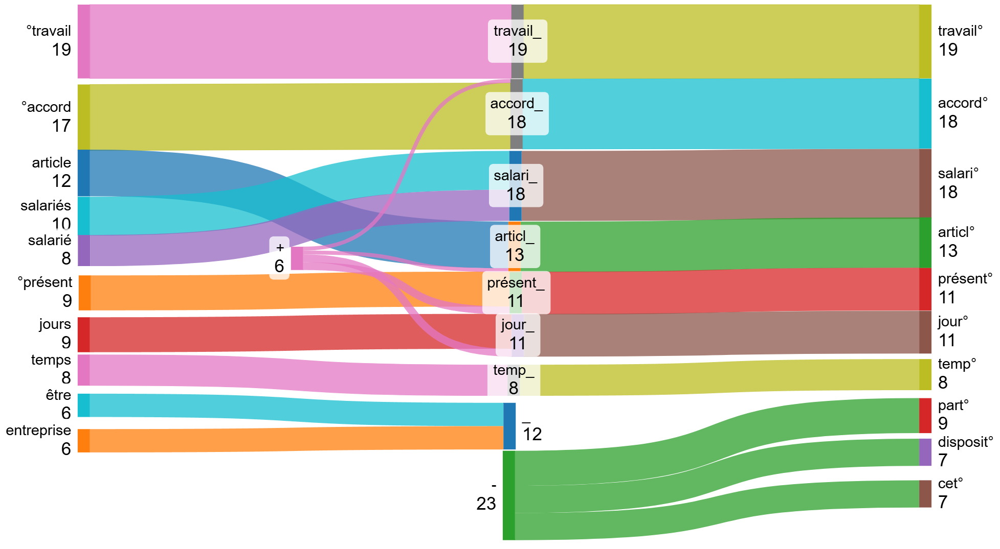

# L'analyse textuelle à la rescousse

## L'analyse textuelle : quezako ?!

::: {.callout-note title="Analyse textuelle" .fragment}
Ensemble des méthodes informatisées permettant de traiter le langage 
naturel
:::

::: {.callout-tip title="Exemples" .fragment}

📊 Analyse fréquentielle (bags of words, n-grams)

🧩 Analyse thématique (Latent Dirichlet Allocation, BERTopic)
 
📝 Extraction d’information structurée (RAG avec LLM)

…etc.

:::
 
## L'analyse textuelle : la problématique

:::{.fragment .center}
*On vous donne un corpus de textes/documents*
:::

 

:::{.fragment .center}
**Que faites-vous ?**
:::

 

:::{.fragment .center}
  
:::

## Première solution

:::{.fragment .center}
*Evident mais à rappeler*
:::

 

:::{.fragment .center}

:::

 

:::{.fragment .center}
  **Ouvrir quelques documents !**
:::
 

  
 

## L'analyse fréquentielle : compter les mots

:::{.fragment .center}
**Approche sac de mots (bags of word)**
:::

:::{.fragment .center}
{width=600px}
:::
  
## L'analyse fréquentielle : Bag of words

::: {.callout-note title="Bag of words" .fragment}
* On compte les mots
* **L'ordre n'est ici pas considéré dans un premier temps**
:::

::: {.callout-tip title="Applications" .fragment}
* Top 10 des mots les plus fréquents sur l'ensemble du corpus, sur un document (absolu, relatif)
* Nuage de mots
:::

::: {.callout-tip title="Complexité algorithmique" .fragment}
*Linéaire à la taille du document* : **O(n)**
:::

## L'analyse fréquentielle : Nuage de mots

:::{.center}
{width=800px}
:::

## L'analyse fréquentielle : prétraiter

* enlever les mots-vides (stopwords) 
	* articles (le, la, les, un, des, du, etc...)
	* pronoms (je, mon, ce, qui, on)
	* prépositions (à, de, dans)
	* conjonction (et, ou, mais)
	* adverbe (ne ... pas, ici, très, toujours)
* regrouper les mots en notions (lemmatisation, stemming)

## L'analyse fréquentielle : lemmatisation-stemming

🌱 stemming → racine 

📖 lemmatiser → forme grammaticale canonique ~ notion/concept

{width=800px}

## L'analyse fréquentielle : Compter en n-grams

::: {.callout-note title="Généralisation aux n-grams" .fragment}
* on peut compter les mots par deux, trois, quatre ... (n-grams)
* Locutions (avoir lieu, faire attention), expressions (il pleut des cordes, jeter l'éponge)
* [Collocations](https://www.tonitraduction.net/) (attitude courageuse, café allongé, café serré), mot composés (arc-en-ciel, intelligence artificielle, deep learning)
:::

::: {.callout-important title="Hypothèse relachée" .fragment}
* **L'ordre importe !**
:::

## L'analyse fréquentielle : application {.scrollable}

🎲 Tirage aléatoire de 1000 accords

| Statistiques / Top 10   ^[en milliers, arrondis à l'inférieur]                      | Nettoyage des Stopwords                                                                                                                                                                                                                                                         | Nettoyage des Stopwords + Stemming                                                                                                                                                                                                                                                | Nettoyage des Stopwords + Lemmatisation                                                                                                                                                                                                                                                         |
| --------------------------------------------- | ---------------------------------------------------------------------------------------------------------------------------------------------------------------------------------------------------------------------------------------------------------------- | ------------------------------------------------------------------------------------------------------------------------------------------------------------------------------------------------------------------------------------------------------- | ---------------------------------------------------------------------------------------------------------------------------------------------------------------------------------------------------------------------------------------------------------------- |
| **Nombre de mots dans le corpus**             | 2 439 | 2 439 | 2 439 |
| **Nombre de mots hors mots-vides**            | 1 214 | 1 214 | 1 214 |
| **Nombre de mots différents hors mots-vides** | 33 562 | 23 546 | 22 237
| **Top 10 des mots les plus fréquents**        | travail: 19 (1.60%) accord: 17 (1.45%) article: 12 (1.02%) salariés: 10 (0.84%) présent: 9 (0.79%) jours: 9 (0.75%) salarié: 8 (0.72%) temps: 8 (0.68%) être: 6 (0.57%) entreprise: 6 (0.53%) | travail: 19 (1.60%) salari: 19 (1.57%) accord: 18 (1.54%) articl: 13 (1.13%) jour: 11 (0.95%) présent: 11 (0.94%) part: 9 (0.80%) temp: 8 (0.68%) disposit: 7 (0.63%) cet: 7 (0.63%) | travail: 19 (1.63%) accord: 19 (1.57%) article: 14 (1.16%) salarié: 13 (1.11%) jour: 11 (0.96%) présent: 10 (0.84%) pouvoir: 9 (0.76%) temps: 8 (0.69%) entreprise: 7 (0.66%) être: 7 (0.60%) |

## L'analyse fréquentielle : effet Stemming

## L'analyse fréquentielle : Bigrams

::: {.panel-tabset}

### Bigrams bruts
{style="width: 800px; height: 400px;"}

### + Stem
{style="width: 800px; height: 400px;"}

### + Lem
{style="width: 800px; height: 400px;"}

### >Communs
{style="width: 800px; height: 400px;"}

:::

## L'analyse fréquentielle : Trigrams

::: {.panel-tabset}

### Trigrams bruts
{style="width: 800px; height: 400px;"}

### + Stem
{style="width: 800px; height: 400px;"}

### + Lem
{style="width: 800px; height: 400px;"}

### >Communs
{style="width: 800px; height: 400px;"}

:::

## L'analyse fréquentielle : thématique

:::{.fragment .center}
*Raisonnement précédent en population générale*
:::

:::{.fragment .center}
on vous fournit la métadonnée suivante : les thématiques (brutes et redressées)
:::

* télétravail : oui/non
* heures supplémentaire : oui/non
* CET : oui/non   ... et etc
	

**Si on se restreint à une thématique, est-ce que la distribution lexicale est similaire ?**

## L'analyse fréquentielle : heures supplémentaires - bigrams

Sur 1000 accords d'heures supplémentaires (label redressé) signés en 2024

## L'analyse fréquentielle : heures supplémentaires - trigrams

## L'analyse fréquentielle : heures supplémentaires - ngrams

📊 Pour chaque document → fréquence relative des ngrams (#n-grams/longueur du document) → moyenne

{width=800px}

## L'analyse fréquentielle : heures supplémentaires - classifieur

{width=850px}

$$\text{Classifieur}(w) = \mathbf{1}_{\{\text{fréquence_relative_bigram_hs}(w) \ge 0{,}002\}}$$

## L'analyse fréquentielle : matrice de confusion

Classifieur appliqué à un échantillon aléatoire de 1000

:::{.columns}

::: {.column width="60%"}

{width=500px}

:::

::: {.column width="40%"}

Exactitude/précision globale : 93%

Rappel : 89%

F-score : 94%

FP et FN parfois faux

:::

:::

## L'analyse fréquentielle : conclusion

:::{.fragment}
⚡ Possibilité de construire un classifieur rapide à partir des mots-clefs

🏆 Performance excellente, pour reproduire et remettre en question les thématiques déclarées

🌐 Généralisable aux autres thématiques, mais nécessite de décider des règles (n-grammes + seuils)

:::

:::{.fragment}
⁉️ *En creux, qu'est-ce qu'une thématique ????!!!*
:::

