# L'analyse textuelle à la rescousse

## L'analyse textuelle : quezako ?!

*  Ensemble des méthodes informatisées permettant de traiter le langage 
naturel
* Exemples :
	* Analyse fréquentielle (bags of word, n-grams)
	* Analyse thématique (Latent dirichlet allocation, BERTopic)
	* Extraction d’information structurée (RAG avec LLM)
	* Etc.
 
 
## L'analyse textuelle : la problématique

On vous donne un corpus de textes/documents 

* Que faites-vous ? 
  

## Première solution

Evident mais à rappeler : 

* Ouvrir quelques documents !
  
 

## L'analyse fréquentielle : compter les mots

* approche sac de mots (bags of word)
  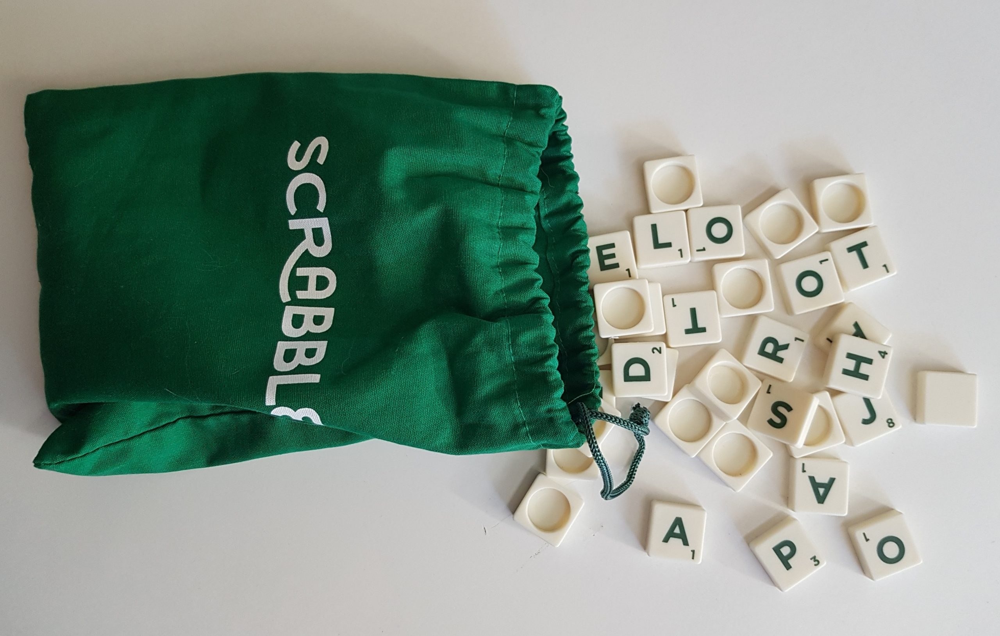{width=600px}
  
  
## L'analyse fréquentielle : Bag of words

* On compte les mots
* L'ordre n'est ici pas considéré dans un premier temps
* Top 10 des mots les plus fréquents sur l'ensemble du corpus, sur un document (absolu, relatif)
* Nuage de mots
* O(n)

## L'analyse fréquentielle : Nuage de mots

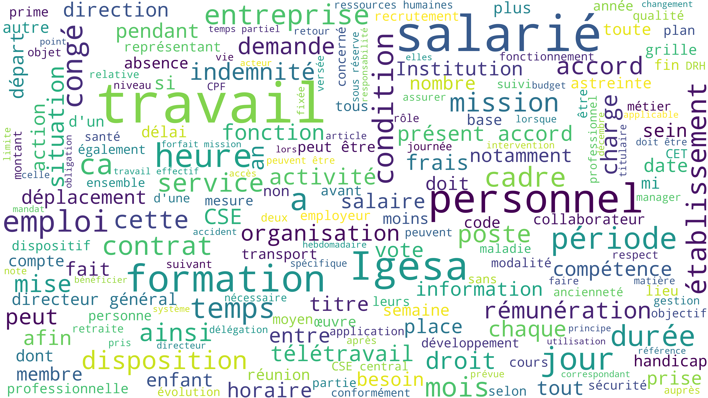

## L'analyse fréquentielle : prétraiter

* enlever les mots-vides (stopwords) 
	* articles (le, la, les, un, des, du, etc...)
	* pronoms (je, mon, ce, qui, on)
	* prépositions (à, de, dans)
	* conjonction (et, ou, mais)
	* adverbe (ne ... pas, ici, très, toujours)
* regrouper les mots en notions (lemmatisation, stemming)

## L'analyse fréquentielle : lemmatisation-stemming

🌱 stemming → racine 

📖 lemmatiser → forme grammaticale canonique ~ notion/concept

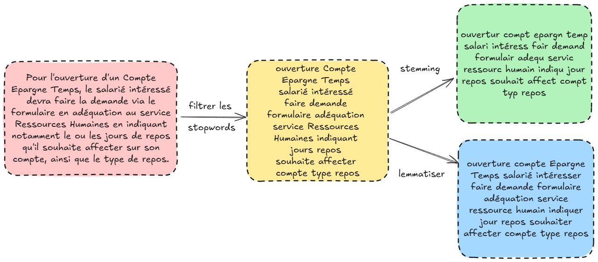{width=800px}

## L'analyse fréquentielle : Compter en n-grams

* on peut compter les mots par deux, trois, quatre ... (n-grams)
* Locutions (avoir lieu, faire attention), expressions (il pleut des cordes, jeter l'éponge)
* [Collocations](https://www.tonitraduction.net/) (attitude courageuse, café allongé, café serré), mot composés (arc-en-ciel, intelligence artificielle, deep learning)
* L'ordre importe !

## L'analyse fréquentielle : application {.scrollable}

🎲 Tirage aléatoire de 1000 accords

| Statistiques / Top 10                         | Nettoyage des Stopwords                                                                                                                                                                                                                                                         | Nettoyage des Stopwords + Stemming                                                                                                                                                                                                                                                | Nettoyage des Stopwords + Lemmatisation                                                                                                                                                                                                                                                         |
| --------------------------------------------- | ---------------------------------------------------------------------------------------------------------------------------------------------------------------------------------------------------------------------------------------------------------------- | ------------------------------------------------------------------------------------------------------------------------------------------------------------------------------------------------------------------------------------------------------- | ---------------------------------------------------------------------------------------------------------------------------------------------------------------------------------------------------------------------------------------------------------------- |
| **Nombre de mots dans le corpus**             | 2 439 791                                                                                                                                                                                                                                                        | 2 439 791                                                                                                                                                                                                                                               | 2 439 791                                                                                                                                                                                                                                                        |
| **Nombre de mots hors mots-vides**            | 1 214 943                                                                                                                                                                                                                                                        | 1 214 943                                                                                                                                                                                                                                               | 1 217 223                                                                                                                                                                                                                                                        |
| **Nombre de mots différents hors mots-vides** | 33 562                                                                                                                                                                                                                                                           | 23 546                                                                                                                                                                                                                                                  | 22 237                                                                                                                                                                                                                                                           |
| **Top 10 des mots les plus fréquents**        | travail: 19 491 (1.60%) accord: 17 573 (1.45%) article: 12 360 (1.02%) salariés: 10 162 (0.84%) présent: 9 657 (0.79%) jours: 9 121 (0.75%) salarié: 8 720 (0.72%) temps: 8 304 (0.68%) être: 6 903 (0.57%) entreprise: 6 392 (0.53%) | travail: 19 494 (1.60%) salari: 19 076 (1.57%) accord: 18 674 (1.54%) articl: 13 776 (1.13%) jour: 11 529 (0.95%) présent: 11 426 (0.94%) part: 9 685 (0.80%) temp: 8 305 (0.68%) disposit: 7 688 (0.63%) cet: 7 643 (0.63%) | travail: 19 830 (1.63%) accord: 19 084 (1.57%) article: 14 123 (1.16%) salarié: 13 570 (1.11%) jour: 11 683 (0.96%) présent: 10 172 (0.84%) pouvoir: 9 247 (0.76%) temps: 8 457 (0.69%) entreprise: 7 980 (0.66%) être: 7 277 (0.60%) |

## L'analyse fréquentielle : application bigrams

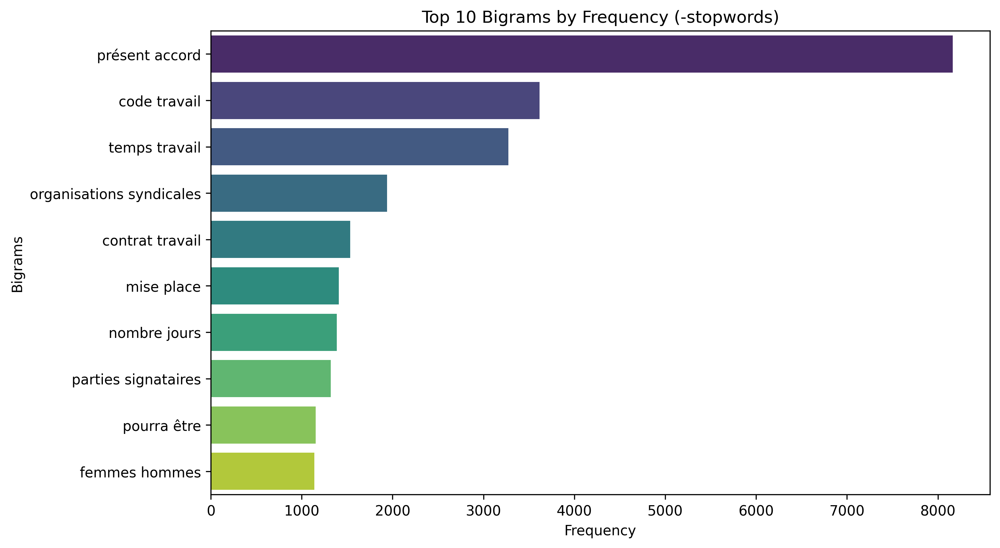{.fragment  style="position:absolute; top:0; left:0; object-fit:contain;"}

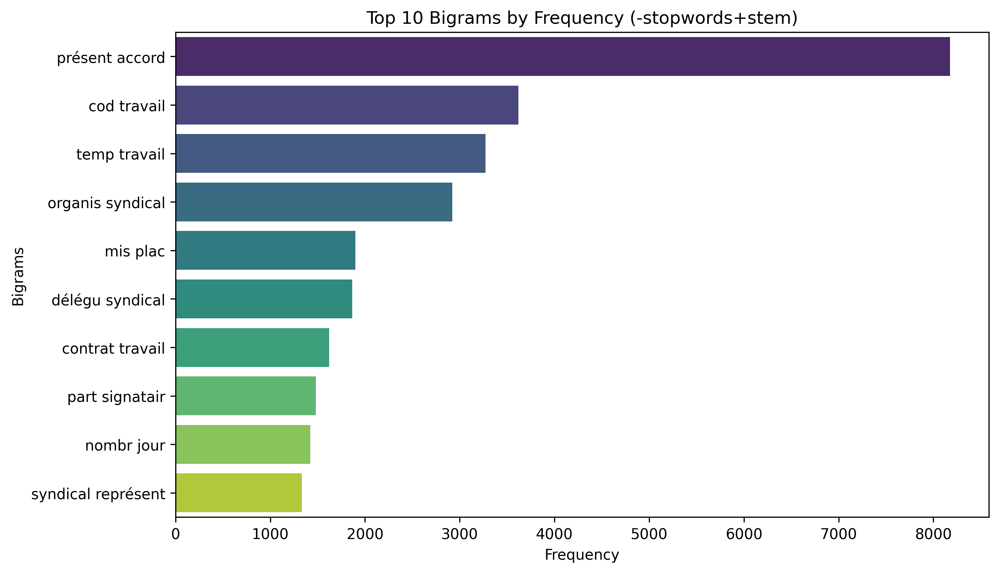{.fragment  style="position:absolute; top:0; left:0; object-fit:contain;"}

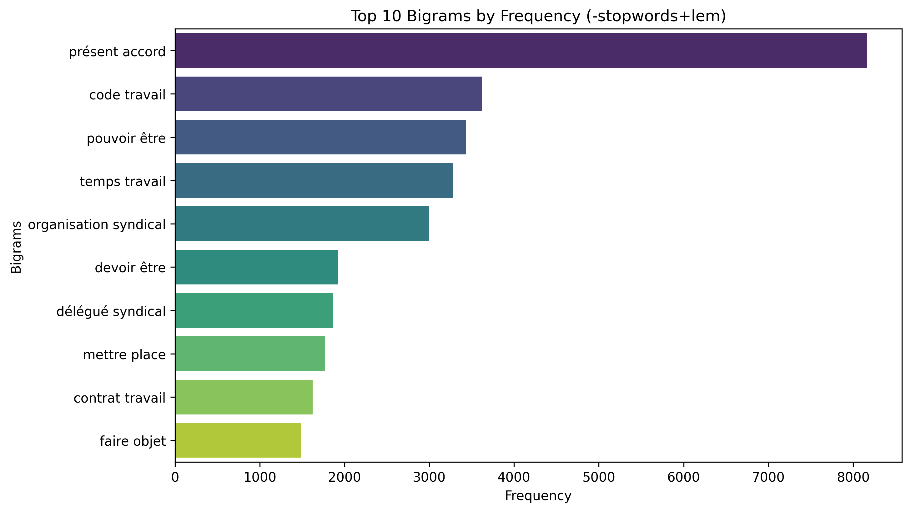{.fragment  style="position:absolute; top:0; left:0;  object-fit:contain;"}

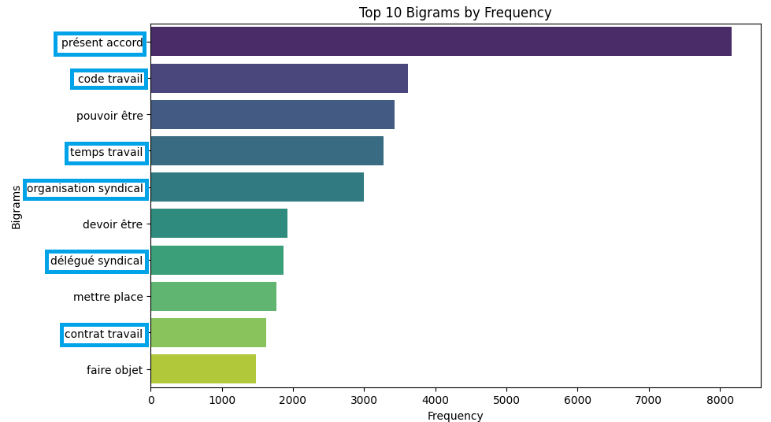{.fragment  style="position:absolute; top:0; left:0;  object-fit:contain;"}

## L'analyse fréquentielle : application trigrams

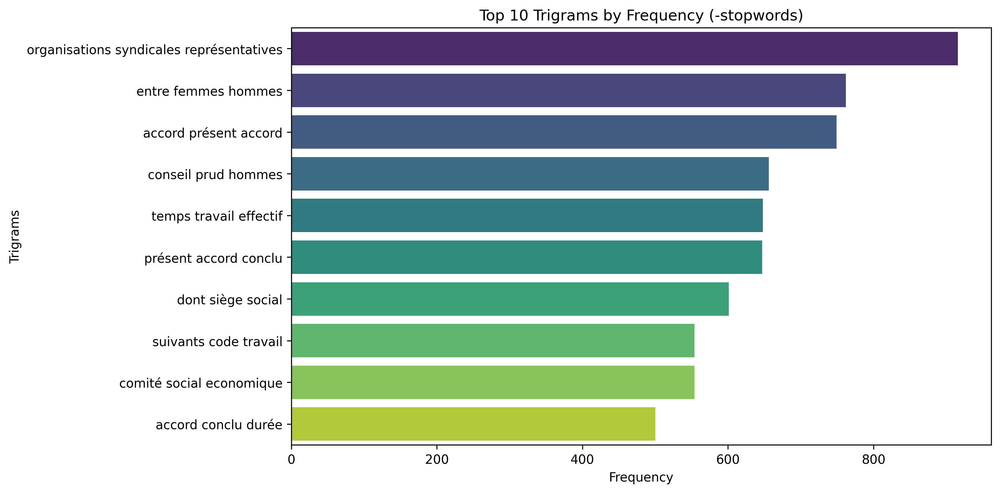{.fragment  style="position:absolute; top:0; left:0; object-fit:contain;"}

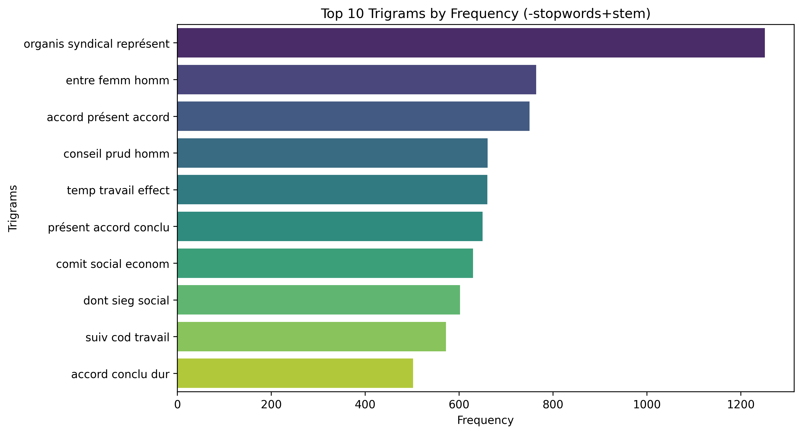{.fragment  style="position:absolute; top:0; left:0; object-fit:contain;"}

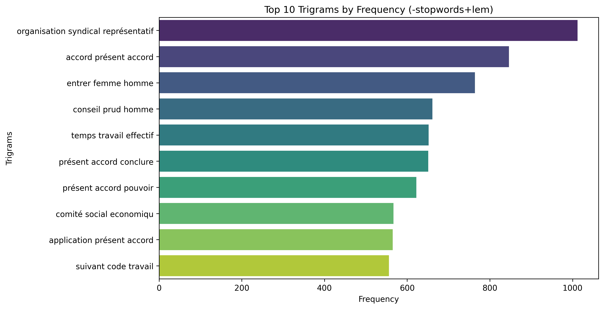{.fragment  style="position:absolute; top:0; left:0;  object-fit:contain;"}

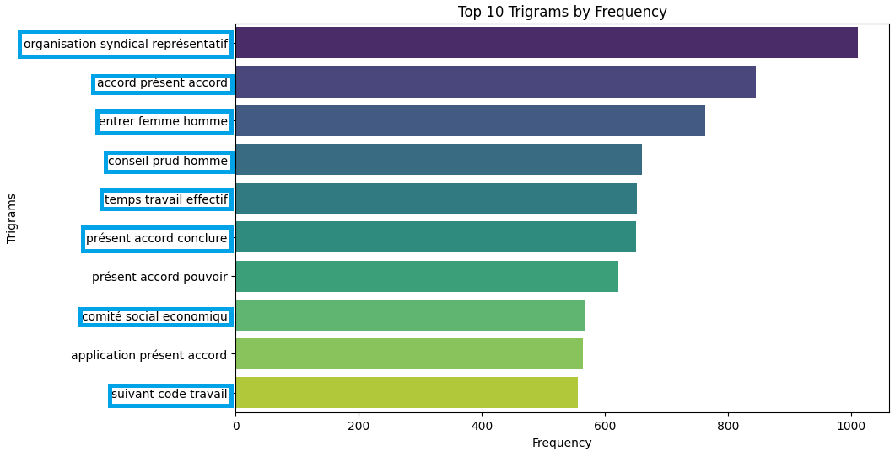{.fragment  style="position:absolute; top:0; left:0;  object-fit:contain;"}

## L'analyse fréquentielle : accord thématique

* Raisonnement précédent en population générale
* on vous fournit la métadonnée suivante : les thématiques (brutes et redressées)
* télétravail : oui/non
* heures supplémentaire : oui/non
* CET : oui/non   ... et etc
* **Si on se restreint à une thématique, est-ce que la distribution lexicale est similaire ?**

## L'analyse fréquentielle : heures supplémentaires - bigrams

Sur 1000 accords d'heures supplémentaires (label redressé) signés en 2024

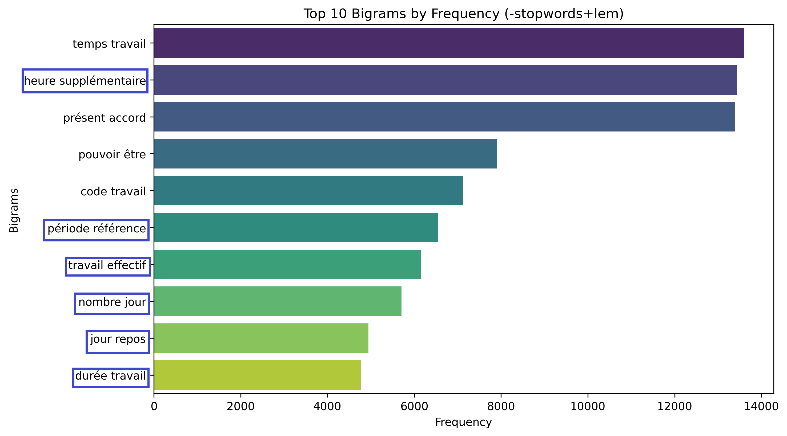

## L'analyse fréquentielle : heures supplémentaires - trigrams

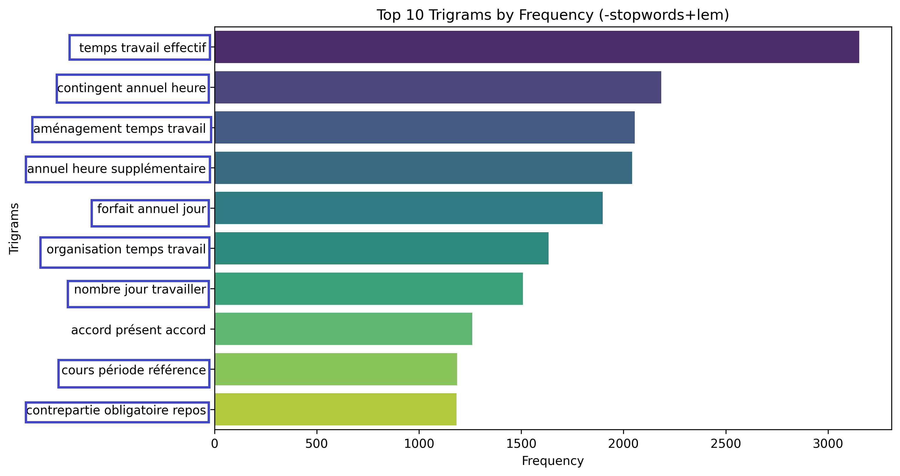

## L'analyse fréquentielle : heures supplémentaires - ngrams

📊 Pour chaque document > fréquence relative des ngrams (#n-grams/longueur du document) > moyenne

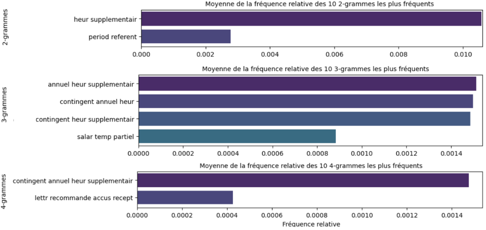{width=800px}

## L'analyse fréquentielle : heures supplémentaires - classifieur

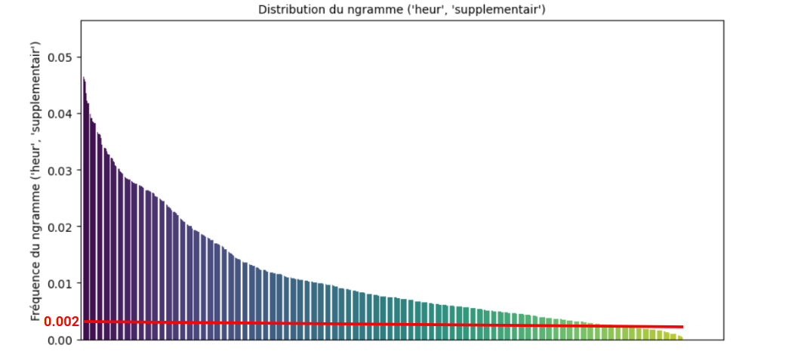{width=900px}

$$
\text{Classifieur}(w) = \mathbf{1}_{\{\text{fréquence_relative_bigram_hs}(w) \ge 0{,}002\}}
$$

## L'analyse fréquentielle : heures supplémentaires - matrice de confusion

Classifieur appliqué à un échantillon aléatoire de 1000

:::{.columns}

::: {.column width="60%"}

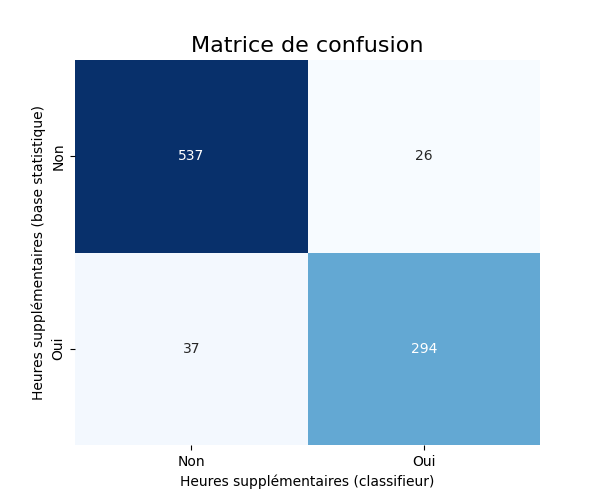{width=500px}

:::

::: {.column width="40%"}

Exactitude/précision globale : 93%

Rappel : 89%

F-score : 94%

FP et FN parfois faux

:::

:::

## L'analyse fréquentielle : conclusion

⚡ Possibilité de construire un classifieur rapide à partir des mots-clefs

🏆 Performance excellente, pour reproduire et remettre en question les thématiques déclarées

🌐 Généralisable aux autres thématiques, mais nécessite de décider des règles (n-grammes + seuils)

⁉️ En creux, qu'est-ce qu'une thématique ????!!!

