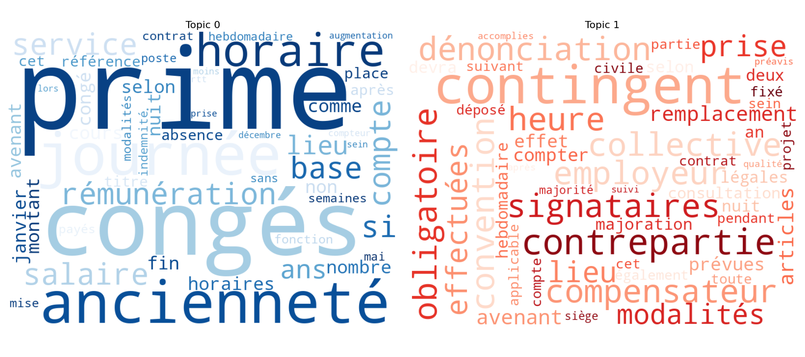
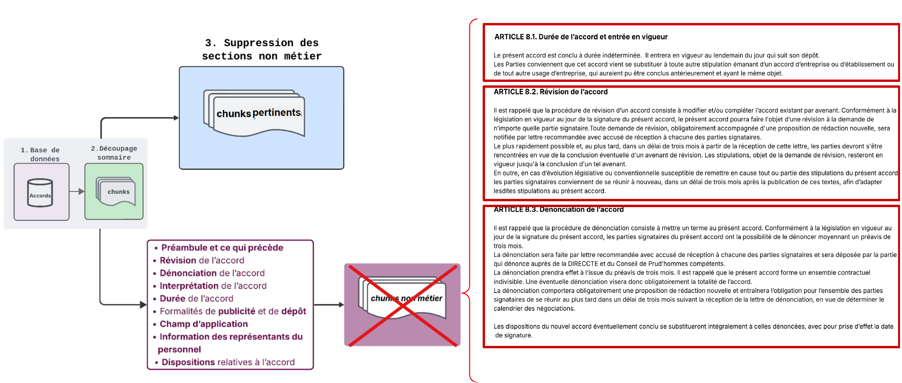
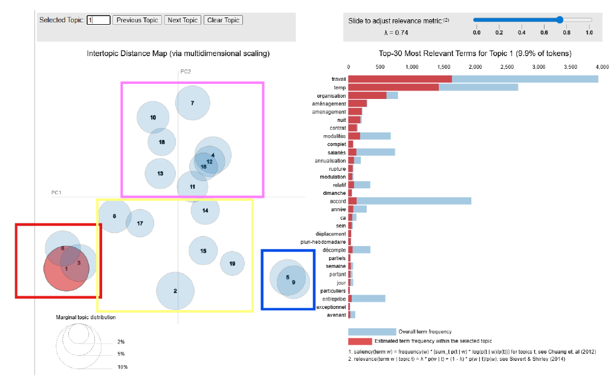
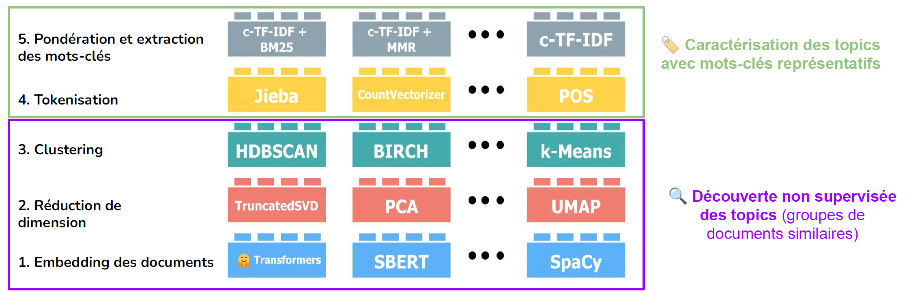
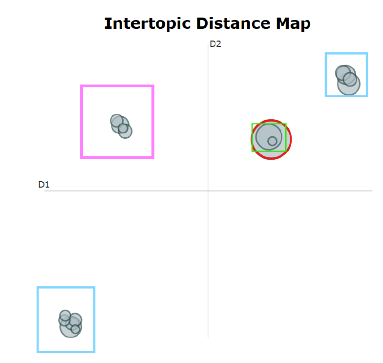

# La modélisation thématique

## La modélisation thématique : quezako ?!

::: {.fragment .center}
*Aussi connu sous le nom de topic modeling*
:::

::: {.fragment .center} 
Permet de trouver des thématiques latentes
:::
 
:::{.fragment .center}
{width=900px}
:::

## La modélisation thématique 

::: {.callout-note title="Principes généraux" .fragment}
1. **Un document est composé de mots**  
2. **Les mots ne sont pas choisis au hasard**  
3. **Certains mots sont des marqueurs de sujets (topic)**
:::

::: {.callout-important title="Hypothèse centrale" .fragment}
Un document est un **mélange de sujets** et chaque sujet est caractérisé par une **distribution particulière de mots**.
:::

::: {.callout-tip title="Objectif" .fragment}
Découvrir / construire les sujets en observant les distributions des mots, tant au niveau du **corpus** que des **documents individuels**.
:::


## La modélisation thématique : deux applications

::: {.callout-note title="Deux applications" .fragment}
1. *En population générale* : **retrouve t'on les thématiques déclarées/redressées ?** (classification)
2. *En population restreinte à une thématique* : **quels sont les sujets usuels traités ?** (caractérisation en sous-classes)
:::

::: {.callout-tip title="Bonus" .fragment}
Pour un accord donné, quels sont les sujets traités ? (classification multiples en sous-classes)
:::


## Latent Dirichlet Allocation (LDA)

::: {.callout-note title="Latent Dirichlet Allocation" .fragment}
* Mécanisme de génération de documents, en se donnant des topics et leur distribution textuelle
* "Problème dual" : à document généré, deviner les topics qui ont servi, en se donnant un nombre k de topics
	* par approximation computationnelle
:::


## LDA : structure générative

1. Choisir le nombre de mots à générer pour le document (N)
2. Choisir la distribution des sujets pour un document selon une distribution de Dirichlet. ($\theta$)
3. Pour chaque mot du document :
   - Sélectionner un sujet selon la distribution de sujets du document.
   - Sélectionner un mot selon la distribution de mots associée à ce sujet.

## Exemple

Soit deux sujets et leur distribution :

:::: {.columns}

::: {.column width="52%" .fragment}

| Mot | Rép. | % |
|-----|------|----|
| CET | ███████ | 50 % |
| Compte | ██ | 16 % |
| Épargne | ██ | 16 % |
| Temps | ██ | 16 % |

:::

::: {.column width="48%"  .fragment}

| Mot | Rép. | % |
|-----|------|----|
| Télétravail | ██████████ | 70 % |
| Droit | ██ | 15 % |
| Déconnexion | ██ | 15 % |

:::

::::


## Exemple : Génération de 2 mots (N=2)

:::{.fragment}
<table>
  <thead>
    <tr>
      <th>Sujet</th>
      <th>Répartition</th>
      <th>%</th>
    </tr>
  </thead>
  <tbody>
    <tr class="highlight">
      <td>Sujet 1</td>
      <td>███████████</td>
      <td>75%</td>
    </tr>
    <tr >
      <td>Sujet 2</td>
      <td>███</td>
      <td>25%</td>
    </tr>
  </tbody>
</table>
:::

:::{.fragment}
<p>Pour le premier mot :</p>

<table>
  <thead>
    <tr>
      <th>Mot</th>
      <th>Rép.</th>
      <th>%</th>
    </tr>
  </thead>
  <tbody>
    <tr class="highlight">
      <td>CET</td>
      <td>███████</td>
      <td>50%</td>
    </tr>
    <tr >
      <td>Compte</td>
      <td>██</td>
      <td>16%</td>
    </tr>
    <tr >
      <td>Épargne</td>
      <td>██</td>
      <td>16%</td>
    </tr>
    <tr>
      <td>Temps</td>
      <td>██</td>
      <td>16%</td>
    </tr>
  </tbody>
</table>
:::

## Exemple : Génération de 2 mots (N=2)


:::{.fragment}
<table>
  <thead>
    <tr>
      <th>Sujet</th>
      <th>Répartition</th>
      <th>%</th>
    </tr>
  </thead>
  <tbody>
    <tr>
      <td>Sujet 1</td>
      <td>███████████</td>
      <td>75%</td>
    </tr>
    <tr class="highlight">
      <td>Sujet 2</td>
      <td>███</td>
      <td>25%</td>
    </tr>
  </tbody>
</table>
:::

:::{.fragment}
Pour le deuxième mot :

<table>
  <thead>
    <tr>
      <th>Mot</th>
      <th>Rép.</th>
      <th>%</th>
    </tr>
  </thead>
  <tbody>
    <tr class="highlight">
      <td>Télétravail</td>
      <td>██████████</td>
      <td>70%</td>
    </tr>
    <tr>
      <td>Droit</td>
      <td>██</td>
      <td>15%</td>
    </tr>
    <tr>
      <td>Déconnexion</td>
      <td>██</td>
      <td>15%</td>
    </tr>
  </tbody>
</table>

:::


## LDA : découverte de topics 

::: {.callout-note title="Hypothèses" .fragment}
1. *a posteriori*, les documents sont supposés générés par la méthode précédente
2. un nombre de sujets à définir (**hp. K**)
:::


::: {.callout-note title="Gibbs-Sampling" .fragment}
1. Initialiser aléatoirement une attribution de sujets aux mots du corpus (**N**=*#total*).
2. Mettre à jour ces attributions en fonction de la probabilité conditionnelle d'un mot appartenant à un sujet donné, basée sur les occurrences dans le corpus. (*)
3. Répéter l’opération jusqu’à convergence (**hp. I nombre d'itérations**).
:::
	
::: {.callout-tip title="Complexité algorithmique" .fragment}
  fonction des hyperparamètres : O(I\*N\*K)   → arbitrage I et K
:::


## Problèmes LDA

* coût computationnel :
	* sur corpus volumineux → échantillon
	* sur document long (N) → (N)ettoyer
* choix de l'hyperparamètre K (nombre de topics)
* choix de l'hyperparamètre I (nombre d'itérations)


## Solutions LDA

::: {.callout-tip title="Nettoyage" .fragment}
1. Enlever les parties non pertinentes du document (préambule) ← utilisation d'une modèle de production de sommaire
2. Enlever les mots rares (présent dans moins de X documents) et les mots trop présents (présent dans Y% des documents)
:::

::: {.callout-tip title="Choix de K" .fragment}
1. Grid search avec maximisation de la cohérence intra-topic
2. A dire d'experts
:::

::: {.callout-tip title="Choix de I" .fragment}
Grand si possible pour assurer la convergence de Gibbs-Sampling
:::

## Nettoyage LDA




## Méthode LDA appliqué aux accords

1. Utilisation d’un modèle d’extraction de sommaire (Memsum)
2. Nettoyage des articles génériques
3. Extraction des articles restants (= documents)
4. Application d’une méthode d’analyse thématique


## Visualisation LDA

<iframe src="anim/lda_vis.html" width="100%" height="100%"></iframe>

## Visualisation LDA


:::{.columns}

::: {.column width="70%"}
{width=700px}
:::

::: {.column width="30%"}
* <span style="color:#FF69B4">en rose</span> : congés et rémunération
* <span style="color:#f4ff2b">en jaune</span> : *bruit*
* <span style="color:#FF0000">en rouge</span> : temps et conditions de travail
* <span style="color:#1E90FF">en bleu</span> : heures supplémentaires
:::

:::


## BERTopic

::: {.callout-note title="Fonctionnement" .fragment}
* Même principe que le LDA
* Sauf qu'on lache la partie probabiliste pour des embeddings sémantiques
* Librairie framework avec plusieurs modules
:::

::: {.callout-tip title="Avantages" .fragment}
* Davantage de flexibilité
* Comprend le contexte, les synonymes (vs LDA qui comptent les mots)
:::

## Principe de BERTopic



Méthodologie en deux temps :

1. Projeter/Réduire/Regrouper **les documents**
2. Caractériser **les documents** *avec des mots*

## Embedding - représentation vectorielle numérique

- On peut plonger les mots dans un espace vectoriel sémantique <sup style="font-size:0.7em;color:gray">qui permet de mesurer les synonymes/antonymes</sup> 
- Vecteur fixe <sup style="font-size:0.7em;color:gray">1 mot = 1 vecteur</sup> ou vecteur contextuel <sup style="font-size:0.7em;color:gray">1 mot + son contexte = 1 vecteur</sup>  
- Représentation vectorielle d'un document <sup style="font-size:0.7em;color:gray">moyenne/médiane de ses vecteurs, sentence transformers</sup>  
- Dimension de 384 et plus de 1024 

## Réduire la dimension et clustering

::: {.callout-note title="Réduction de dimension ?" .fragment}
* Débruitage, dimensions peu informatives ou redondantes
* TruncatedSVD, PCA, UMAP (projection)
:::

::: {.callout-note title="Clustering" .fragment}
* HDBSCAN
* k-Means
* etc.
:::

## Tokeniser et caractériser

::: {.callout-note title="Tokeniser" .fragment}
* Méthodes de preprocessing vues au chapitre précédent (CountVectorizer=ngrams)
* POS (Part Of Speech tagging)
* Jieba (Tokenisation du chinois)
:::

::: {.callout-note title="Caractériser" .fragment}
* **TF-IDF** : mesure l’importance d’un mot dans un document, en augmentant son poids s’il est fréquent dans ce document et en le diminuant s’il est fréquent dans l’ensemble du corpus.
* **c-TF-IDF** : mesure l’importance d’un mot dans un **cluster** (assimilé à un document), en augmentant son poids s’il est fréquent dans ce cluster et en le diminuant s’il est fréquent dans les autres clusters ; il permet d’identifier les mots distinctifs d’un topic.
:::


## Résultats BERTopic

<div id="myPlot" style="width:100%;height:600px;"></div>

```{=html}
<script src="https://cdn.plot.ly/plotly-3.4.0.min.js" charset="utf-8"></script>
<script>
const data = [{"customdata":[[0,"heure | supplémentaire | jour | repos | congé",2282],[1,"rémunération | absence | salarié | période | heure",969],[2,"article | jour | forfait | titre | chapitre",714],[3,"horaire | travail | jour | temps | salarié",660],[4,"accord | révision | présent | party | dénonciation",512],[5,"temps | pause | effectif | travail | vaquer",425],[6,"exemplaire | accord | dépôt | déposer | prud",321],[7,"temps | article | amenagement | aménagement | travail",267],[8,"vigueur | accord | conclure | indéterminé | durée",260],[9,"télétravail | déconnexion | outil | droit | professionnel",247],[10,"charge | entretien | salarié | travail | vie",244],[11,"durée | maximal | travail | hebdomadaire | heure",230],[12,"accord | travail | société | présent | temps",176],[13,"part | société | représenter | social | siège",165],[14,"organisation | temps | travail | article | modalité",129],[15,"complémentaire | heure | durée | contractuel | tiers",115],[16,"convention | forfaire | individuel | forfait | jour",112]],"hovertemplate":"\u003cb\u003eTopic %{customdata[0]}\u003c\u002fb\u003e\u003cbr\u003e%{customdata[1]}\u003cbr\u003eSize: %{customdata[2]}","legendgroup":"","marker":{"color":"#B0BEC5","size":{"dtype":"i2","bdata":"6gjJA8oClAIAAqkBQQELAQQB9wD0AOYAsAClAIEAcwBwAA=="},"sizemode":"area","sizeref":1.42625,"symbol":"circle","line":{"color":"DarkSlateGrey","width":2}},"mode":"markers","name":"","orientation":"v","showlegend":false,"x":{"dtype":"f4","bdata":"iFDkQKGt3UDmK29Bp3tPwbV+akFvFwDBE9JlQT3M78Dk8HBBScpMweGNSME\u002fYAXB8G9ZwUpCWMGjZffAFcvoQE0NSME="},"xaxis":"x","y":{"dtype":"f4","bdata":"KnElQa3EKEGWgmxBao6UwFlFeEHKGzhBp3t6QT3pL0F9anJBBI2MwKHigsB9Vj1BL9iDwItlcMDNvjNBsTMjQWuMmsA="},"yaxis":"y","type":"scatter"}]
const layout = {"template":{"data":{"barpolar":[{"marker":{"line":{"color":"white","width":0.5},"pattern":{"fillmode":"overlay","size":10,"solidity":0.2}},"type":"barpolar"}],"bar":[{"error_x":{"color":"rgb(36,36,36)"},"error_y":{"color":"rgb(36,36,36)"},"marker":{"line":{"color":"white","width":0.5},"pattern":{"fillmode":"overlay","size":10,"solidity":0.2}},"type":"bar"}],"carpet":[{"aaxis":{"endlinecolor":"rgb(36,36,36)","gridcolor":"white","linecolor":"white","minorgridcolor":"white","startlinecolor":"rgb(36,36,36)"},"baxis":{"endlinecolor":"rgb(36,36,36)","gridcolor":"white","linecolor":"white","minorgridcolor":"white","startlinecolor":"rgb(36,36,36)"},"type":"carpet"}],"choropleth":[{"colorbar":{"outlinewidth":1,"tickcolor":"rgb(36,36,36)","ticks":"outside"},"type":"choropleth"}],"contourcarpet":[{"colorbar":{"outlinewidth":1,"tickcolor":"rgb(36,36,36)","ticks":"outside"},"type":"contourcarpet"}],"contour":[{"colorbar":{"outlinewidth":1,"tickcolor":"rgb(36,36,36)","ticks":"outside"},"colorscale":[[0.0,"#440154"],[0.1111111111111111,"#482878"],[0.2222222222222222,"#3e4989"],[0.3333333333333333,"#31688e"],[0.4444444444444444,"#26828e"],[0.5555555555555556,"#1f9e89"],[0.6666666666666666,"#35b779"],[0.7777777777777778,"#6ece58"],[0.8888888888888888,"#b5de2b"],[1.0,"#fde725"]],"type":"contour"}],"heatmap":[{"colorbar":{"outlinewidth":1,"tickcolor":"rgb(36,36,36)","ticks":"outside"},"colorscale":[[0.0,"#440154"],[0.1111111111111111,"#482878"],[0.2222222222222222,"#3e4989"],[0.3333333333333333,"#31688e"],[0.4444444444444444,"#26828e"],[0.5555555555555556,"#1f9e89"],[0.6666666666666666,"#35b779"],[0.7777777777777778,"#6ece58"],[0.8888888888888888,"#b5de2b"],[1.0,"#fde725"]],"type":"heatmap"}],"histogram2dcontour":[{"colorbar":{"outlinewidth":1,"tickcolor":"rgb(36,36,36)","ticks":"outside"},"colorscale":[[0.0,"#440154"],[0.1111111111111111,"#482878"],[0.2222222222222222,"#3e4989"],[0.3333333333333333,"#31688e"],[0.4444444444444444,"#26828e"],[0.5555555555555556,"#1f9e89"],[0.6666666666666666,"#35b779"],[0.7777777777777778,"#6ece58"],[0.8888888888888888,"#b5de2b"],[1.0,"#fde725"]],"type":"histogram2dcontour"}],"histogram2d":[{"colorbar":{"outlinewidth":1,"tickcolor":"rgb(36,36,36)","ticks":"outside"},"colorscale":[[0.0,"#440154"],[0.1111111111111111,"#482878"],[0.2222222222222222,"#3e4989"],[0.3333333333333333,"#31688e"],[0.4444444444444444,"#26828e"],[0.5555555555555556,"#1f9e89"],[0.6666666666666666,"#35b779"],[0.7777777777777778,"#6ece58"],[0.8888888888888888,"#b5de2b"],[1.0,"#fde725"]],"type":"histogram2d"}],"histogram":[{"marker":{"line":{"color":"white","width":0.6}},"type":"histogram"}],"mesh3d":[{"colorbar":{"outlinewidth":1,"tickcolor":"rgb(36,36,36)","ticks":"outside"},"type":"mesh3d"}],"parcoords":[{"line":{"colorbar":{"outlinewidth":1,"tickcolor":"rgb(36,36,36)","ticks":"outside"}},"type":"parcoords"}],"pie":[{"automargin":true,"type":"pie"}],"scatter3d":[{"line":{"colorbar":{"outlinewidth":1,"tickcolor":"rgb(36,36,36)","ticks":"outside"}},"marker":{"colorbar":{"outlinewidth":1,"tickcolor":"rgb(36,36,36)","ticks":"outside"}},"type":"scatter3d"}],"scattercarpet":[{"marker":{"colorbar":{"outlinewidth":1,"tickcolor":"rgb(36,36,36)","ticks":"outside"}},"type":"scattercarpet"}],"scattergeo":[{"marker":{"colorbar":{"outlinewidth":1,"tickcolor":"rgb(36,36,36)","ticks":"outside"}},"type":"scattergeo"}],"scattergl":[{"marker":{"colorbar":{"outlinewidth":1,"tickcolor":"rgb(36,36,36)","ticks":"outside"}},"type":"scattergl"}],"scattermapbox":[{"marker":{"colorbar":{"outlinewidth":1,"tickcolor":"rgb(36,36,36)","ticks":"outside"}},"type":"scattermapbox"}],"scattermap":[{"marker":{"colorbar":{"outlinewidth":1,"tickcolor":"rgb(36,36,36)","ticks":"outside"}},"type":"scattermap"}],"scatterpolargl":[{"marker":{"colorbar":{"outlinewidth":1,"tickcolor":"rgb(36,36,36)","ticks":"outside"}},"type":"scatterpolargl"}],"scatterpolar":[{"marker":{"colorbar":{"outlinewidth":1,"tickcolor":"rgb(36,36,36)","ticks":"outside"}},"type":"scatterpolar"}],"scatter":[{"fillpattern":{"fillmode":"overlay","size":10,"solidity":0.2},"type":"scatter"}],"scatterternary":[{"marker":{"colorbar":{"outlinewidth":1,"tickcolor":"rgb(36,36,36)","ticks":"outside"}},"type":"scatterternary"}],"surface":[{"colorbar":{"outlinewidth":1,"tickcolor":"rgb(36,36,36)","ticks":"outside"},"colorscale":[[0.0,"#440154"],[0.1111111111111111,"#482878"],[0.2222222222222222,"#3e4989"],[0.3333333333333333,"#31688e"],[0.4444444444444444,"#26828e"],[0.5555555555555556,"#1f9e89"],[0.6666666666666666,"#35b779"],[0.7777777777777778,"#6ece58"],[0.8888888888888888,"#b5de2b"],[1.0,"#fde725"]],"type":"surface"}],"table":[{"cells":{"fill":{"color":"rgb(237,237,237)"},"line":{"color":"white"}},"header":{"fill":{"color":"rgb(217,217,217)"},"line":{"color":"white"}},"type":"table"}]},"layout":{"annotationdefaults":{"arrowhead":0,"arrowwidth":1},"autotypenumbers":"strict","coloraxis":{"colorbar":{"outlinewidth":1,"tickcolor":"rgb(36,36,36)","ticks":"outside"}},"colorscale":{"diverging":[[0.0,"rgb(103,0,31)"],[0.1,"rgb(178,24,43)"],[0.2,"rgb(214,96,77)"],[0.3,"rgb(244,165,130)"],[0.4,"rgb(253,219,199)"],[0.5,"rgb(247,247,247)"],[0.6,"rgb(209,229,240)"],[0.7,"rgb(146,197,222)"],[0.8,"rgb(67,147,195)"],[0.9,"rgb(33,102,172)"],[1.0,"rgb(5,48,97)"]],"sequential":[[0.0,"#440154"],[0.1111111111111111,"#482878"],[0.2222222222222222,"#3e4989"],[0.3333333333333333,"#31688e"],[0.4444444444444444,"#26828e"],[0.5555555555555556,"#1f9e89"],[0.6666666666666666,"#35b779"],[0.7777777777777778,"#6ece58"],[0.8888888888888888,"#b5de2b"],[1.0,"#fde725"]],"sequentialminus":[[0.0,"#440154"],[0.1111111111111111,"#482878"],[0.2222222222222222,"#3e4989"],[0.3333333333333333,"#31688e"],[0.4444444444444444,"#26828e"],[0.5555555555555556,"#1f9e89"],[0.6666666666666666,"#35b779"],[0.7777777777777778,"#6ece58"],[0.8888888888888888,"#b5de2b"],[1.0,"#fde725"]]},"colorway":["#1F77B4","#FF7F0E","#2CA02C","#D62728","#9467BD","#8C564B","#E377C2","#7F7F7F","#BCBD22","#17BECF"],"font":{"color":"rgb(36,36,36)"},"geo":{"bgcolor":"white","lakecolor":"white","landcolor":"white","showlakes":true,"showland":true,"subunitcolor":"white"},"hoverlabel":{"align":"left"},"hovermode":"closest","mapbox":{"style":"light"},"paper_bgcolor":"white","plot_bgcolor":"white","polar":{"angularaxis":{"gridcolor":"rgb(232,232,232)","linecolor":"rgb(36,36,36)","showgrid":false,"showline":true,"ticks":"outside"},"bgcolor":"white","radialaxis":{"gridcolor":"rgb(232,232,232)","linecolor":"rgb(36,36,36)","showgrid":false,"showline":true,"ticks":"outside"}},"scene":{"xaxis":{"backgroundcolor":"white","gridcolor":"rgb(232,232,232)","gridwidth":2,"linecolor":"rgb(36,36,36)","showbackground":true,"showgrid":false,"showline":true,"ticks":"outside","zeroline":false,"zerolinecolor":"rgb(36,36,36)"},"yaxis":{"backgroundcolor":"white","gridcolor":"rgb(232,232,232)","gridwidth":2,"linecolor":"rgb(36,36,36)","showbackground":true,"showgrid":false,"showline":true,"ticks":"outside","zeroline":false,"zerolinecolor":"rgb(36,36,36)"},"zaxis":{"backgroundcolor":"white","gridcolor":"rgb(232,232,232)","gridwidth":2,"linecolor":"rgb(36,36,36)","showbackground":true,"showgrid":false,"showline":true,"ticks":"outside","zeroline":false,"zerolinecolor":"rgb(36,36,36)"}},"shapedefaults":{"fillcolor":"black","line":{"width":0},"opacity":0.3},"ternary":{"aaxis":{"gridcolor":"rgb(232,232,232)","linecolor":"rgb(36,36,36)","showgrid":false,"showline":true,"ticks":"outside"},"baxis":{"gridcolor":"rgb(232,232,232)","linecolor":"rgb(36,36,36)","showgrid":false,"showline":true,"ticks":"outside"},"bgcolor":"white","caxis":{"gridcolor":"rgb(232,232,232)","linecolor":"rgb(36,36,36)","showgrid":false,"showline":true,"ticks":"outside"}},"title":{"x":0.05},"xaxis":{"automargin":true,"gridcolor":"rgb(232,232,232)","linecolor":"rgb(36,36,36)","showgrid":false,"showline":true,"ticks":"outside","title":{"standoff":15},"zeroline":false,"zerolinecolor":"rgb(36,36,36)"},"yaxis":{"automargin":true,"gridcolor":"rgb(232,232,232)","linecolor":"rgb(36,36,36)","showgrid":false,"showline":true,"ticks":"outside","title":{"standoff":15},"zeroline":false,"zerolinecolor":"rgb(36,36,36)"}}},"xaxis":{"anchor":"y","domain":[0.0,1.0],"title":{"text":""},"visible":false,"range":[-15.628302764892577,17.31763286590576]},"yaxis":{"anchor":"x","domain":[0.0,1.0],"title":{"text":""},"visible":false,"range":[-5.554086995124817,18.003466844558716]},"legend":{"tracegroupgap":0,"itemsizing":"constant"},"margin":{"t":60},"title":{"font":{"size":22,"color":"Black"},"text":"\u003cb\u003eIntertopic Distance Map\u003c\u002fb\u003e","y":0.95,"x":0.5,"xanchor":"center","yanchor":"top"},"hoverlabel":{"font":{"size":16,"family":"Rockwell"},"bgcolor":"white"},"width":650,"height":650,"sliders":[{"active":0,"pad":{"t":50},"steps":[{"args":[{"marker.color":[["red","#B0BEC5","#B0BEC5","#B0BEC5","#B0BEC5","#B0BEC5","#B0BEC5","#B0BEC5","#B0BEC5","#B0BEC5","#B0BEC5","#B0BEC5","#B0BEC5","#B0BEC5","#B0BEC5","#B0BEC5","#B0BEC5"]]}],"label":"Topic 0","method":"update"},{"args":[{"marker.color":[["#B0BEC5","red","#B0BEC5","#B0BEC5","#B0BEC5","#B0BEC5","#B0BEC5","#B0BEC5","#B0BEC5","#B0BEC5","#B0BEC5","#B0BEC5","#B0BEC5","#B0BEC5","#B0BEC5","#B0BEC5","#B0BEC5"]]}],"label":"Topic 1","method":"update"},{"args":[{"marker.color":[["#B0BEC5","#B0BEC5","red","#B0BEC5","#B0BEC5","#B0BEC5","#B0BEC5","#B0BEC5","#B0BEC5","#B0BEC5","#B0BEC5","#B0BEC5","#B0BEC5","#B0BEC5","#B0BEC5","#B0BEC5","#B0BEC5"]]}],"label":"Topic 2","method":"update"},{"args":[{"marker.color":[["#B0BEC5","#B0BEC5","#B0BEC5","red","#B0BEC5","#B0BEC5","#B0BEC5","#B0BEC5","#B0BEC5","#B0BEC5","#B0BEC5","#B0BEC5","#B0BEC5","#B0BEC5","#B0BEC5","#B0BEC5","#B0BEC5"]]}],"label":"Topic 3","method":"update"},{"args":[{"marker.color":[["#B0BEC5","#B0BEC5","#B0BEC5","#B0BEC5","red","#B0BEC5","#B0BEC5","#B0BEC5","#B0BEC5","#B0BEC5","#B0BEC5","#B0BEC5","#B0BEC5","#B0BEC5","#B0BEC5","#B0BEC5","#B0BEC5"]]}],"label":"Topic 4","method":"update"},{"args":[{"marker.color":[["#B0BEC5","#B0BEC5","#B0BEC5","#B0BEC5","#B0BEC5","red","#B0BEC5","#B0BEC5","#B0BEC5","#B0BEC5","#B0BEC5","#B0BEC5","#B0BEC5","#B0BEC5","#B0BEC5","#B0BEC5","#B0BEC5"]]}],"label":"Topic 5","method":"update"},{"args":[{"marker.color":[["#B0BEC5","#B0BEC5","#B0BEC5","#B0BEC5","#B0BEC5","#B0BEC5","red","#B0BEC5","#B0BEC5","#B0BEC5","#B0BEC5","#B0BEC5","#B0BEC5","#B0BEC5","#B0BEC5","#B0BEC5","#B0BEC5"]]}],"label":"Topic 6","method":"update"},{"args":[{"marker.color":[["#B0BEC5","#B0BEC5","#B0BEC5","#B0BEC5","#B0BEC5","#B0BEC5","#B0BEC5","red","#B0BEC5","#B0BEC5","#B0BEC5","#B0BEC5","#B0BEC5","#B0BEC5","#B0BEC5","#B0BEC5","#B0BEC5"]]}],"label":"Topic 7","method":"update"},{"args":[{"marker.color":[["#B0BEC5","#B0BEC5","#B0BEC5","#B0BEC5","#B0BEC5","#B0BEC5","#B0BEC5","#B0BEC5","red","#B0BEC5","#B0BEC5","#B0BEC5","#B0BEC5","#B0BEC5","#B0BEC5","#B0BEC5","#B0BEC5"]]}],"label":"Topic 8","method":"update"},{"args":[{"marker.color":[["#B0BEC5","#B0BEC5","#B0BEC5","#B0BEC5","#B0BEC5","#B0BEC5","#B0BEC5","#B0BEC5","#B0BEC5","red","#B0BEC5","#B0BEC5","#B0BEC5","#B0BEC5","#B0BEC5","#B0BEC5","#B0BEC5"]]}],"label":"Topic 9","method":"update"},{"args":[{"marker.color":[["#B0BEC5","#B0BEC5","#B0BEC5","#B0BEC5","#B0BEC5","#B0BEC5","#B0BEC5","#B0BEC5","#B0BEC5","#B0BEC5","red","#B0BEC5","#B0BEC5","#B0BEC5","#B0BEC5","#B0BEC5","#B0BEC5"]]}],"label":"Topic 10","method":"update"},{"args":[{"marker.color":[["#B0BEC5","#B0BEC5","#B0BEC5","#B0BEC5","#B0BEC5","#B0BEC5","#B0BEC5","#B0BEC5","#B0BEC5","#B0BEC5","#B0BEC5","red","#B0BEC5","#B0BEC5","#B0BEC5","#B0BEC5","#B0BEC5"]]}],"label":"Topic 11","method":"update"},{"args":[{"marker.color":[["#B0BEC5","#B0BEC5","#B0BEC5","#B0BEC5","#B0BEC5","#B0BEC5","#B0BEC5","#B0BEC5","#B0BEC5","#B0BEC5","#B0BEC5","#B0BEC5","red","#B0BEC5","#B0BEC5","#B0BEC5","#B0BEC5"]]}],"label":"Topic 12","method":"update"},{"args":[{"marker.color":[["#B0BEC5","#B0BEC5","#B0BEC5","#B0BEC5","#B0BEC5","#B0BEC5","#B0BEC5","#B0BEC5","#B0BEC5","#B0BEC5","#B0BEC5","#B0BEC5","#B0BEC5","red","#B0BEC5","#B0BEC5","#B0BEC5"]]}],"label":"Topic 13","method":"update"},{"args":[{"marker.color":[["#B0BEC5","#B0BEC5","#B0BEC5","#B0BEC5","#B0BEC5","#B0BEC5","#B0BEC5","#B0BEC5","#B0BEC5","#B0BEC5","#B0BEC5","#B0BEC5","#B0BEC5","#B0BEC5","red","#B0BEC5","#B0BEC5"]]}],"label":"Topic 14","method":"update"},{"args":[{"marker.color":[["#B0BEC5","#B0BEC5","#B0BEC5","#B0BEC5","#B0BEC5","#B0BEC5","#B0BEC5","#B0BEC5","#B0BEC5","#B0BEC5","#B0BEC5","#B0BEC5","#B0BEC5","#B0BEC5","#B0BEC5","red","#B0BEC5"]]}],"label":"Topic 15","method":"update"},{"args":[{"marker.color":[["#B0BEC5","#B0BEC5","#B0BEC5","#B0BEC5","#B0BEC5","#B0BEC5","#B0BEC5","#B0BEC5","#B0BEC5","#B0BEC5","#B0BEC5","#B0BEC5","#B0BEC5","#B0BEC5","#B0BEC5","#B0BEC5","red"]]}],"label":"Topic 16","method":"update"}]}],"shapes":[{"line":{"color":"#CFD8DC","width":2},"type":"line","x0":0.8446650505065918,"x1":0.8446650505065918,"y0":-5.554086995124817,"y1":18.003466844558716},{"line":{"color":"#9E9E9E","width":2},"type":"line","x0":-15.628302764892577,"x1":17.31763286590576,"y0":6.22468992471695,"y1":6.22468992471695}],"annotations":[{"showarrow":false,"text":"D1","x":-15.628302764892577,"y":6.22468992471695,"yshift":10},{"showarrow":false,"text":"D2","x":0.8446650505065918,"xshift":10,"y":18.003466844558716}]}

Plotly.newPlot('myPlot', data, layout, {responsive:true});
</script>
```


## Résultats BERTopic

:::{.columns}

::: {.column width="70%"}
{width=600px}
:::

::: {.column width="30%"}
* <span style="color:#FF69B4">en rose</span> : temps et conditions de travail
* <span style="color:#1E90FF">en bleu</span> : *bruit*
* <span style="color:#FF0000">en rouge</span> : contingent annuel
* <span style="color:#32CD32">en vert</span> : congés et rémunération
:::

:::


## Résumé BERTopic/LDA

::: {.callout-note title="LDA" .fragment}
1. On part des mots pour construire les topics
2. Approche fréquentielle
3. Mots → topics
:::

::: {.callout-note title="BERTopic" .fragment}
1. On part des documents pour former des groupes (clusters) qui deviennent les topics, puis on les décrit avec des mots
2. Approche contextuelle
3. Documents → clusters → topics ← mots
:::

## La modélisation thématique : conclusion

* Définir la problématique
* Nécessité de nettoyer les documents
* Sur les heures supplémentaires, résultats de LDA et BERTopic concordants
* Possibilité de caractériser les thématiques par sous-thématiques
* (Ou de caractériser le corpus en thématiques)