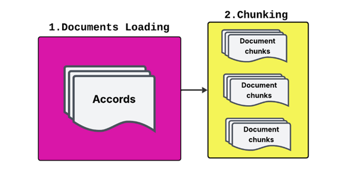
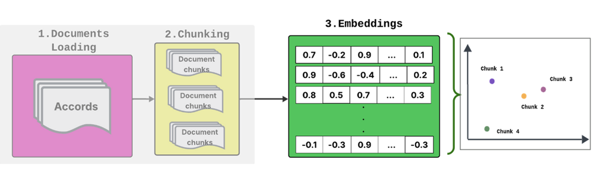
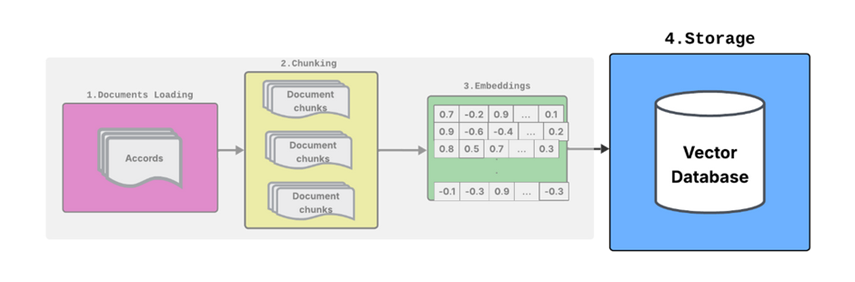
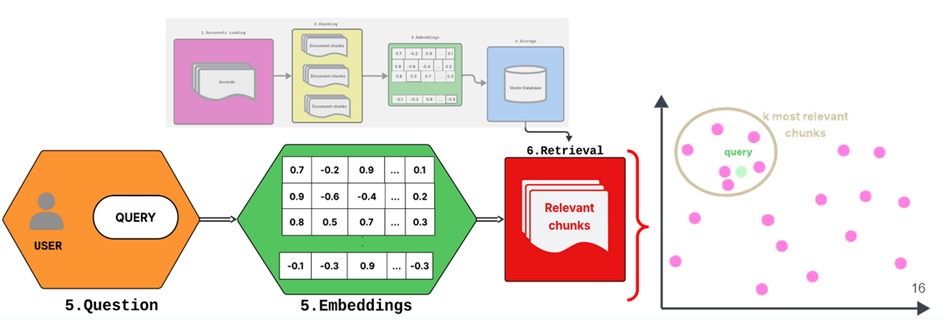
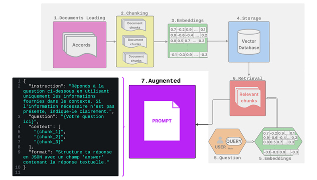
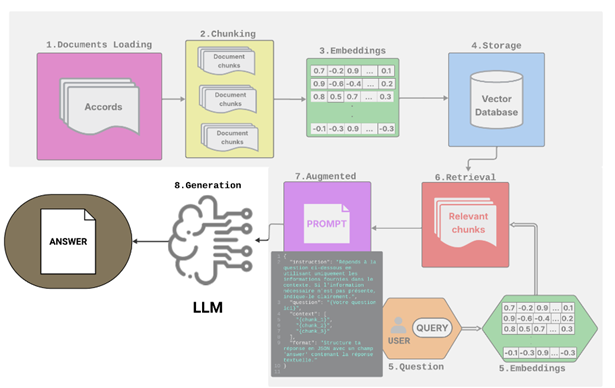

# L'extraction d'information

## Extraire de l’information dans les accords

🎯   Extraire les variables clés identifiées

Progrès majeurs grâce aux modèles de langue de grande taille  (LLMs).

Deux approches :

	Génération libre 

	Extraction structurée 

Retrieval Augmented Generation (RAG) : Recherche des segments pertinents + génération contrôlée

Extraction par fenêtre glissante

## Application aux heures supplémentaires

📄 Contenu

	• Contingent annuel d’heures supplémentaires → 220 h/an (Code du travail)

	• Règles de majoration

	• Repos compensateur

📊 Échantillon

	• Entraînement : 1000 accords (2024, publics, anonymisés)

	• Évaluation : tirage aléatoire de 100 accords

🖋️     Annotation

	• Double annotation manuelle (validation croisée)

	• < 5 cas ambigus → résolution par consensus

## La recherche documentaire : Retrieval

Etape 1 & 2- Chargement + Découpage des documents

Segmenter les accords en paragraphes (chunks) 

## La recherche documentaire : Retrieval

Etape 3 - Embedding 

Transformer chaque chunk de texte en un vecteur numérique (embedding) 

## La recherche documentaire : Retrieval

Etape 4 - Stockage dans une base vectorielle 

Enregistrer tous les embeddings dans une base vectorielle (optimisée pour la recherche de similarité). 

## La recherche documentaire : Retrieval

Etape 5 & 6 - Embedding de la question + Recherche dans la base vectorielle 

Transformer la question utilisateur en vecteur

Trouver les k paragraphes les plus proches dans la base (Retrieval) : calcul de similarité  

## Augmented generation

Etape 7 - Augmented 

Formater : les paragraphes sont récupérés et injectés dans le prompt du LLM.

## Augmented generation

Etape 8 - Generation

LLM : lecture du prompt enrichi + génération d’une réponse 

## Extraction d’information avec RAG

* Outil Ollama
* ✂️ Découpage  : 
	* Naïf : Découpage récursif + zone de chevauchement 
	* Par article : Structure logique  du document  	

## Analyse de sensibilité à l’hyperparamètre k  

📌 k = nombre de segments récupérés

🔍 Analyse Llama3.1
	
	• Découpage par article : optima locaux à k = 2 et k = 6
	
	• Découpage naïf : –20 pts de précision à k = 5 (segments ≥ 15 000 caractères)

⚠️ Conclusion 
	
	• Trop d’articles non pertinents → dégradation de la précision

## Les limites du modèle RAG 

🔎 Qualité du retrieval
	
	• Segments manquants ou mal identifiés → réponses inadéquates

💭 Hallucinations LLM

📍 Sensibilité à la position
	
	• Infos au milieu / dispersées → risque accru d’erreurs

✂️ Limites du découpage
	
	• Informations réparties sur plusieurs segments ou articles → perte d’information

## Discussion - perspective 

Exploitation possible grâce à l’adaptation d’outils de traitement du langage naturel existants !

⚙️Méthodes efficaces 

 	- Réduction de dimension, calcul distribué, traitement séquentiel

❗Limites actuelles

Résultats insuffisants sur variables multimodales 

Besoin d’étendre à toutes les thématiques

🤖 Évolutions technologiques : 

Workflows  

Systèmes multi-agents

⚠️ Précautions et limitations 

Sécurité des données

Hallucinations de l’IA 

Impact écologique 

