# Introduction au monde du Travail

## Juridiction du code du Travail

:::{.columns}

::: {.column width="30%"}

[**Code du travail**](https://www.legifrance.gouv.fr/codes/texte_lc/LEGITEXT000006072050/2026-02-20)

:::

::: {.column width="70%"}

{width=400px}

:::

:::

:::{.columns}

::: {.column width="30%"}

[**Vers. numérique**](https://code.travail.gouv.fr/)

:::

::: {.column width="70%"}

{width=400px}

:::

:::

 

## Composition du code du Travail

:::{.columns}

::: {.column width="30%"}

**Droit législatif**  

:::

::: {.column width="70%"}

{width=1000px}

:::

:::

:::{.columns}

::: {.column width="30%"}

**Droit réglementaire**

:::

::: {.column width="70%"}

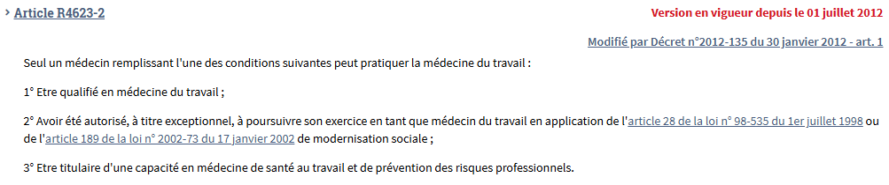{width=1000px}  
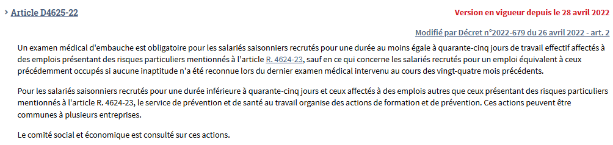{width=1000px}

:::

:::

## Droit du Travail

{style="position:absolute; width:100%;"}

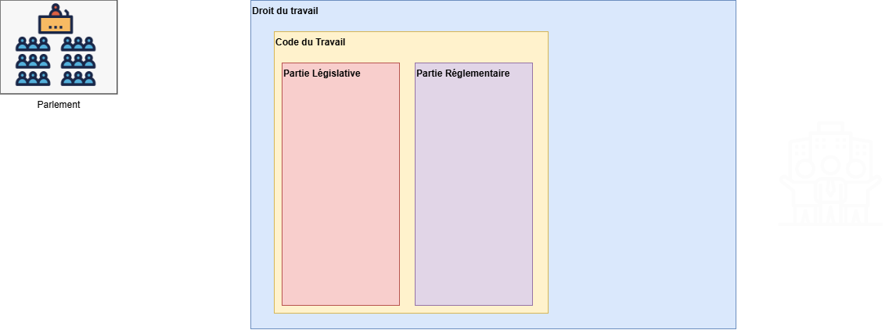{.fragment style="position:absolute; width:100%;"}

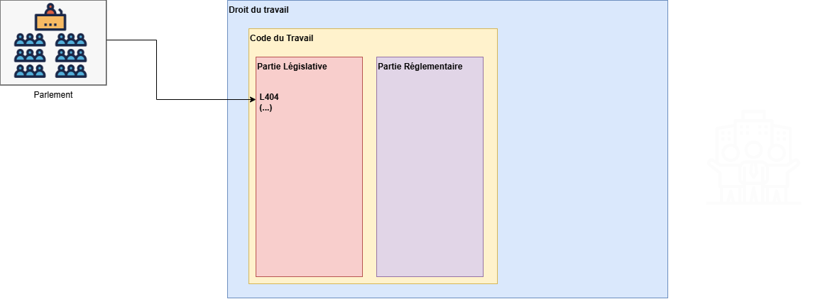{.fragment style="position:absolute; width:100%;"}
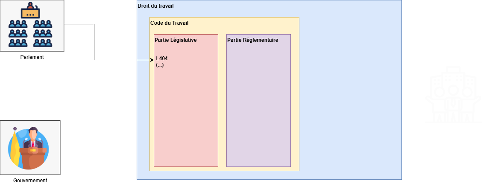{.fragment style="position:absolute; width:100%;"}
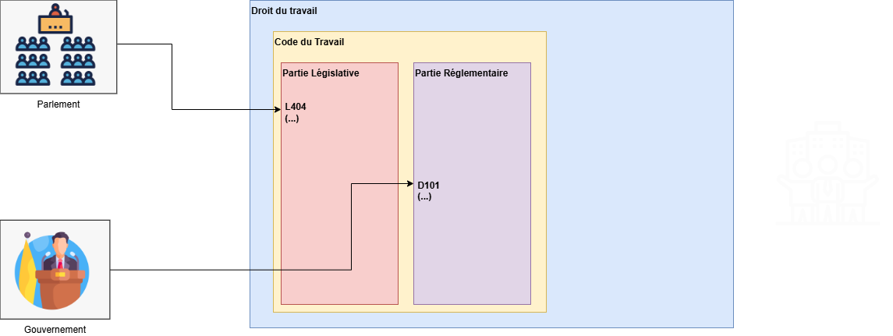{.fragment style="position:absolute; width:100%;"}
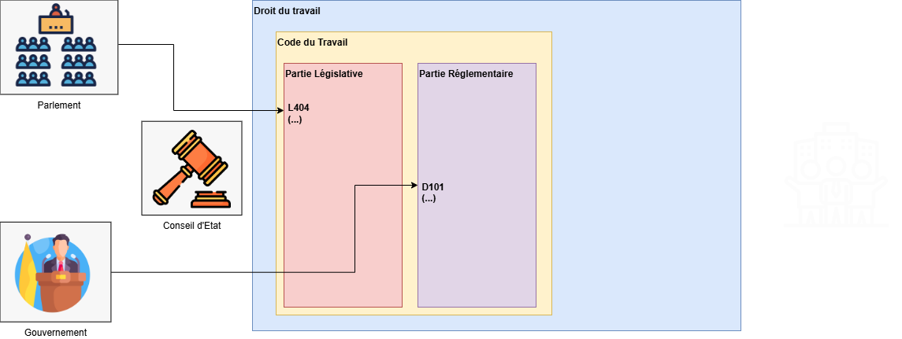{.fragment style="position:absolute; width:100%;"}
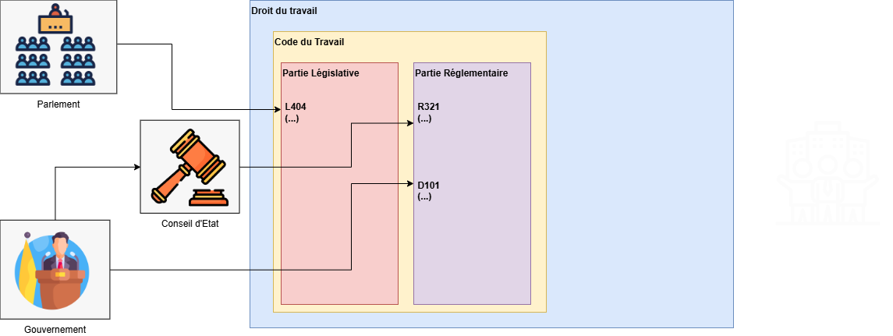{.fragment style="position:absolute; width:100%;"}
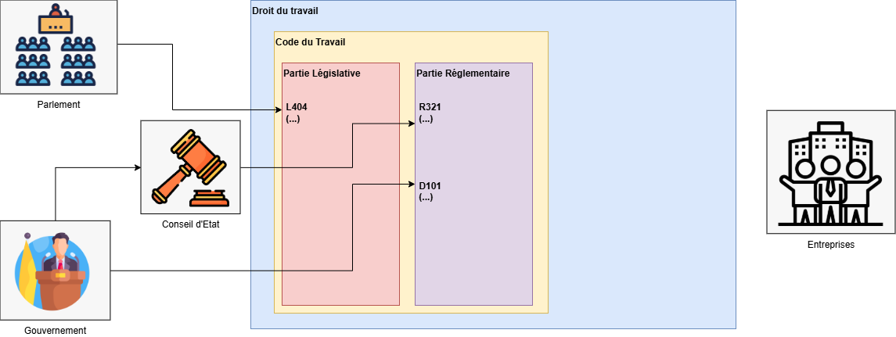{.fragment style="position:absolute; width:100%;"}
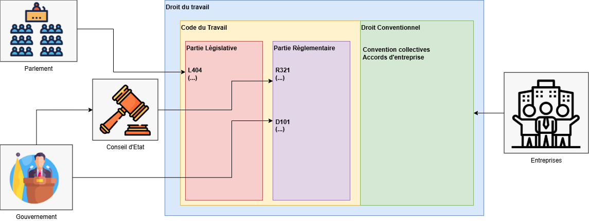{.fragment style="position:absolute; width:100%;"}

## Droit conventionnel

:::{.columns}

::: {.column width="30%"}

[**Convention collective**](https://www.legifrance.gouv.fr/conv_coll/id/KALICONT000005635702?origin=list&facetteEtat=VIGUEUR&facetteEtat=VIGUEUR_ETEN&facetteEtat=VIGUEUR_NON_ETEN&facetteTexteBase=TEXTE_BASE&page=1&pageSize=50&sortValue=DATE_UPDATE&tab_selection=all)

:::

::: {.column width="70%"}

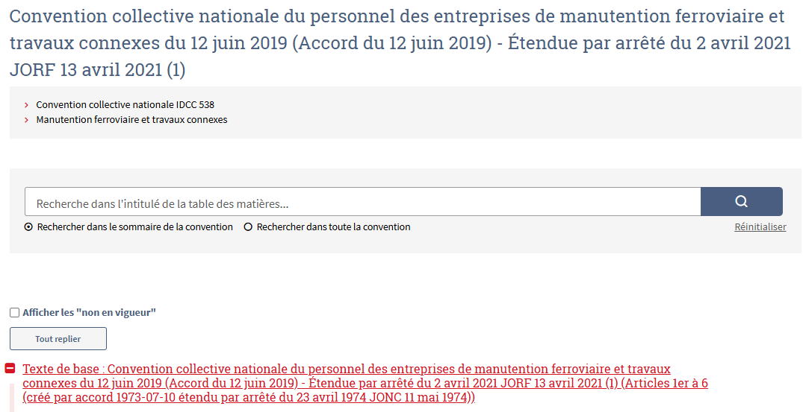{width=400px}

:::

:::

:::{.columns}

::: {.column width="30%"}

[**Accord de branche**](https://www.legifrance.gouv.fr/conv_coll/id/KALITEXT000050623896/?idConteneur=KALICONT000005635702)

:::

::: {.column width="70%"}

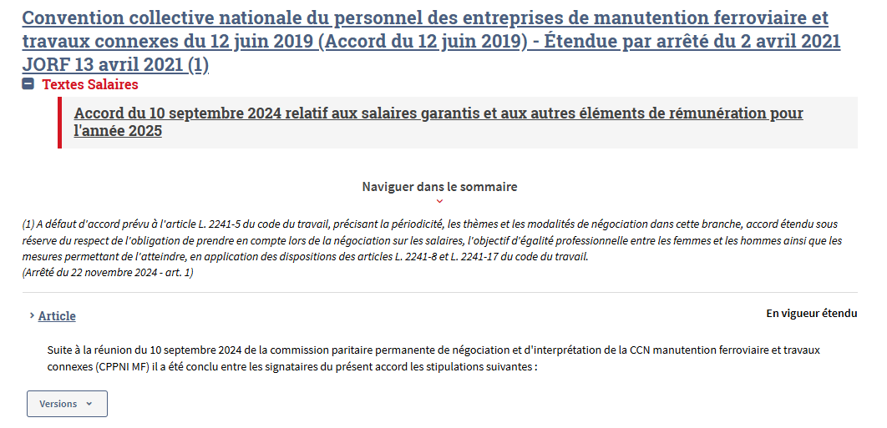{width=400px} 

:::

:::

 

[**Accords d'entreprise**](https://www.legifrance.gouv.fr/search/acco?tab_selection=acco&searchField=ALL&query=%2A&searchType=ALL&typePagination=DEFAULT&sortValue=PERTINENCE&pageSize=25&page=1#acco)

 

## Les accords d'entreprise

* Disponible en grande partie sur Légifrance

